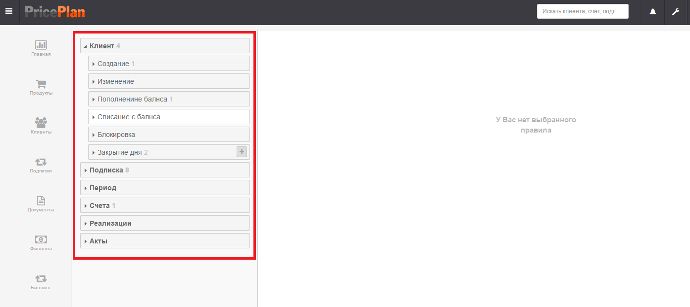
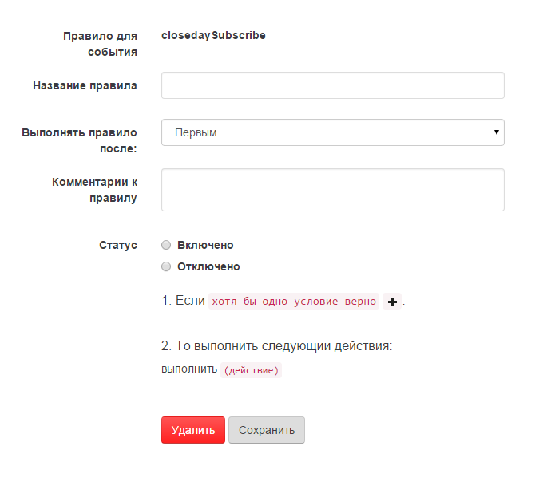

# Бизнес правила

Логика работы системы определяется настройками «Правил». В Правилах описывается какие действия когда система должна выполнять. Все правила привязаны к определенным событиям.
## Интерфейс меню создания правил

Для входя в интерфейс настройки правил необходимо войти в меню настроек и выбрать пункт «Правила» Рис.1 

## Описание интерфейса

Интерфейс меню создания правил разбит на два окна: 
В левом окне отображаются направления событий. Вкладка направление события – может быть раскрыта, после чего появится перечень событий относящихся к данному направлению (Рис. 2). 

В правом окне отображается диалоговое меню создания правила либо уже созданное правило. Для создания правила необходимо выбрать событие, нажать кнопку «+» рядом с событием (рис. 3).

## События

Правила в системе могут создаваться для следующих направлений событий:

* **Клиент** – события связанные с клиентом;
* **Подписка** – события связанные с подпиской;
* **Период** – события связанные с периодом подписки;
* **Счета** – события связанные со счетами;
* **Реализации** – списание средств со счета клиента;
* **Акты** – события связанные с Актами.

Список всех предусмотренных в системе событий  

#### Клиент
  
> ***Создание*** - Создание клиента  
> ***Изменение*** - Изменение кагого либо поля в карточке клиента  
> ***Пополнение баланса*** - Поступление средств на баланс клиента  
> ***Списание с баланса*** - Списание средств с баланса клиента  
> ***Блокировка*** - Блокировка клиента  
> ***Закрытие дня*** - Расчет списаний за оказанные услуги  

#### Подписка

> ***Создание*** - Создание подписки для клиента  
> ***Изменение*** - Изменение какого либо параметра подписки  
> ***Продление*** - Продление подписки  
> ***Блокировка*** - Блокировка подписки  
> ***Удаление*** - Удаление подписки  
> ***Счетчики*** - Действие со счетчиком. В случае если он используется  
> ***Закрытие дня*** - Расчет списаний за оказанные услуги

#### Период

> ***Продление*** - Продление периода

#### Счета

> ***Выставление*** - Формирование счета за оказанные услуги или счета на предоплату

#### Реализации

> ***Выставление*** - Списание средств с баланса клиента

#### Акты

> ***Выставление*** - Формирование Акта за оказанные услуги

Для событий могут быть предусмотрены варианты действий «До» и «После» события.
При наступлении события А, система проверяет наличие правил в категории «До», если такие правила есть, то они выполняются.  
После выполнения правил в категории «До», выполняется само событие. Затем система проверяет наличие правил в категории «После», и выполняет эти правила.

## Диалоговое меню создания правил

Диалоговое меню создание правил имеет вид указанный на рис.4.

### Описание полей:

**Правило для события** – системное название события для которого устанавливается правило;  
**Название правила** – поле в котором пользователь в произвольной форме создает название правила;  
**Выполнять правило после** – поле которое определяет порядок выполнения правил для одного события;  
**Комментарии к правилу** – поле комментариев;  
**Статус** –  переключатель включения/выключения правил;  

Условия:  
1. Если хотя бы одно условие верно/все условия верны – логический оператор определяющий применение условий. Пиктограмма «+» добавляет условия;  
После оператора «если» может быть установлено одно или несколько условий;  
2. То выполнить следующие действия:  
«выполнить» - после оператора выполнить применяется одна из команд. 

## Создание правил

Для создания правил применяется конструкция типа «если -….. выполнить- ….»  
В диалоге «если» указываются переменные (рис.5) определяющие условия при которых будет задействована команда «выполнить». В диалоге выбора переменных используются как системные переменные, так и переменные созданные пользователем.   
  

В зависимости от выбранной переменной система может потребовать установку логических операторов и/или каких либо значений (Рис. 6).  
  

В диалоге выбора условий. Можно не устанавливать какое либо значение. В этом случае команда выполнить будет применена во всех случаях когда произошло указанное событие.  

После выбора условий необходимо выбрать действие, которое будет выполняться, при наступлении указанных условий (Рис. 7).  

В общем случае после выбора действия, необходимо указать дополнительные параметры (Рис.8).  
   

## Описание выполняемых действий

> ***Отмена операции*** - отменяет все действия примененные к этому событию  
> ***Удалить текущую подписку*** - удаляет текущую подписку в соответствии с заданными условиями  
> ***Отправка email*** - отправляет сообщение по электронной почте. Сообщение должно быть заранее создано в шаблонах сообщения. Адрес отправки является переменной  
> ***Отправка sms*** - отправляет смс. Номер на который отправляется смс является переменной. Предварительно должен быть создан шаблон смс  
Изменение значения клиента - изменяет значение переменной (поля) относящегося к Карточке клиента  
> ***Изменение значения подписки*** - изменяет значение переменной (поля) относящейся к карточке подписки  
> ***Продлить подписку*** - продлевает подписку на следующий период  
> ***Продлить все подписки*** - продлевает все подписки на следующий период  
> ***Выставить счет за все неоплаченные списания на время события*** - производит расчет всех списаний со счета абонента на указанную дату и формирует счет на оплату  
> ***Отправить счет*** - отправляет выставленный счет по электронной почте. Адрес почты заявляется переменной. Предварительно должен быть создан шаблон электронного сообщения  
> ***Отправить акт*** - отправляет выставленный акт по электронной почте. Адрес почты заявляется переменной. Предварительно должен быть создан шаблон электронного сообщения  
> ***Отправить счет-фактуру*** - отправляет выставленный счет-фактуру по электронной почте. Адрес почты заявляется переменной. Предварительно должен быть создан шаблон электронного сообщения  
> ***Выставить счет-фактуру*** - формирует счет-фактуру за прошедший период  
> ***Рассчитать реализацию*** - производит расчет всех списаний с абонентских счетов за услуги  
> ***Отправить TODO*** - отправляет внутренне сообщение в системе. Отправка производится либо указанному пользователю либо в качестве получателя выбирается значение переменной. Предварительно должен быть создан шаблон сообщения  
> ***Сместить период*** - производит сдвиг начала и конца периода на указанное количество дней  
> ***Продлить период*** - продлевает период на указанное количество дней  
> ***Блокировка клиента*** - устанавливает блокировку определенного типа для клиента. Все услуги на которые подписан клиент приостанавливаются  
> ***Снятие блокировки с клиента*** - снимает блокировку указанного типа с клиента  
> ***Снятие блокировки со всех подписок*** - снимает блокировку определенного типа со всех подписок  
> ***Блокировка подписки*** - устанавливает блокировку определенного типа на подписку  
> ***Снятие блокировки с подписки*** - снимает блокировку определенного типа с подписки  
> ***Рассчитать и применить установку/снятие блокировок*** - проверяет установку или снятие блокировок сделанных в ручную  
> ***Рассчитать дневную реализацию*** - производит расчет всех списаний с абонентских счетов за день  
> ***Выставить акт*** - формирует акт за прошедший период  
> ***Выставить акт и счет фактуру*** - формирует акт и счет-фактуру за прошедший период  
> ***Отправить акт и счет фактуру*** - отправляет выставленный акт и счет-фактуру по электронной почте. Адрес почты является переменной. Предварительно должен быть создан шаблон электронного сообщения  
> ***Произвести списание по счетчику*** - производит учет всех услуг оказанных по счетчикам. Необходимо выбрать счетчик (переменную)  
> ***Рассчитать списания за следующий период*** - производит расчет списаний за следующий период  
> ***Отправить web hook*** - передает информацию стороннему программному обеспечению с помощью HttpPOST запроса  
> ***Сбросить и отправить реквизиты личного кабинета по email*** – отправляет логин и пароль от личного кабинета клиенту на указанный адрес электронной почты. Ранее установленные пароль и логин они сбрасываются. Адрес почты является переменной. Предварительно должен быть создан шаблон электронного сообщения

 
