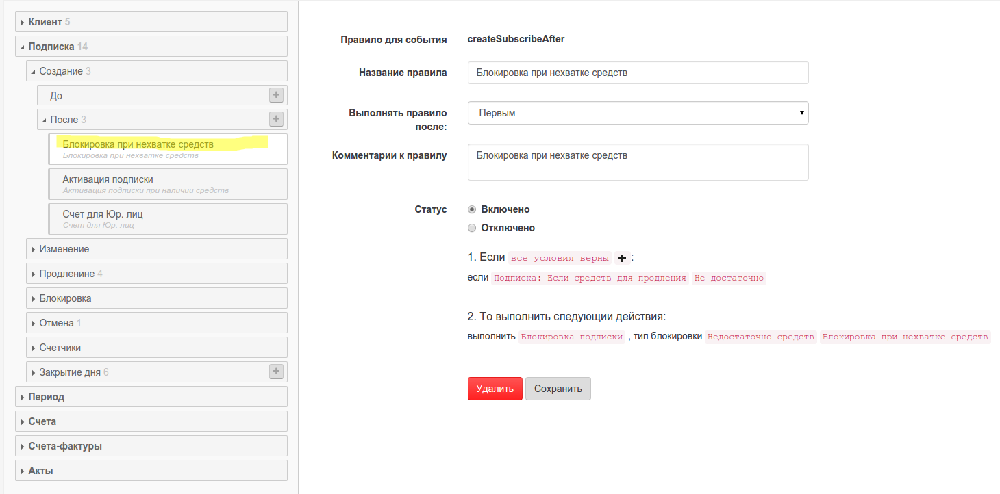
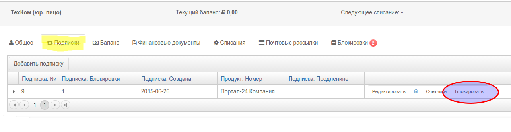
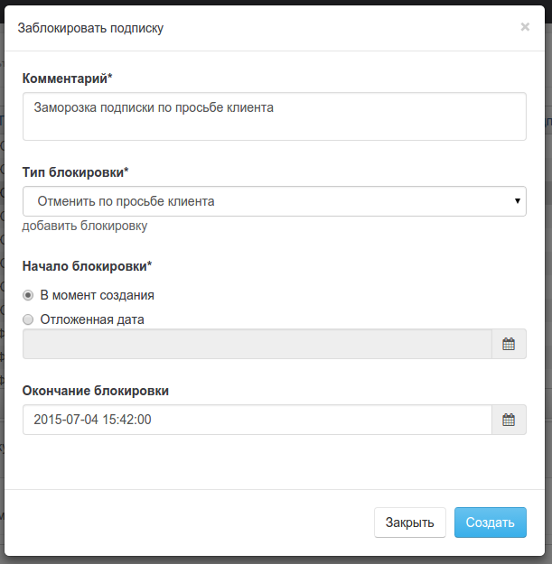
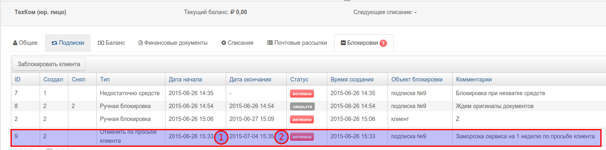

# Блокировки подписки

Для того, чтобы ваш сервис мог получить информацию о статусе подписки, используется механизм блокировок. Предполагается, что перед входом в ваш сервис, вы вызовете API биллинга, и если количество активных блокировок больше 0, то доступ к вашему сервису будет запрещен.

Вы также можете в этот момент показать причины блокировок вашим пользователям.

На каждую подписку может быть установлена одна или более блокировок.

## Работа с блокировками в правилах

Блокировка может быть создана в правилах биллинга **автоматически** \(при наступлении определенных условий\). Например, если подписку не удалость продлить из-за недостатка средств на балансе. В данном примере создано правило, устанавливающее блокировку, если при создании подписки не хватает средств на ее активацию.  При поступленни средств эта блокировка должна быть снята. 

## Ручные блокировки

Блокировка пользователем РricePlan может быть создана **вручную** . Например, если в вашем сервисе предусмотрена блокировка по просьбе клиента. Для создания ручной блокировки, найдите клиента и откройте вкладку `подписки`, и нажмите кнопку "Блокировать".

 В открывшемся окне

* Выберите тип блокировки \(любые типы блокировки могут быть заданы в настройках системы\).
* Введите комментарии \(обязательное поле\)
* Дата начала блокировки. Может быть в будущем \(отложеная блокировка\)
* Дата окончания блокировки. 
  * Если эта дата не задана, то подписка будет блокирована до того, как кто-то ее не снимет. 
  * Если эта дата указана, то система отменит блокировку автоматически.

Созданая блокировка будет видна в разделе "Блокировки" клиента.  Снятие блокировки также может произведено как вручную, так и автоматически \(например, при поступлении средств на баланс\). В нашем случае:

* Блокировка №9 активна, но будет отменена системой автоматически 2015-07-04 в 15:35
* Блокировка №7 активна и никогда не будет отменена автоматически
* Блокировка №7 отменена 2015-06-26 в 14:54 пользователем №2

**ВАЖНО!**  **УСТАНОВКА БЛОКИРОВКИ НИКАК НЕ ВЛИЯЕТ НА РАСЧЕТЫ ЗА ТЕКУЩУЮ ПОДПИСКУ.**   
По умолчанию считается, что во время блокировки списания за предоставляемые услуги не меняются. Для перерасчета списаний по подписке используйте функцию [отмены](../deistviya_s_aktivnimi_podpiskami/subscription_cancellation.md) или [редактирования параметров подписки](../deistviya_s_aktivnimi_podpiskami/)

