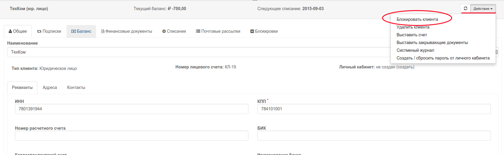
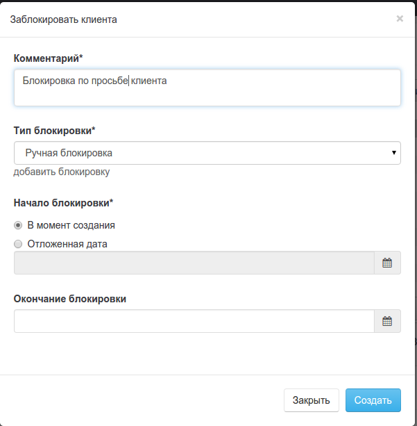
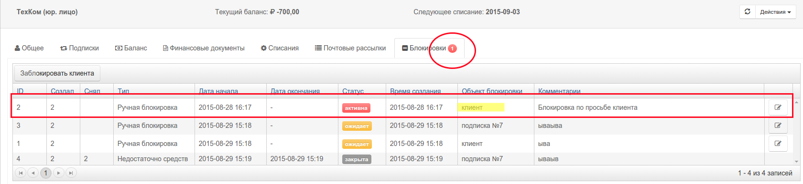
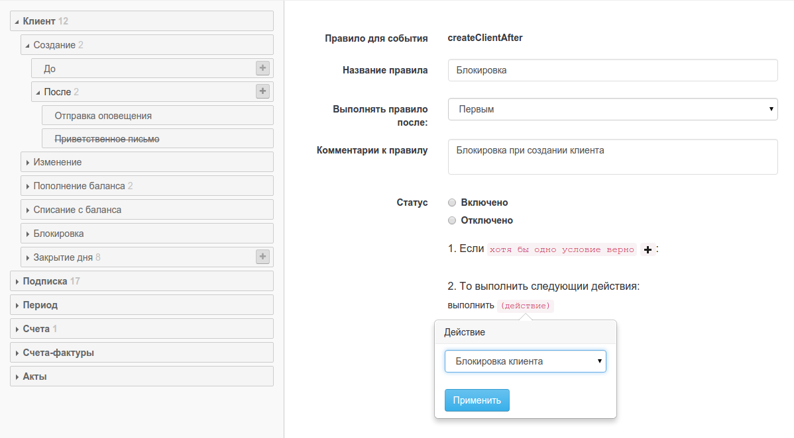

#Блокировки клиента
Блокировки клиента работают абсолютно так же как и блокировки подписки. Отличие их в том, что установленная блокировка клиента отображается так же и во всех подписках. То есть у блокированного клиента не может быть активных подписок.

##Ручные блокировки
Блокирови можно создавать в ручном режиме или в правилах. в ручном режиме блокировка создается из контекстного меню клиента




У каждого клиента может быть установлена одна или более блокировок разного типа. 

В открывшемся окне 
- Выберите тип блокировки (любые типы блокировки могут быть заданы в настройках системы).
- Введите комментарии (обязательное поле)
- Дата начала блокировки. Может быть в будущем (отложеная блокировка)
- Дата окончания блокировки. 
  - Если эта дата не задана, то подписка будет блокирована до того, пока кто-то ее не снимет. 
  - Если эта дата указана, то система отменит блокировку автоматически.

Блокировки клиента доступны в общем списке блокировок со значением "Объект блокировки" = "клиент".  

```Система не допускает создания более одной активной блокировки одного типа.```



Блокировка клиента, установленая вручную может быть снята вручную или в каком -то правиле.

##Блокировки в правилах
Блокировка может быть создана в правилах биллинга  **автоматически** (при наступлении определенных условий). В примере ниже, создано правило, устанавливающее блокировку клиента, сразу после создания



**ВАЖНО! ** **УСТНОВКА БЛОКИРОВКИ НИКАК НЕ ВЛЯИЕТ НА СПИСАНИЯ ЗА ТЕКУЩУЮ ПОДПИСКУ. ** По умолчанию считается, что во время установленной блокировки списания за предоставляемые услуги не меняются. Для перерасчета списаний по подписке используйте функцию [отмены](subscription_cancellation.md) или [редактирования](deistviya_s_aktivnimi_podpiskami.md)


```В правиле можно создать только безвременную (вечную) блокировку.```

```Блокировка клиента, установленая в правиле может быть снята в другом правиле или пользователем системы вручную.```
