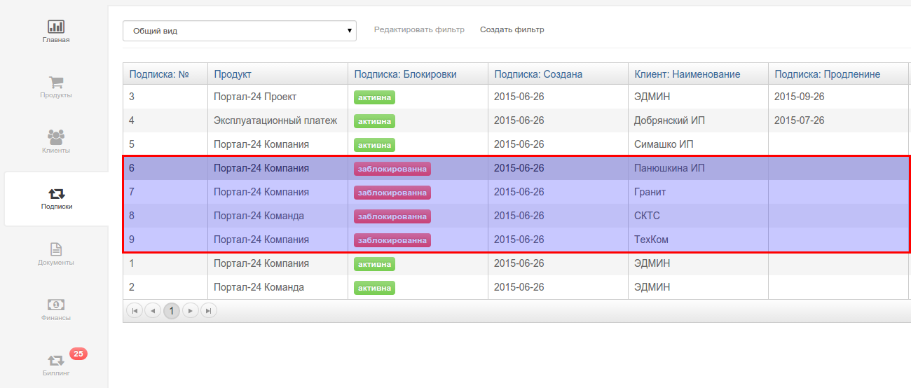
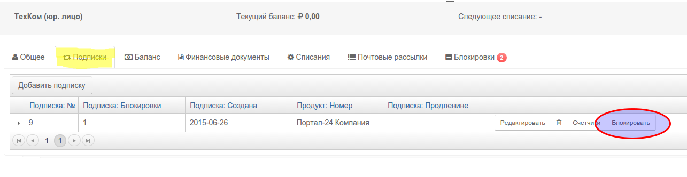
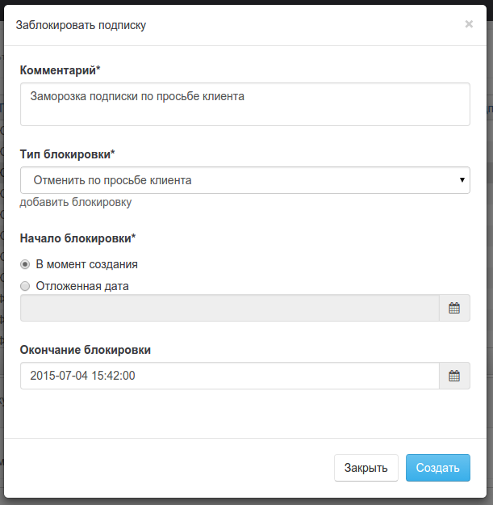
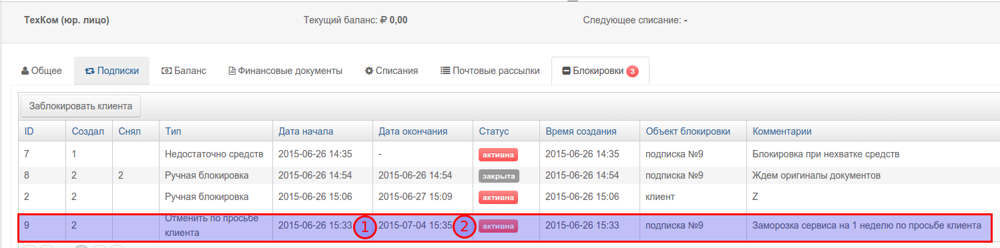

Для того чтобы ваш сервис мог получить информацию о статусе подписки используется механизм блокировок. 

На подписку может быть установлена одна или более блокировок.

Блокировка может быть создана **автоматически** при наступлении определенных условий. Например если подписку не удалость продлить из за недостатка средств на баллансе. Для создания 

Блокировка пользователем pricePlan может быть создана **вручную**  Например если в вашем сервисе предусмотрена блокировка по просьбе клиента. Для создания ручной блокировки найдите клиента и откройте вкладку `подписки` и нажмите кнопку "Блокировать"

В открывшемся окне 
- выберите тип блокировки (любыет типы блокировки могут быть заданы в настройках системы).
- Введите комментарии.
- 

Снятие блокировки также может произведено как вручную так и автоматически (например при поступлении средств на баланс).

Дата начала блокировки
Дата окончания блокировки
Тип блокировки
Комментарии