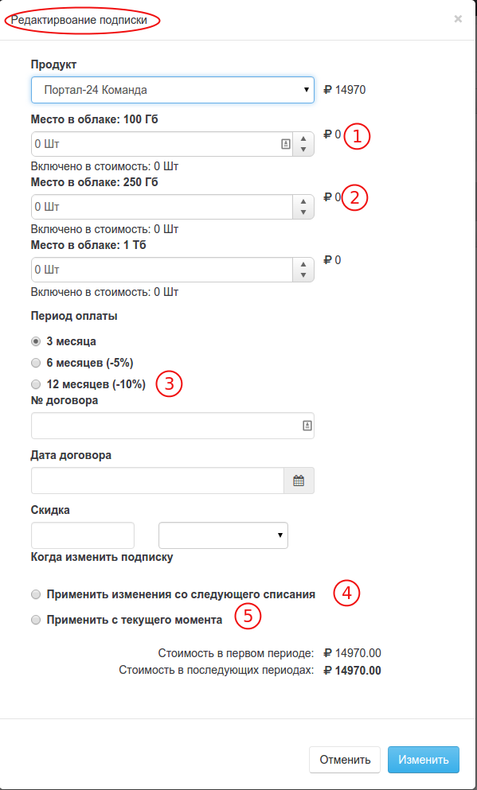
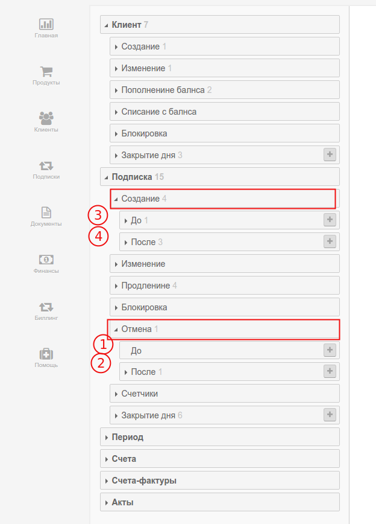

# Апгрейд \(Upgrade\)

`Апгрейдом` в биллинге PricePlan называется, изменение параметров подписки, при котором увеличивается её стоимость за период, но не меняется продукт. .

**Пример 1** Клиент подписан на ежемесячную подписку, стоимостью 100 руб в месяц. В ее стоимость входит "1 пользователь", с возможностью заказа дополнительных пользователей по цене 50 руб. в месяц. Заказ дополнительного пользователя, будет считаться `Апгрейдом`.Показатель MRR клиента в этом случае увеличится.

**Пример 2** Клиент подписан на ежемесячную подписку \(предоплата\), стоимостью 100 руб в месяц, с возможностью перейти на ежегодную подписку, стоимостью 1000 руб за 12 месяцев. Переход клиента на ежегодную подписку, будет также считаться `Апгрейдом`. Показатель MRR клиента в этом случае уменьшится., но вырастет показатель LTV.

При выполнении операции `Апгрейда` биллинг последовательно выполняет 2 операции: 1. [Отмена подписки](subscription_cancellation.md) 2. Создание новой подписки При этом, в разделе подписок этот процесс будет отражен, как отмена текущего периода и создание нового \( сама подписка останется активной\).

Апгрейд можно провести в любой момент жизни подписки одним из двух способов

1. В реальном времени, при поступлении запроса в интерфейсе PricePlan или через вызов API 
2. Как отложное действие, с начала следующего периода 

В первом случае, при операции Апгрейда параметры подписки будут изменены мгновенно, а текущий день будет пересчитан по новым условиям. То есть, даже, если Апгрейд произошел в 23:55 и фактически клиент отработал по новым условиям только 5 минут, он заплатит по новым условиям за полный день подписки.

При выполнении операции `Апгрейд` происходит триггер нескольких событий, для которых вы можете создать свои бизнес правила, в соответствии с вашими договорными обязательствами. Например, вы можете запретить `Апгрейд`, если на балансе лицевого счета клиента недостаточно средств для этой операции.

