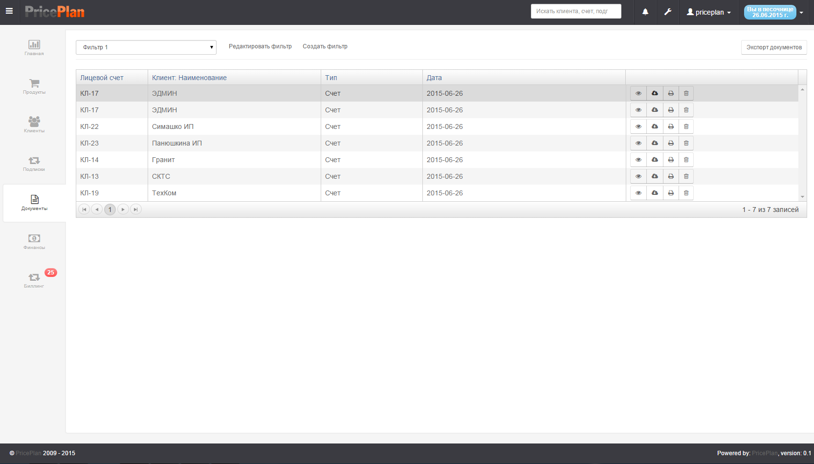
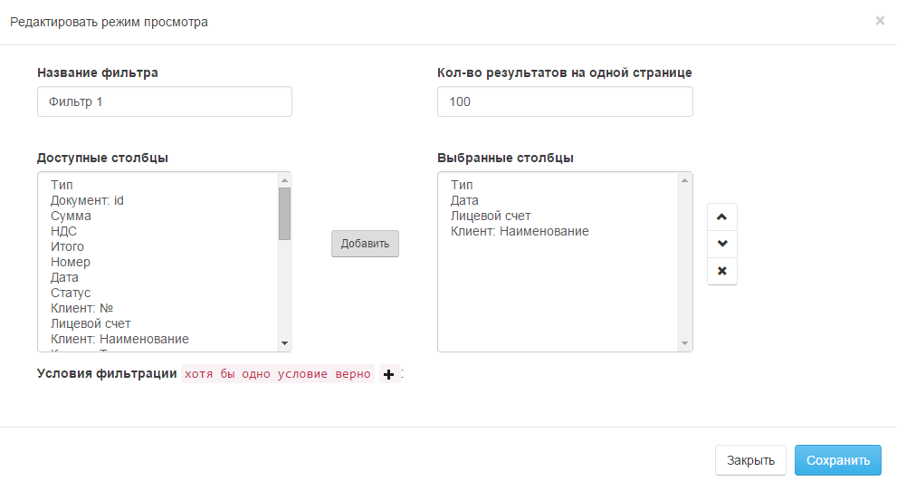
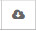
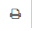
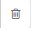
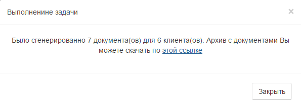

# Документы

Вкладка "Документы" содержит все документы, которые сгенерировала система. Рис.1.

## Фильтр

Фильтры позволяют выводить список документов в соответствии с условиями, задаваемыми фильтром. Для создания или редактирования фильтра, необходимо нажать кнопку "Редактировать/Создать фильтр", после чего, в открывшемся диалоге, создать или отредактировать фильтр. Рис.2

## Действия с документами

Оператор может произвести следующие действия с документами:

*  Просмотреть документ;  
*  Скачать документ на компьютер;  
*  Отправить документ на печать;  
*  Удалить документ;  

Для экспорта всех документов одним архивом, необходимо нажать кнопку "Экспорт документов", после чего, в открывшемся окне, скачать архив по указанной ссылке. Рис.3

