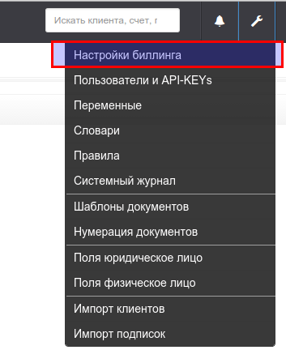
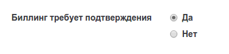

# Режим работы "с подтверждением"

Так же известен, как "двухшаговый режим работы". В этом режиме выполнение закрытия дня производится в 2 шага:

1. Автоматический расчет всех операций  
2. Ручное подтверждение биллинга

После выполнения, пакетный биллинг остается в режиме "ожидает подтверждения" до того момента, пока пользователь не нажмет кнопку "подтвердить" или "отменить". 
После подтверждения, биллинг  переходит в статус "выполнен".

После отмены, биллинг перейдет в режим "отменен" до выполнения следующего пакетного биллинга или до перезапуска биллинга вручную.

Пример 1:
>Пакетный биллинг запущен системой 2го февраля в 04:00 в режиме "с подтверждением".
>
Биллинг рассчитал закрытие дня за 1е января. Отправил сообщение менеджеру и остановился, ожидая подтверждения рассчитанных операций. 
>
>Менеджер пришел на работу  2го февраля в 09:00 и увидел уведомление о необходимости подтвердить действия биллинга.
>
>В 09:05 менеджер подтверждает биллинг для лицевого счета "001". 
>
>В результате подтверждения, для этого лицевого счета сгенерированы акты и счета-фактуры. Документы отправлены клиенту по электронной почте.

>В 09:06 менеджер отменяет биллинг для лицевого счета "002", из-за выявленной ошибки в акте. Теперь у менеджера есть возможность исправить неверные данные и перезапустить биллинг заново.

При работе в режиме "полный автомат" такой возможности у менеджера **НЕ БУДЕТ**.

>Замечание. Если в примере 1 01-02-2015 в 04:00 Клиент внесет какие-то изменения (зачислен платеж, внесено показание счетчика, и.т.п), то будет произведен перерасчет операций биллинга. В 09:05 менеджер увидит данные уже с учетом последних изменений.

Важно: Если вы работаете в режиме  "с подтверждением", то рекомендуется проверять расчеты и подтверждать биллинг каждый день, включая выходные и праздники.

Мы рекомендуем, использовать режим "с подтверждением" первые 2-3 месяца после начала эксплуатации биллинга и переключиться на режим "полный автомат", только после полной уверенности в безошибочной работе всех правил.

Включить режим "с подтверждением"" можно в настойках биллинга. 

