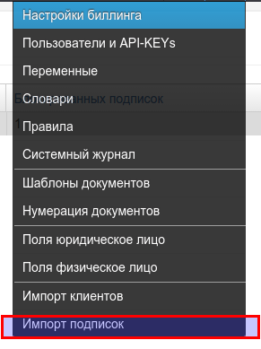
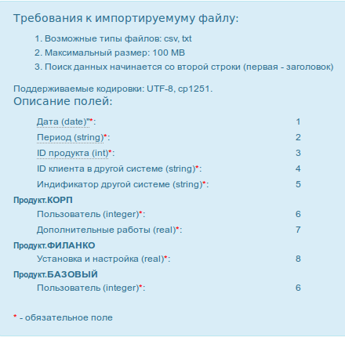
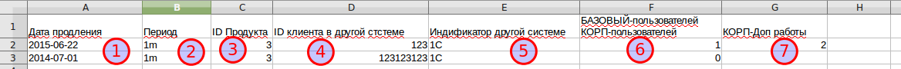
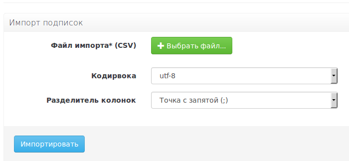

# Импорт подписок

## Подговительные действия:

1. Cоздать в PricePlan все поля для импортируемых данных
2. Подготовить файл загрузки в формате CSV
3. Загрузить клиентов, к которым относятся подписки
4. Созать продукты, указанные в подписках

## Загрузка:

Зайдите в верхнее меню. Импорт подписок

Для начала загрузки вам понадобится создать CSV файл с исходными данными.

Требования к импортируемому файлу:

* Возможные типы файлов: csv, txt
* Максимальный размер: 100 MB
* Поиск данных начинается со второй строки \(первая - заголовок\)
* Поддерживаемые кодировки: UTF-8, cp1251.

Для всех продуктов используется единый формат загрузки.

Пример 1 Создадим загрузочный файл, содержащий 2 подписки на 2 сервиса, по инструкции на странице загрузки.

В пустом файле создадим первую строку и введем туда заголовки колонок из инструкции.

 Поле "Дата продления". Дата окончания текущего периода подписки. Вводится в формате "YYYY-MM-DD'. Это обязательное поле \(отмечено звездочкой\). Необходимо убедиться в том, чтобы это поле было заполнено во всех строках файла.

 Поле "Период". Это период продления, после наступления "даты продления". Вводится в формате "Nm" или "Nd" \(количество месяцев или дней\). Необходимо убедиться, что в продукте есть возможность продления на этот срок. Обязательное поле. Необходимо убедиться в том, чтобы это поле было заполнено во всех строках файла.

 ID Продукта. Значение можно увидеть в списке продуктов..Обязательное поле. Необходимо убедиться в том, чтобы это поле было заполнено во всех строках файла.

 ID клиента в другой системе. Это поле должно быть уникальным в сочетании с полем \(5\).

 ID другой системы. Это поле должно быть уникальным в сочетании с полем \(4\). В нашем примере "другой системой является ПО "1С".

 "Количество пользователей" для планов БАЗОВЫЙ и КОРП. Обязательное поле

 "Дополнительные работы" для плана КОРП. Обязательное поле

> В вашем случае, поля \(6\) и \(7\) будут называться в соответствии с продуктами, созданными в вашей базе данных.

После того как исходный файл подготовлен, нужно: 1. сохранить данные в формате CSV 2. На странице загрузки данных PricePlan указать путь к файлу, кодировку и разделитель колонок. 3. Нажать кнопку "Импортировать"

После этого система отправит задачу в очередь. В зависимости от количества подписок, загрузка может занять от нескольких секунд до нескольких часов. В случае обнаружения ошибок или успешной загрузки система покажет соответствующие сообщения. 

