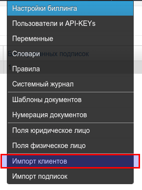
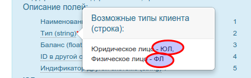
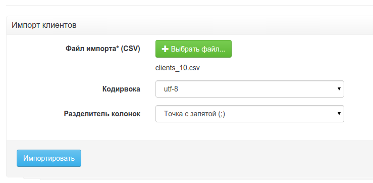

# Импорт клиентов

Перед загрузкой клиентов необходимо:

1. создать в PricePlan все поля для импортируемых данных
2. подготовить файл загрузки в формате CSV

Зайдите в верхнее меню. Загрузка клиентов

Для начала загрузки вам понадобится создать CSV файл с исходными данными.

Требования к импортируемому файлу:
* Возможные типы файлов: csv, txt
* Максимальный размер: 100 MB
* Поиск данных начинается со второй строки (первая - заголовок)
* Поддерживаемые кодировки: UTF-8, cp1251.

Для юридических и физических лиц используется единый формат загрузки. 

Пример 1
Создадим загрузочный файл содержащий данные одного юридического лица и и одного физического лица по инструкции на странице загрузки.

В пустом файле создадим первую строку и введем туда заголовки колонок из инструкции. 

 Поле "Наименование". Это обязательное поле (отмечено звездочкой). Необходимо убедиться в том, чтобы это поле было заполнено во всех строках файла.  

 Поле "Тип". Это обязательное поле. Необходимо убедиться в том, чтобы это поле было заполнено во всех строках файла.  По инструкции видно что система принимает только два возможных значения: "ЮЛ" и "ФЛ". 

 Остаток на лицевом счету клиента. По умолчанию 0.

 ID в другой системе. Это поле должно быть уникальным в сочетании с полем (5).

  ID другой системы. Это поле должно быть уникальным в сочетании с полем (4). В нашем примере "другой системой является ПО "1С". 

 ИНН (пользовательское поле). Заполнение не обязательно. 

В нашем примере все остальные поля не обязательны к заполнению и мы их не стали заполнять. Например если необходимо загрузить адреса регистрации для физических лиц то вам необходимо скопировать их в 20-Ю колонку (колонка "T" в Excel или Libreoffice).

После того как исходный файл подготовлен нужно:
1. сохранить данные в формате CSV 
2. На странице загрузки данных PricePlan указать путь к файлу, кодировку и разделитель колонок. 
3. Нажать кнопку "Импортировать"

После этого система отправит задачу в очередь. В зависимости от количества клиентов, загрузка может занять от нескольких секунд до нескольких часов. В случае обнаружения ошибок или успешной загрузки система покажет соответствующие сообщения.
