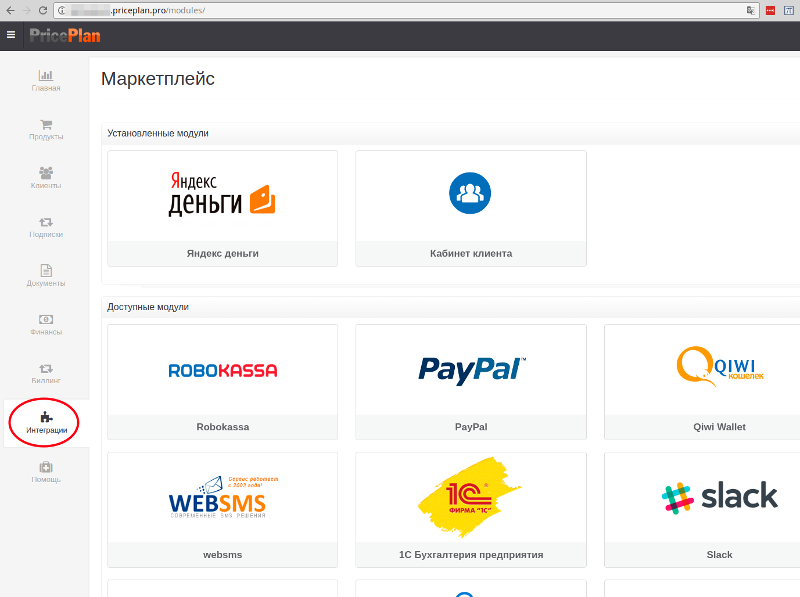

# Интеграции

Чаще всего Биллинг внедряется в организацию не изолированно, а как часть большого бизнес процесса. В таких случаях системе биллинга необходимо обмениваться информацией со сторонними системами, поддерживающими другие функции организации. В платформе PriceЗlan есть достаточно гибкий механизм REST API и Web-Hooks, но этого не всегда бывает достаточно. 

Именно по этому в платформу PricePlan включён модуль "Интеграции" - набор адаптеров, для подключения биллинга к системам конкретных производителей с инструкциями по настройке. Наши инженеры оказывают техническую поддержку для всех модулей в разделе "Интеграции" на любом тарифном плане.

Количество модулей в разделе "Интеграции" постоянно растет. Большинство из них бесплатны, однако могут встречаться и платные модули. Цена, в таком случае указана в описании модуля и рассчитывается с момента подключения модуля и до момента его отключения.   

Если у Вас есть идеи или потребности в разработке нового модуля интеграции с платформой биллинга Pricмeplan присылай нам свои идеи  требования, мы обязательно вам ответим!

