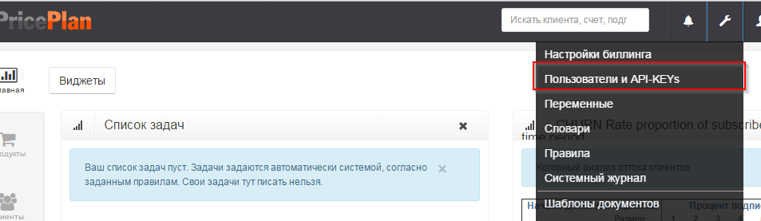
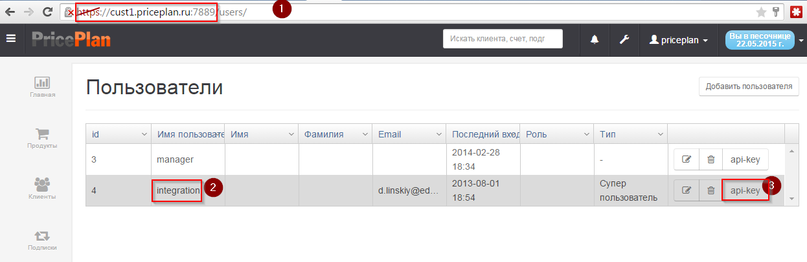
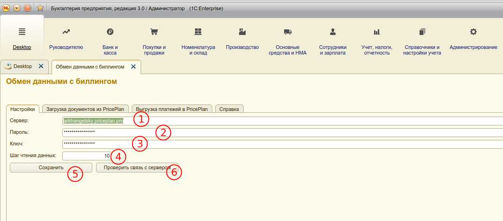
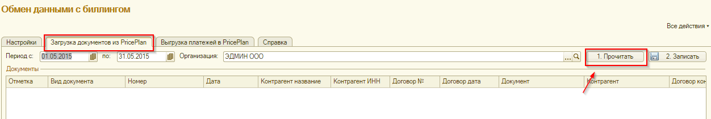
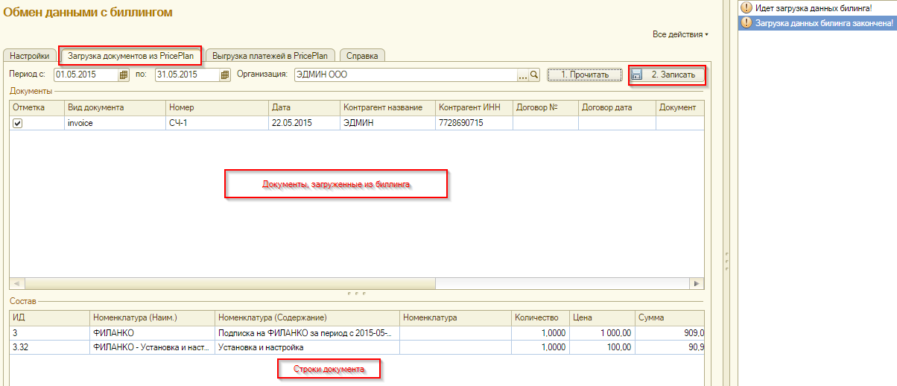
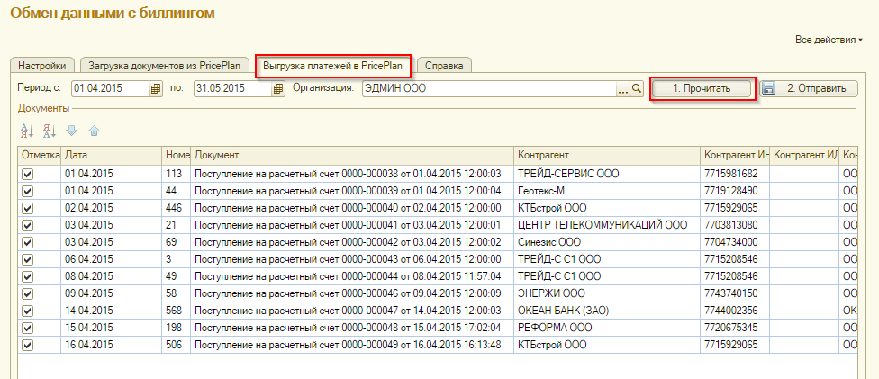
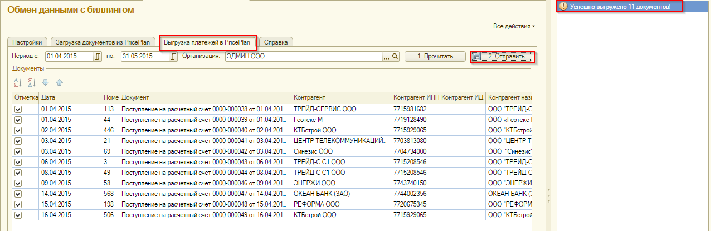
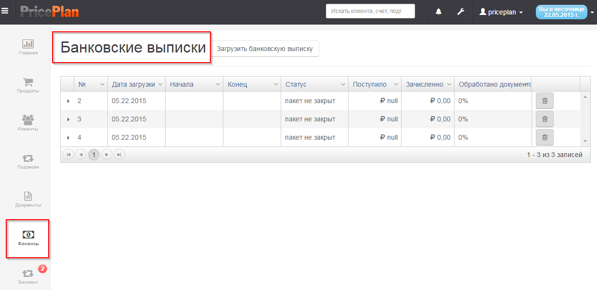

# 1С Бухгалтерия предприятия 8

Интеграция PricePlan c программой `1C Бухгалтерия Предприятия 8` реализована через внешнюю обработку \(расширение epf\). Это дает возможность, использовать модуль интеграции с биллингом в 1С без изменения структуры базовой конфигурации.

[Ссылка на загрузку последней актуальной версии](https://github.com/linskiy/priceplan_1C/blob/master/priceplan.epf).

Интеграция предусматривает двусторонний обмен данными: 1. PricePlan может передавать в 1С контрагентов, счета и закрывающие документы.

1. 1С может передавать в PricePlan информацию о поступивших платежах. 

## Установка внешней обработки в "1C Бухгалтерия Предприятия 8"

1. Сохраните файл внешней обработки `priceplan.epf` из раздела "Помощь" на диск вашего компьютера;
2. В 1С Бухгалтерия 3.0 откройте окно регистрации внешних обработок в меню "Сервис" - "Дополнительные отчеты и обработки" - "Дополнительные внешние обработки";
3. В открывшемся окне, нажмите кнопку "Добавить", в результате чего, откроется окно регистрации внешней обработки;
4. Нажмите кнопку "Создать" и ,в открывшемся окне, выберите файл внешней обработки \(\*.epf\) c диска компьютера;
5. Измените название обработки в поле "Наименование" \(если требуется\) и нажмите кнопку "ОК". Обработка зарегистрирована и готова к использованию.

## Использование внешней обработки

1. Откройте окно регистрации внешней обработки в меню "Сервис" - "Дополнительные отчеты и обработки" - "Дополнительные внешние обработки";
2. Запустите обработку двойным кликом мышки;

## Настройки подключения к PricePlan.

* Войдите в PricePlan, как суперпользователь;
* В правом верхнем меню выберите "Пользователи и API KEYS" \(иллюстрация 1.2\);

* Скопируйте адрес сервера, пароль и api-key и заполните их в модуле 1С \(иллюстрация 1.3 и 1.1\);

* Сохраните настройки и проверьте связь с сервером \(иллюстрация 1.1\). Должно появиться сообщение о том, что связь установлена успешно.

* Модуль готов к обмену информацией.

## Загрузка документов PricePlan в 1С

* Во вкладке "Загрузка документов из PricePlan" выберите диапазон дат и организацию;
* Нажмите кнопку "Прочитать";

* В блоке "Документы" появится список документов, удовлетворяющих заданным условиям;
* В блоке "Состав" - детали каждого документа;
* Выберите необходимые документы из списка и нажмите кнопку "Записать"\(иллюстрация 2.2\).;

* Документы будут добавлены в 1С.
* Если контрагент еще не существует в 1С, то модуль обмена создаст нового.
* Если номенклатура не существует в 1С, то модуль обмена создаст новую.
* Проверьте загруженные документы в 1С и проведите их.

## Выгрузка платежей из 1С в PricePlan

* Во вкладке "Выгрузка платежей в PricePlan" выберите диапазон дат и организацию.
* Нажмите кнопку "Прочитать" \(иллюстрация 3.1\)..
* В блоке "Документы" появится список платежей, удовлетворяющих выбранным условиям.
* Выберите необходимые платежи из списка и нажмите кнопку "Отправить" \(иллюстрация 3.2\).

* Документы будут переданы в PricePlan.
* Дальнейшая обработка платежей происходит в разделе "Финансы" сервиса PricePlan \(иллюстрация 3.3\)

