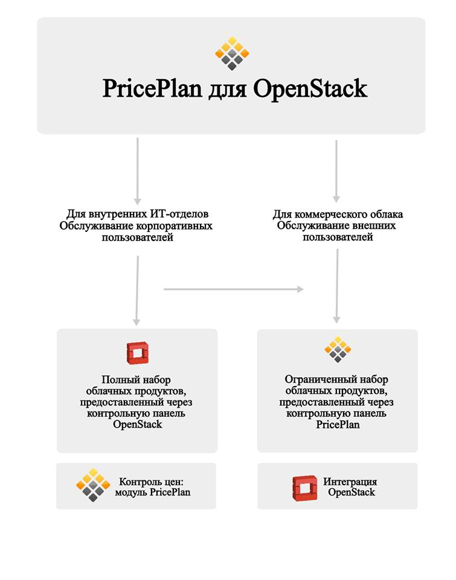
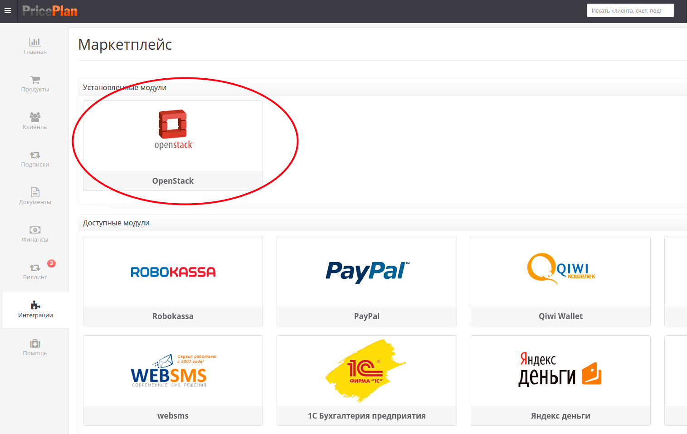
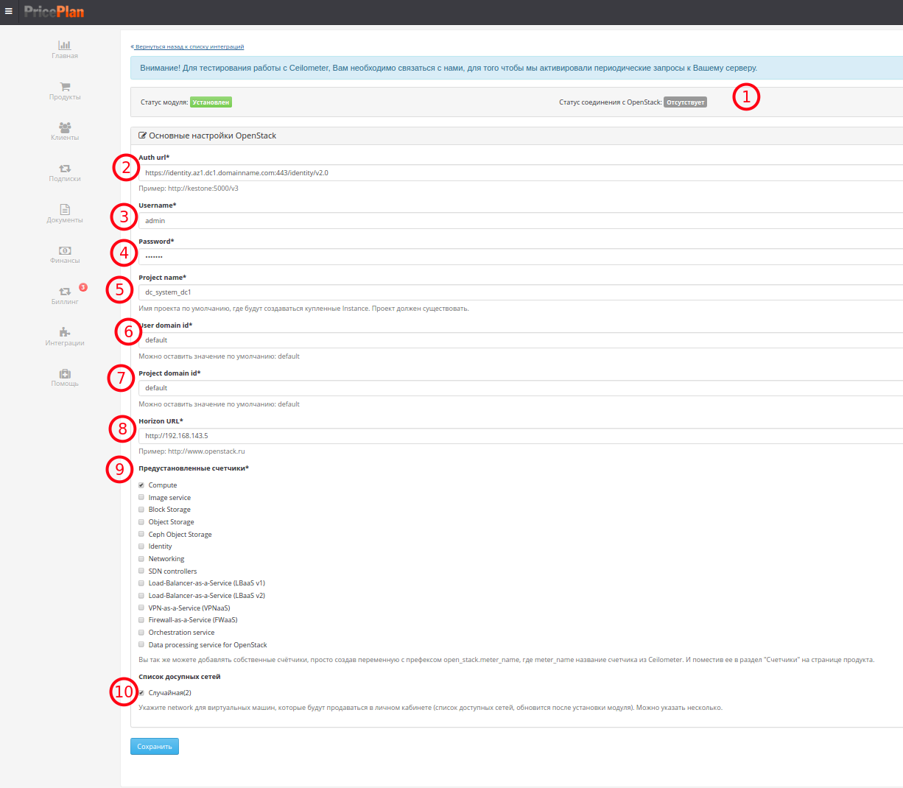

# OpenStack

Комплекс проектов свободного программного обеспечения, для управления инфраструктурными облачными сервисами и облачными хранилищами.

Интеграция PricePlan c OpenStack позволяет

* Монетизировать IaaS ресурсы по модели сервис-провайдера на открытом рынке, или внутри организации по модели "chargeback" или "showback"
* Создавать предоплатные или постоплатные тарифные планы на основе продуктов OpenStack
* Рассчитывать утилизацию ресурсов по любой из 160+ стандартных метрик OpenStack.
* Хранить детализацию расхода ресурсов любое кочество времени и строить отчеты на этих данных.
* Предоставлять возможность управления ресурсами конечным пользователям в "панели самообслуживания"

## Для интеграции биллинга с OpenStack необходимо подключить соответствующий модуль в разделе "Интеграции"

## Настройки модуля

1. После заполнения реквизитов для подключения можно проверить статус соединения с OpenStack. При успешном подключении статус должен быть зеленым.
2. Auth URL - адрес OpenStack keystone
3. username - имя пользователя keystone \(с правами администратора\)
4. Password - пароль пользователя keystone
5. Имя проекта по умолчанию, где будут создаваться заказанные "инстансы". Проект должен существовать в OpenStack.
6. User domain id. Можно оставить значение по умолчанию: default
7. Project domain id. Можно оставить значение по умолчанию: default
8. Horizon URL. Пример [http://www.openstack.ru](http://www.openstack.ru) - URL для входа в ЛК OpenStack
9. Предустановленные счетчики. Облачные ресурсы, по которым будет производиться снятие показаний Ceilometer и расчет оплаты. Вы также можете добавлять собственные счётчики, создав в PricePlan переменную с префиксом open\_stack.meter\_name, где meter\_name название счетчика из Ceilometer. И поместив ее в раздел "Счетчики" на странице продукта.
10. Список доступных сетей. Укажите сеть для виртуальных машин, которые будут предлагаться в личном кабинете \(список доступных сетей, обновится после установки модуля\). Можно указать несколько.

## Работа биллинга с включенным модулем OpenStack

После подключения модуля OS в списке продуктов автоматически появятся продукты на основе существующих публичных ОpenStack Flavors.

Для начала работы необходимо выбрать продукт, задать его стоимость и опубликовать его \(перевести в статус "Активный"\). После публикации продукт будет доступен для заказа в личном кабинете пользователя и в панели администратора.

В личном кабине пользователя появятся 2 новых раздела:

* Мои сервера
* Мои приватные облака

В разделе Мои сервера отображается список заказанных серверов с возможностью управления \(Старт. Стоп. Удаление.\)

В разделе Мои сервераМои приватные облака - ссылки на проект с вашими лимитами.

Ссылка на вебинар: ["От частного облака к готовому бизнесу за 72 часа".Демонстрация решения монетизации облака под управлением OpenStack для IaaS провайдеров и IT отделов крупных компаний. ](https://www.youtube.com/watch?v=En9XaYZPG7Y)

