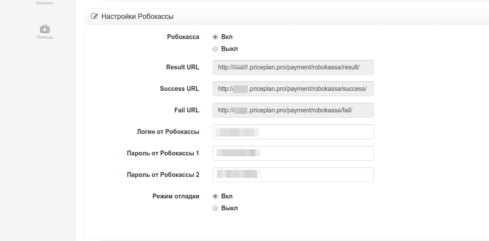
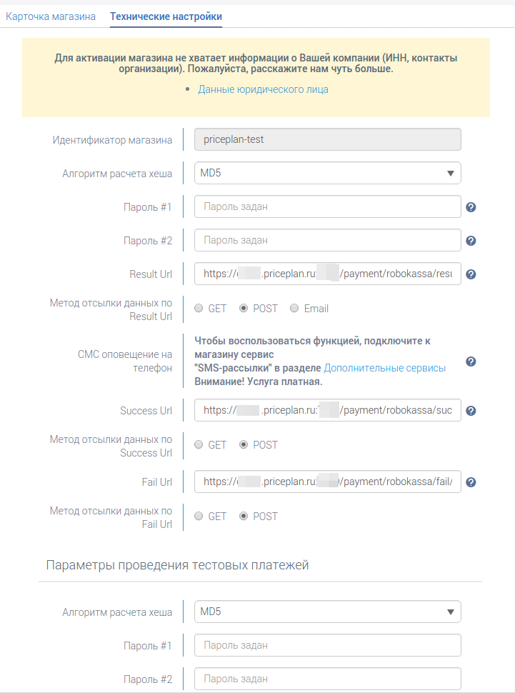

# Робокасса

Для тестирования интеграции Робокассы вам нужно иметь [аккаунт](https://partner.robokassa.ru/Reg/Register?culture=ru) в этой платежной системе, а так же настроить работу этой платежной системы в PricePlan. Так же, вам необходимо ознакомится с [документацией Робокассы](http://docs.robokassa.ru/), и [подключиться к сервису](http://www.robokassa.ru/ru/Contract.aspx)

Для настройки интеграции Робокассы с PricePlan, зайдите на страницу настроек биллинга. На этой странице вы найдете раздел `Настройки Робокассы`.

Заполните следующие поля:

* `Логин от Робокассы` - ваши уникальный `Идентификатор магазина` \(`MerchantLogin`\).
* `Пароль от Робокассы 1` - платежный пароль \#1.
* `Пароль от Робокассы 2` - платежный пароль \#2.

Включите `Режим отладки`.

Поля `Result URL`, `Success URL`, `Fail URL` будут сгенерированы автоматически.

После того, как вы настроите интеграцию Робокассы в PricePlan, необходимо правильно настроить интеграцию вашего магазина в Робокассе. Для этого зайдите в личный кабинет, выберите магазин и перейдите на вкладку `Технические настройки`, на которой расположена форма с настройками.

**Будьте внимательны при заполнении полей данной формы**. Заполните поля:

* `Идентификатор магазина` - уникальный идентификатор вашего магазина. 
* `Алгоритм расчета хеша` - MD5.
* `Result URL`, `Success URL` и `Fail URL` скопируйте значения из PricePlan.
* `Метод отсылки данных по Result Url`, `Метод отсылки данных по Success Url`, `Метод отсылки данных по Fail Url` - везде укажите POST.

Если вы только тестируете интеграцию с Робокассой, задайте пароли в форме `Параметры проведения тестовых платежей`, если же хотите перейти в рабочий режим, укажите пароли в основной форме. В любом случае платежный `Пароль #1`и `Пароль #2` должны совпадать с настройками в PricePlan.

После того, как вы полностью настроили интеграцию с Робокассой, можно приступать к тестированию приема платежей. Для этого пройдите в личный кабинет пользователя и пополните его баланс. Для этого рядом с балансом пользователя нажмите на кнопку "Пополнить баланс". Появится форма пополнения счета. Выставите счет. Если у вас подключено больше одной платежной системы, вы увидите форму выбора с выпадающим списком. Если вы подключили только Робокассу, вас автоматически перенаправит на страницу оплаты этой платежной системы. На ней вы увидите общую информацию о платеже и кнопку `Оплатить`. По клику на кнопке, вас должно отправить на страницу оплаты уже в платежной системе.

После успешной оплаты счета в Робокассе, вас должно перенаправить на страницу успешного платежа. Если в процессе оплаты произошла ошибка, вас перенаправит на страницу с сообщением об ошибке.

В случае успеха, счет клиента должен быть пополнен на размер оплаченной вами суммы.

