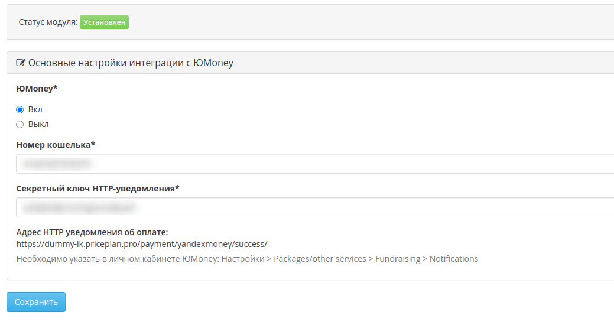

# ЮMoney
### Регистрация в «ЮMoney»
Если вы ещё этого не сделали, зарегистрируйте кошелек в означенном [сервисе](https://yoomoney.ru/)

### Установка параметров на странице настроек модуля

Данная операция не должна вызвать затруднений. Введите Номер кошелька и Секретный ключ.

После того, как вы полностью настроили интеграцию с ЮMoney, можно приступать к тестированию приема платежей. Для этого пройдите в личный кабинет пользователя и пополните его баланс. Для этого рядом с балансом пользователя нажмите на кнопку "Пополнить баланс". Появится форма пополнения счета. Выставите счет. Если у вас подключено больше одной платежной системы, вы увидите форму выбора с выпадающим списком. Если вы подключили только Робокассу, вас автоматически перенаправит на страницу оплаты этой платежной системы. На ней вы увидите общую информацию о платеже и кнопку `Оплатить`. По клику на кнопке, вас должно отправить на страницу оплаты уже в платежной системе.
