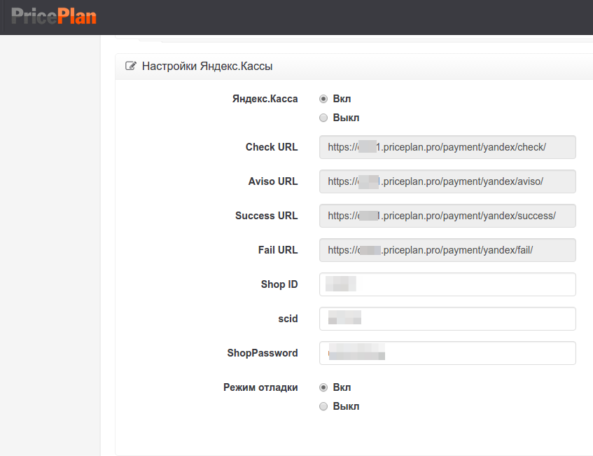
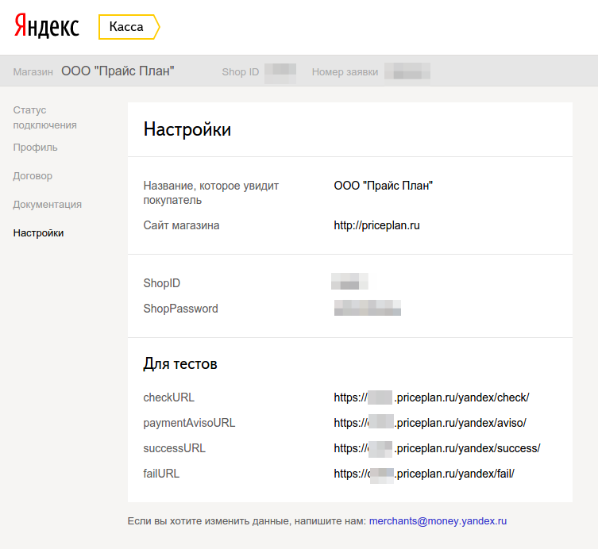

# Яндекс.Касса

## Новая версия \(API\)

### Регистрация в «Яндекс.Касса»

Если вы ещё этого не сделали, зарегистрируйтесь в означенном [сервисе](https://kassa.yandex.ru/)

Согласование параметров работы вашего проекта с «ЯК» потребует некоторого времени и усилий по ведению переписки. Как минимум, придётся заполнить и отправить по e-mail техническую анкету. Вам её предоставят сотрудники сервиса.

Целью данного бизнес-процесса выступает получение **shopId** и т.н. **секретного ключа**, которые в конечном итоге должны отобразиться в вашем ЛК «ЯК».

### Установка параметров на странице настроек модуля

Данная операция не должна вызвать затруднений.

## Старая версия \(HTTP\)

Для тестирования Яндекс Кассы вам нужно иметь [учетную запись](https://money.yandex.ru/joinups) в этой платежной системе, а так же настроить работу этой платежной системы в PricePlan. Так же вам необходимо ознакомится с [документацией](https://tech.yandex.ru/money/doc/dg/concepts/About-docpage/).

Для настройки интеграции Яндекс Кассы с PricePlan, зайдите на страницу [настроек биллинга](https://cust1.priceplan.ru:7889/account/). На этой странице вы найдете раздел `Настройки Яндекс.Кассы`. 

Активируйте данную платежную систему и заполните следующие поля:

* `Shop ID` - уникальный идентификатор вашего магазина.
* `scid` - номер витрины.
* `ShopPassword` - пароль для верификации платежей.
* `Режим отладки`.

После того, как вы настроите интеграцию Яндекс Кассы в PricePlan, необходимо правильно настроить интеграцию вашего магазина в Яндекс Кассе. Для этого зайдите в [личный кабинет](https://money.yandex.ru/my) во вкладку `Статус подключения` и настройте интеграцию по HTTP-протоколу:

* Скопируйте `checkURL`, `avisoURL`, `successURL`, `failURL` из настроек PricePlan.
* Установите галочку `Я буду проводить тестовые платежи`.
* Аналогично скопируйте `checkURL`, `avisoURL`, `successURL`, `failURL` из настроек PricePlan, как вы это уже сделали в первом пункте.
* Укажите `Email для отправки реестров`.
* Заполните `ShopPassword` - он должен совпадать с тем паролем, который вы указали в PricePlan.

После успешного заполнения формы, ваш запрос будет отправлен на модерацию Яндексом. После чего, через некоторое время, вам будет выслано почтовое уведомление с параметрами тестового режима. **Внимательно ознакомьтесь с ним.** `scid`, указанный вами в форме настроек PricePlan, может не совпадать с вашим текущим `scid`, указанным в личном кабинете. Для тестирования используйте `scid` высланый вам в письме.

После того, как вы полностью настроили интеграцию с Яндекс Кассой, можно приступать к тестированию приема платежей. Для этого пройдите в личный кабинет пользователя и пополните его баланс. Для этого рядом с балансом пользователя нажмите на кнопку "Пополнить баланс". Появится форма пополнения счета. Выставите счет. Если у вас подключено больше одной платежной системы, вы увидите форму выбора с выпадающим списком. Если вы подключили только Робокассу, вас автоматически перенаправит на страницу оплаты этой платежной системы. На ней вы увидите общую информацию о платеже и кнопку `Оплатить`. По клику на кнопке, вас должно отправить на страницу оплаты уже в платежной системе.

