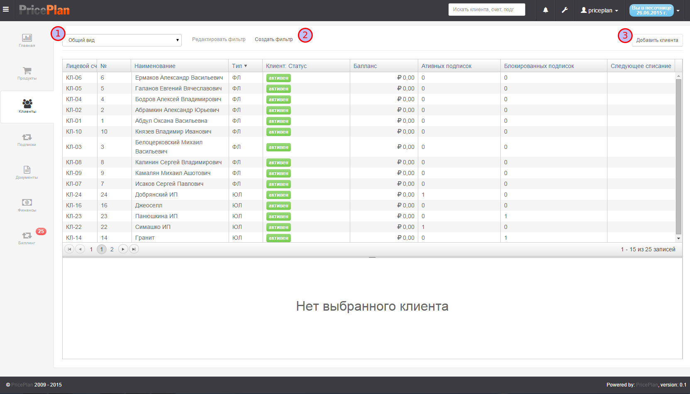
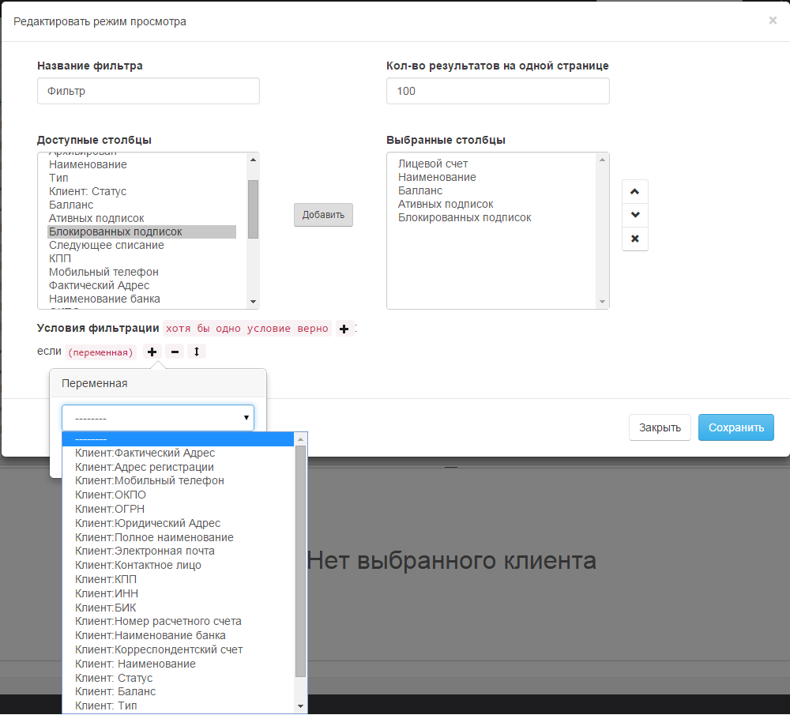
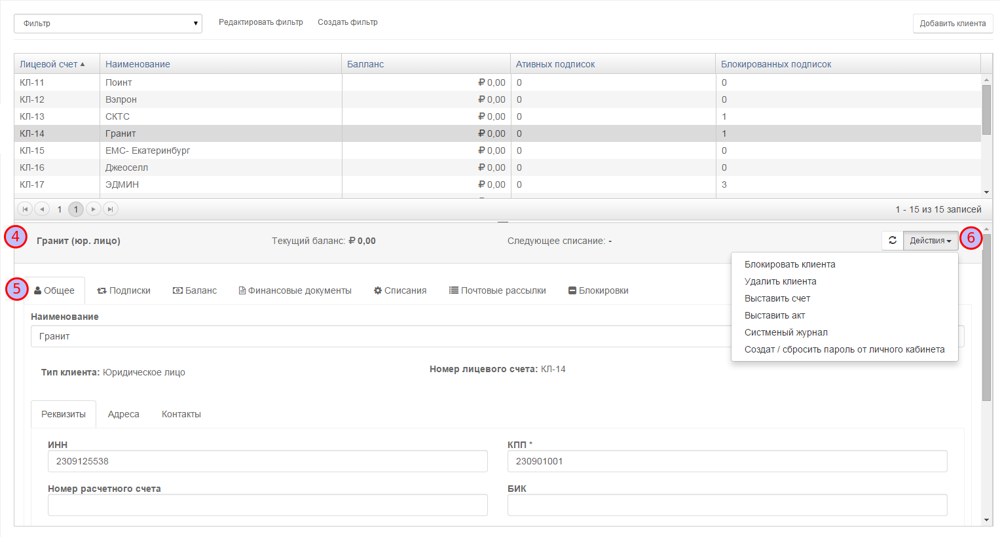
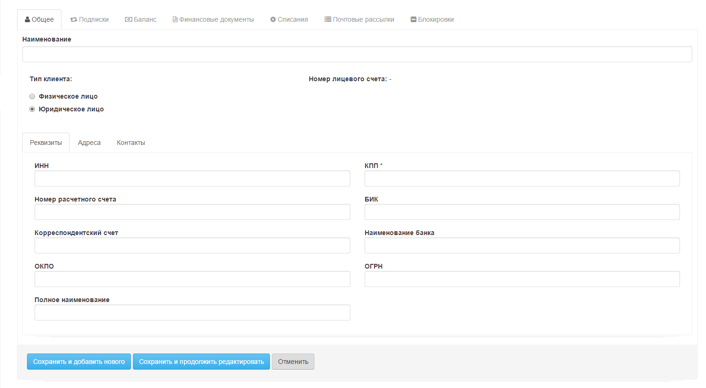

# Клиенты  

На вкладке клиенты расположен список клиентов Рис.1.  
  

 выбор фильтра  
 кнопка создания/редактирования фильтра  
 кнопка добавления клиента

## Фильтр  
Фильтры позволяют выводить список клиентов в соответствии с условиями задаваемыми фильтром. Для создания или редактирования фильтра необходимо нажать соответствующую кнопку , после чего, в открывшемся диалоге создать или отредактировать фильтр Рис.2  

  

## Просмотр информации о клиенте  
Для просмотра информации о клиенте необходимо выбрать клиента нажав на соответствующую строку. После этого в нижнем окне появится информация о клиента Рис.3

  

Верхняя срока  содержит общую информацию о клиенте. Ниже расположены вкладки , на каждой из которых представлена подробная информация о клиенте.
  
* **Общее** содержит информацию из карточки клиента  
* **Подписки** содержит информацию о продуктах на которые подписан клиент, а такде предоставляет возможность добавить или отредактировать подписку  
* **Баланс** содержит информацию о всех действиях производимых с балансом клиента  
* **Финансовые документы** содержит список всех финансовых документов которые система сформировала для данного клиента  
* **Списание** содержит список всех списаний которые были проведены или запланированы, в рамках активных подписок  
* **Почтовые рассылки** содержит список всех уведомлений отправленных клиенту  
* **Блокировки** содержит список блокировок которые применялись к клиенту или подписке  

Кнопка Действие  открывает меню со списком действий которые может выполнить оператор системы в ручном режиме.

## Добавление нового клиента  
Для добавления нового клиента необходимо нажать кнопку Добавить клиента  после чего откроется диалог добавления клиента Рис.4

  

После заполнения полей карточки клиента ее необходимо сохранить.

