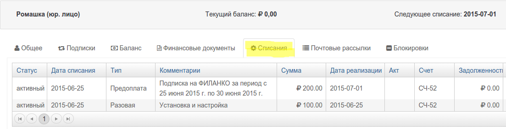

# Кредитный конторль

## Когда возникает задолженность

Задолженность в PricePlan возникает при наличии неоплаченных реализаций \(неоплаченных списаний с просроченной датой реализации\). Соответственно, если вы активировали подписку на услугу с 100% предоплатой, то задолженность возникнет в начале периода подписки. Услуга будет считаться оказанной в конце периода.

При возникновении задолженности, баланс лицевого счета уменьшится на сумму списания.

Баланс клиента рассчитывается как сумма всех списаний с задолженностью минус остаток на балансе.

В примере \(1\) показаны два списания за первый период подписки с 100% предоплатой.

* 26.06 в списании `Установка и настройка` будет отображена задолженность в 100 руб., а баланс клиента станет отрицательным \(-100.00\)
* 01.07 в списании  `ФИЛАНКО` будет отображена задолженность в 1000 руб., а баланс клиента станет -1100.00.

## Настройка правил кредитного контроля

В PricePlan кредитный лимит настраивается с помощью правил и блокировок. Это позволяет настроить кредитную политику на уровне организации, каналов продаж или индивидуального клиента.

**Пример 1.** В самом простом случае кредитного контроля на закрытие дня клиента, необходимо создать 2 правила:

1. `Если` баланс клиента ниже \[ваш кредитный лимит\], `то` установить блокировку "Превышен кредитный лимит".
2. `Если` баланс клиента выше \[ваш кредитный лимит\], `то` снять блокировку "Превышен кредитный лимит".

Таким образом, оказание услуг будет приостановлено при превышении кредитного лимита. Этим же способом возможно также запретить создание новых списаний при превышении кредитного лимита.

**Пример 2.** Если стоит задача уменьшить дебиторскую задолженность 1. Создавать продукты только с 100% предоплатой 2. Создать правило, запрещающее продлевать подписку в кредит \(при недостатке средств на балансе\) 3. Установить блокировку услуг при отрицательном балансе.

