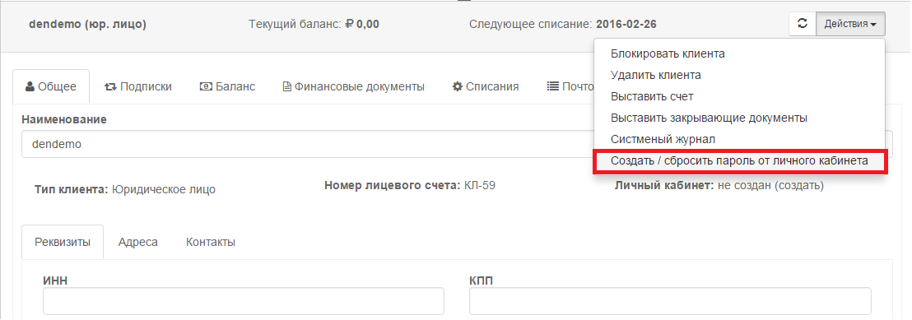
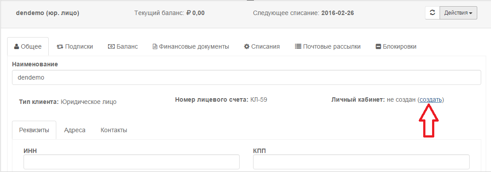
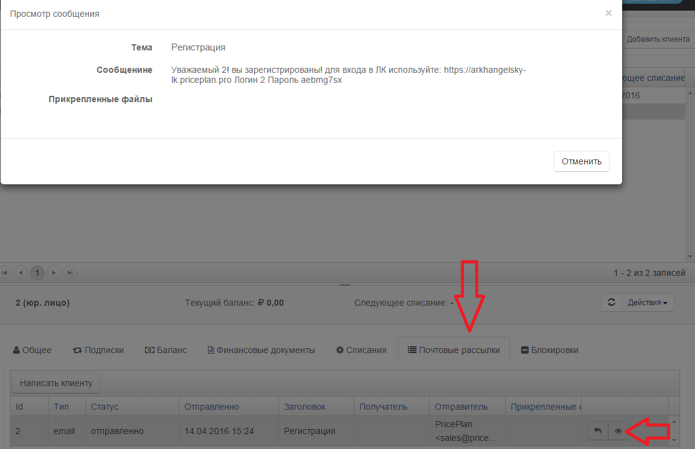
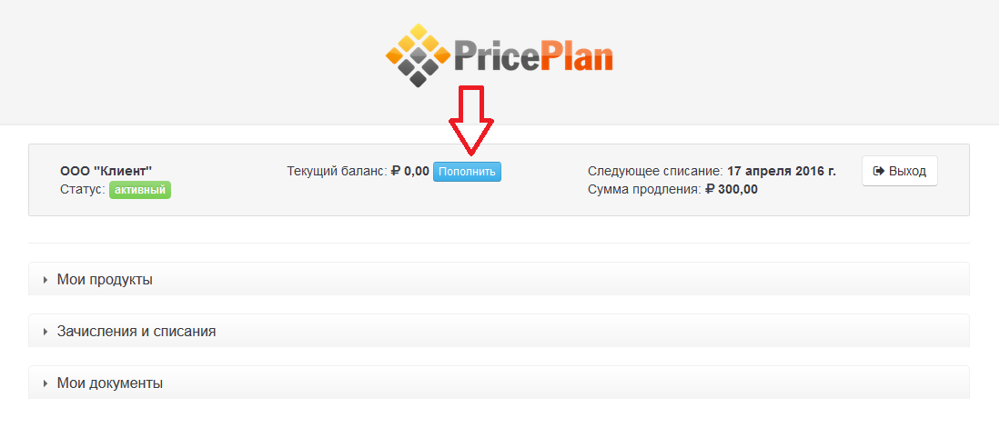
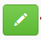
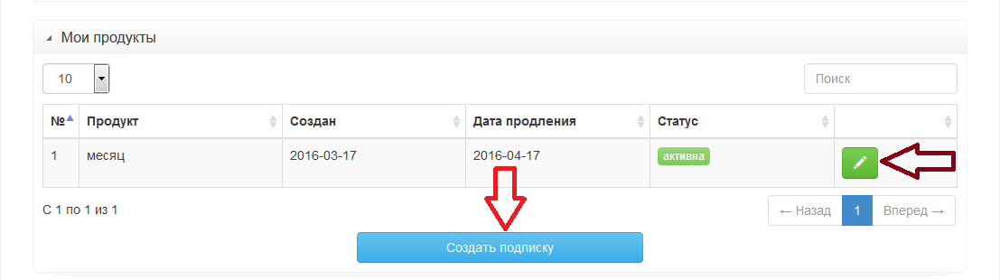
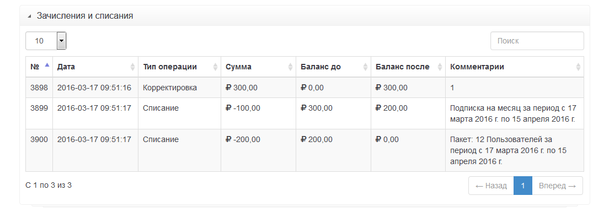
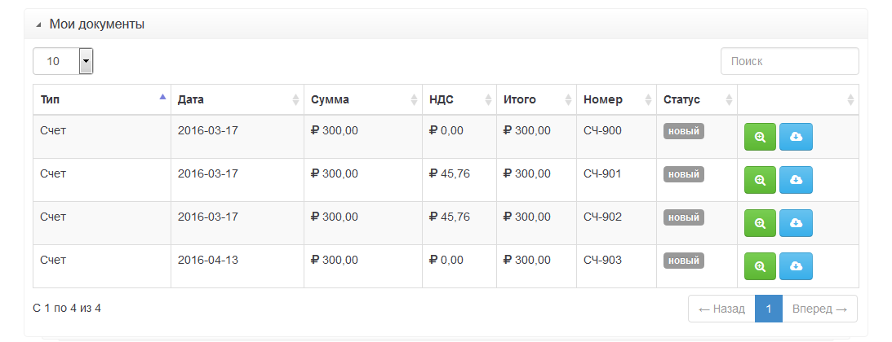

# Личный кабинет клиента
Сервис PricePlan предоставляет возможность использовать стандартный личный кабинет клиента (ЛК). Создание личного кабинета для каждого клиента может производиться несколькими способами:

1  нажать кнопку "Создать/Сбросить пароль от личного кабинета" во вкладке клиенты

2 нажать на ссулку "создать"  

3  создать правила в меню "настройки" -> "правила"

*Важно! Для создания личного кабинета на вкладке контакты должен быть указан адрес электронной почты клиента*   

Просле создания личного кабинета клиенту будет отправлена ссылка для входа в личный кабинет, логин и пароль (логин и проль создаются системой автоматически).
Узнать пароль от ЛК можно открыв отправленное письмо во вкладке "Почтовые рассылки". Также на этой вкладке можно увидеть статус письма.

*Шаблон письма может быть предварительно настроен настройки->шаблоны документов*  

Личный кабинет состоит из четырех блоков:

* Общая информация. Содержит: имя клиента, текущий баланс, дату и сумму следующего списания. Также в данном блоке располагается кнопка "пополнить" позволяющая либо самостоятельно выставить счет на пополнение баланса, либо произвести пополнение баланса чрез платежную систему.

* Мои продукты. Содержит информацию о подписках клиента. Кнопка "Создать подписку" позволяет клиенту самостоятельно оформить подписку на продукт. Кнопка редактировать подписку позволяет клиенту самостоятельно редактировать подписку.

* Зачисления и списания. Содержит информацию о списаниях/зачислениях денежных средств на баланс клиента

* Мои документы. Содержит список всех документов, которые выставлялись клиенту. При этом клиент может просмотреть документ , или скачать его в формате pdf 

 

