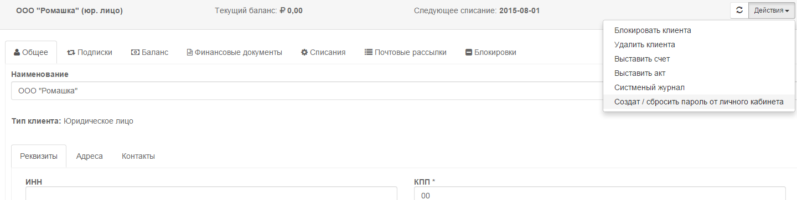
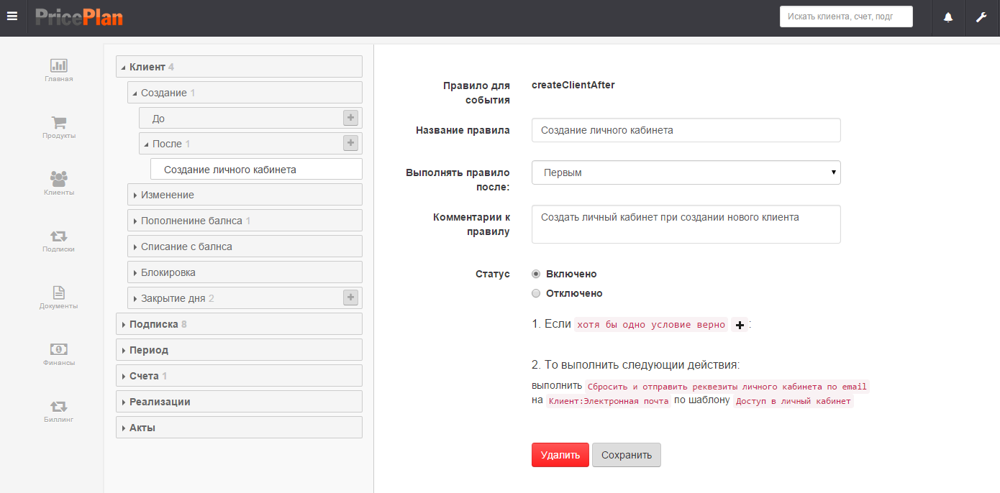
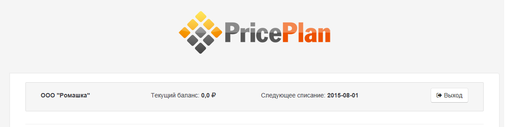
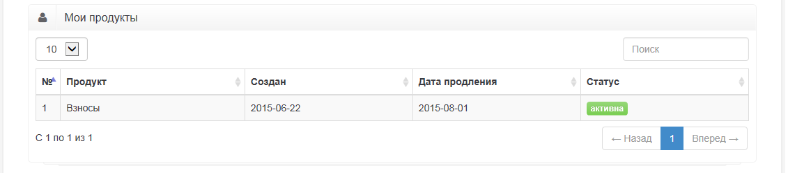
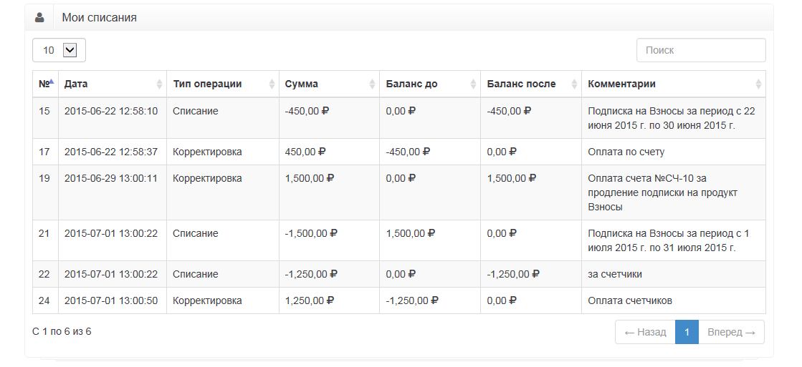
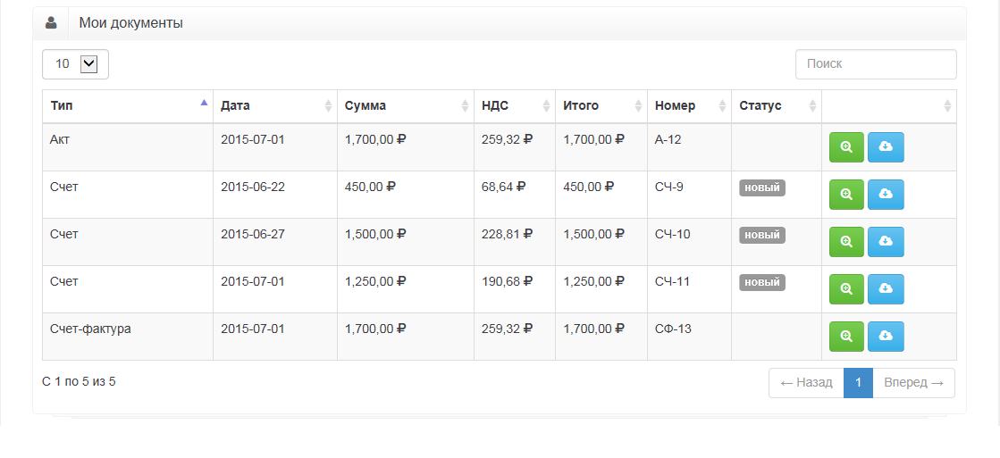

# Личный кабинет клиента
Сервис PricePlan позволяет создавать личный кабинет пользователя. Создание личного кабинета может производиться двумя способами:
*  нажатием кнопки "Создать/Сбросить пароль от личного кабинета" во вкладке клиенты

*  созданием правила в меню "настройки" -> "правила"

Личный кабинет состоит из четырех блоков:

* Общая информация. Содержит имя клиента, текущий баланс и дату следующего списания

* Мои продукты. Содержит информацию о подписках клиента

* Мои списания. Содержит информацию о списаниях/зачислениях денежных средств на баланс клиента

* Мои документы. Содержит список всех документов которые выставлялись клиенту

После создания личного кабинета, клиенту на почту отправляется логин и пароль. Обратите внимание,в том случае, если у клиента не заполнено поле "электронная почта" логин и пароль от личного кабинета не будет созданы. 

***ВАЖНО! В целях безопастности оператор системы не обладает информацией о логине и пароле клиента. В случае если клиент утратил логин или пароль, оператор может повторно создать их используя команду "Создать/Сбросить пароль от личного кабинета".***
 

