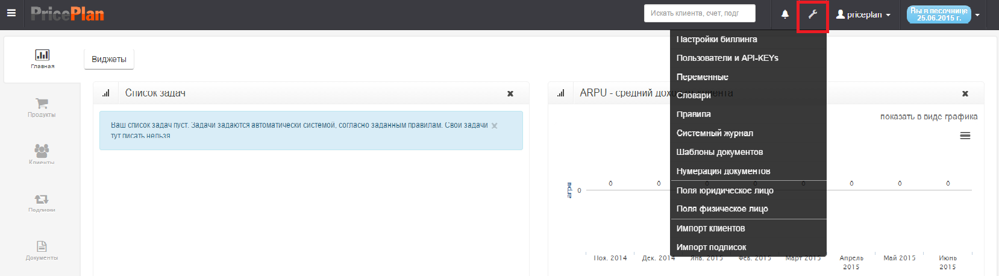

# Настройки системы

Все операции по настройке системы PricePlan выполняются в меню "Настройки". Рис.1   
Далее необходимо выбрать один из пунктов меню.

Обучающий ролик:[ Настройки системы PricePlan \(YouTube\)](https://youtu.be/bPIyBMCtA3c)

