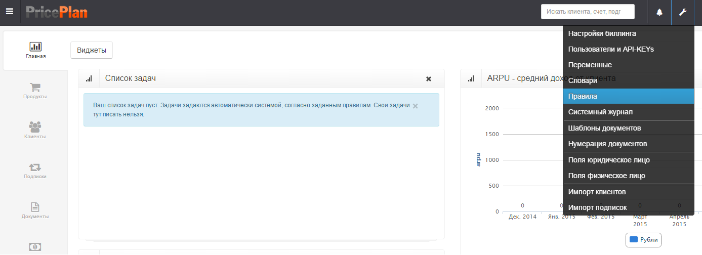
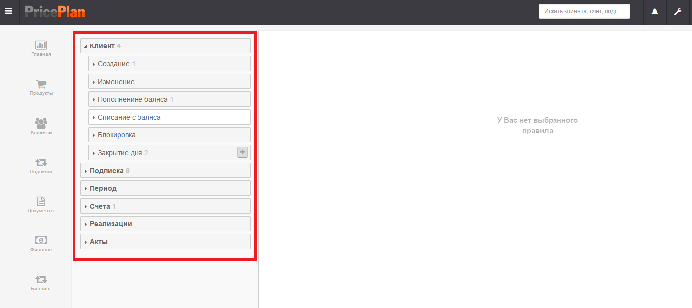
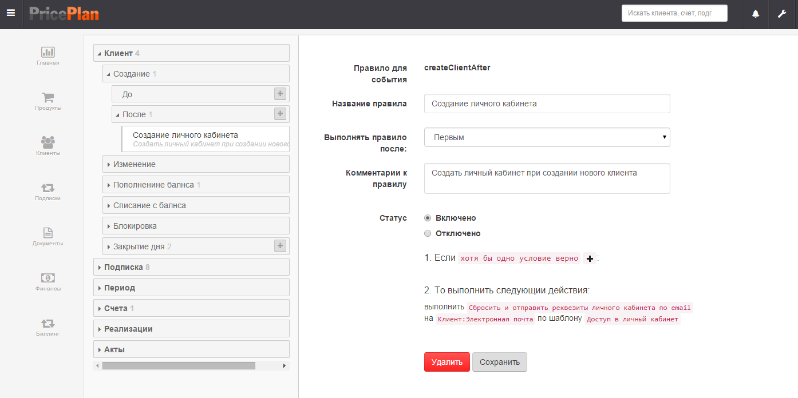
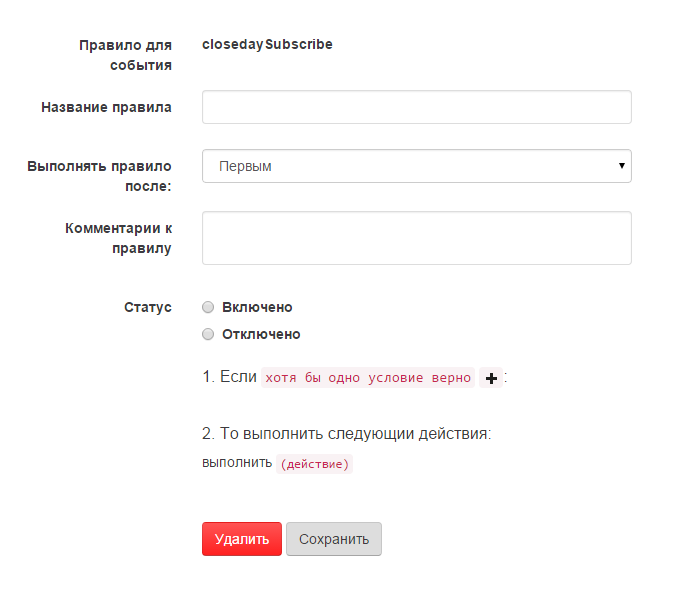
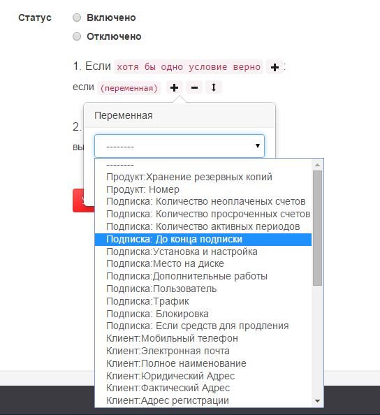
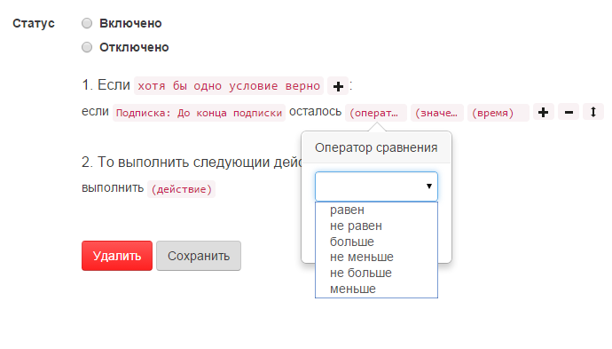
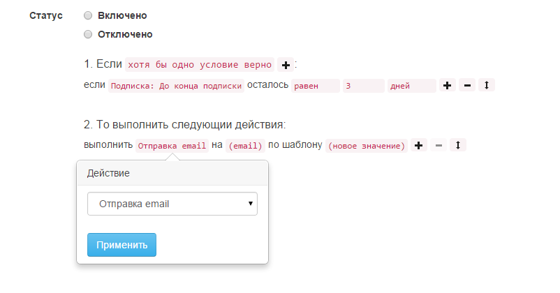
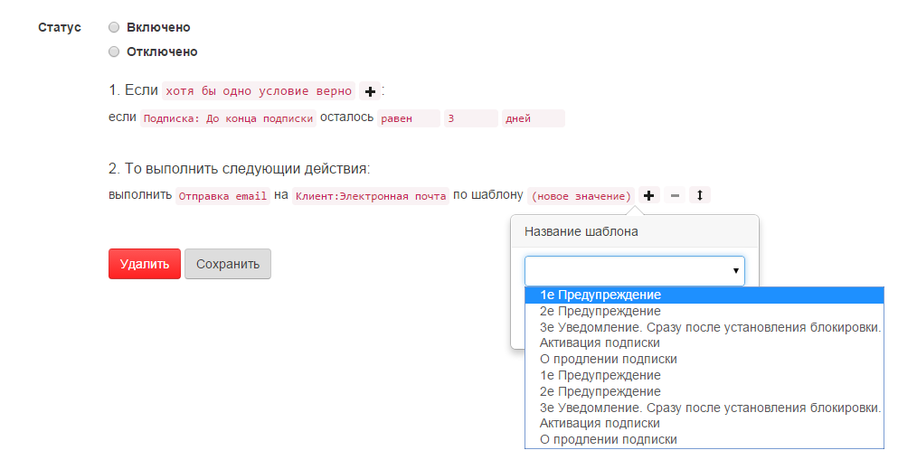

# Бизнес правила

Логика работы системы определяется настройками «Правил». В "Правилах" описывается какие действия, когда система должна выполнять. Все правила привязаны к определенным событиям.

## Интерфейс меню создания правил

Для входя в интерфейс настройки правил, необходимо войти в меню настроек и выбрать пункт «Правила». Рис.1 

## Описание интерфейса

Интерфейс меню создания правил разбит на два окна: в левом окне отображаются направления событий. Вкладка направление события – может быть раскрыта, после чего появится перечень событий, относящихся к данному направлению. \(Рис. 2\). 

В правом окне отображается диалоговое меню создания правила либо уже созданное правило. Для создания правила, необходимо выбрать событие, нажать кнопку «+» рядом с событием \(рис. 3\). 

## События

Правила в системе могут создаваться для следующих направлений событий:

* **Клиент** – события связанные с клиентом;
* **Подписка** – события связанные с подпиской;
* **Период** – события связанные с периодом подписки;
* **Счета** – события связанные со счетами;
* **Реализации** – списание средств со счета клиента;
* **Акты** – события связанные с Актами.

Список всех предусмотренных в системе событий

#### Клиент

> _**Создание**_ - Создание клиента  
> _**Изменение**_ - Изменение кагого-либо поля в карточке клиента  
> _**Пополнение баланса**_ - Поступление средств на баланс клиента  
> _**Списание с баланса**_ - Списание средств с баланса клиента  
> _**Блокировка**_ - Блокировка клиента  
> _**Закрытие дня**_ - Расчет списаний за оказанные услуги

#### Подписка

> _**Создание**_ - Создание подписки для клиента  
> _**Изменение**_ - Изменение какого-либо параметра подписки  
> _**Продление**_ - Продление подписки  
> _**Блокировка**_ - Блокировка подписки  
> _**Удаление**_ - Удаление подписки  
> _**Счетчики**_ - Действие со счетчиком, в случае ,если он используется  
> _**Закрытие дня**_ - Расчет списаний за оказанные услуги

#### Период

> _**Продление**_ - Продление периода

#### Счета

> _**Выставление**_ - Формирование счета за оказанные услуги или счета на предоплату

#### Реализации

> _**Выставление**_ - Списание средств с баланса клиента

#### Акты

> _**Выставление**_ - Формирование Акта за оказанные услуги

Для событий могут быть предусмотрены варианты действий «До» и «После» события. При наступлении события А, система проверяет наличие правил в категории «До», если такие правила есть, то они выполняются.  
После выполнения правил в категории «До», выполняется само событие. Затем система проверяет наличие правил в категории «После» и выполняет эти правила.

## Диалоговое меню создания правил

Диалоговое меню создание правил имеет вид указанный на рис.4. 

### Описание полей:

**Правило для события** – системное название события, для которого устанавливается правило;  
**Название правила** – поле, в котором пользователь в произвольной форме, создает название правила;  
**Выполнять правило после** – поле, которое определяет порядок выполнения правил для одного события;  
**Комментарии к правилу** – поле комментариев;  
**Статус** – переключатель включения/выключения правил;

Условия:  
1. Если хотя бы одно условие верно/все условия верны – логический оператор, определяющий применение условий пиктограмма «+», добавляет условия;  
2.После оператора «если», может быть установлено одно или несколько условий, то можно выполнить следующие действия:  
«выполнить» - после оператора "выполнить" применяется одна из команд.

## Создание правил

Для создания правил, применяется конструкция типа «если -….. выполнить- ….»  
В диалоге «если» указываются переменные \(рис.5\), определяющие условия, при которых будет задействована команда «выполнить». В диалоге выбора переменных используются как системные переменные, так и переменные созданные пользователем.  

В зависимости от выбранной переменной, система может потребовать установку логических операторов и/или каких-либо значений. \(Рис. 6\).  

В диалоге выбора условий можно не устанавливать какое-либо значение. В этом случае команда "выполнить" будет применена во всех случаях, когда произошло указанное событие.

После выбора условий, необходимо выбрать действие, которое будет выполняться, при наступлении указанных условий \(Рис. 7\).  

В общем случае, после выбора действия, необходимо указать дополнительные параметры. \(Рис.8\).  

## Описание выполняемых действий

> _**Отмена операции**_ - отменяет все действия примененные к этому событию  
> _**Удалить текущую подписку**_ - удаляет текущую подписку в соответствии с заданными условиями  
> _**Отправка email**_ - отправляет сообщение по электронной почте. Сообщение должно быть заранее создано в шаблонах сообщения. Адрес отправки является переменной  
> _**Отправка sms**_ - отправляет смс. Номер, на который отправляется смс, является переменной. Предварительно должен быть создан шаблон смс  
> _**Изменение значения клиента**_ - изменяет значение переменной \(поля\), относящегося к карточке клиента  
> _**Изменение значения подписки**_ - изменяет значение переменной \(поля\), относящейся к карточке подписки  
> _**Продлить подписку**_ - продлевает подписку на следующий период  
> _**Продлить все подписки**_ - продлевает все подписки на следующий период  
> _**Выставить счет за все неоплаченные списания на время события**_ - производит расчет всех списаний со счета абонента на указанную дату и формирует счет на оплату  
> _**Отправить счет**_ - отправляет выставленный счет по электронной почте. Адрес почты заявляется переменной. Предварительно должен быть создан шаблон электронного сообщения  
> _**Отправить акт**_ - отправляет выставленный акт по электронной почте. Адрес почты заявляется переменной. Предварительно должен быть создан шаблон электронного сообщения  
> _**Отправить счет-фактуру**_ - отправляет выставленный счет-фактуру по электронной почте. Адрес почты заявляется переменной. Предварительно должен быть создан шаблон электронного сообщения  
> _**Выставить счет-фактуру**_ - формирует счет-фактуру за прошедший период  
> _**Рассчитать реализацию**_ - производит расчет всех списаний с абонентских счетов за услуги  
> _**Отправить TODO**_ - отправляет внутренне сообщение в системе. Отправка производится либо указанному пользователю, либо в качестве получателя выбирается значение переменной. Предварительно должен быть создан шаблон сообщения  
> _**Сместить период**_ - производит сдвиг начала и конца периода на указанное количество дней  
> _**Продлить период**_ - продлевает период на указанное количество дней  
> _**Блокировка клиента**_ - устанавливает блокировку определенного типа для клиента. Все услуги, на которые подписан клиент, приостанавливаются  
> _**Снятие блокировки с клиента**_ - снимает блокировку указанного типа с клиента  
> _**Снятие блокировки со всех подписок**_ - снимает блокировку определенного типа со всех подписок  
> _**Блокировка подписки**_ - устанавливает блокировку определенного типа на подписку  
> _**Снятие блокировки с подписки**_ - снимает блокировку определенного типа с подписки  
> _**Рассчитать и применить установку/снятие блокировок**_ - проверяет установку или снятие блокировок, сделанных в ручную  
> _**Рассчитать дневную реализацию**_ - производит расчет всех списаний с абонентских счетов за день  
> _**Выставить акт**_ - формирует акт за прошедший период  
> _**Выставить акт и счет фактуру**_ - формирует акт и счет-фактуру за прошедший период  
> _**Отправить акт и счет фактуру**_ - отправляет выставленный акт и счет-фактуру по электронной почте. Адрес почты является переменной. Предварительно должен быть создан шаблон электронного сообщения  
> _**Произвести списание по счетчику**_ - производит учет всех услуг оказанных по счетчикам. Необходимо выбрать счетчик \(переменную\)  
> _**Рассчитать списания за следующий период**_ - производит расчет списаний за следующий период  
> _**Отправить web hook**_ - передает информацию стороннему программному обеспечению с помощью HttpPOST запроса  
> _**Сбросить и отправить реквизиты личного кабинета по email**_ – отправляет логин и пароль от личного кабинета клиенту на указанный адрес электронной почты. Ранее установленные пароль и логин сбрасываются. Адрес почты является переменной. Предварительно должен быть создан шаблон электронного сообщения

