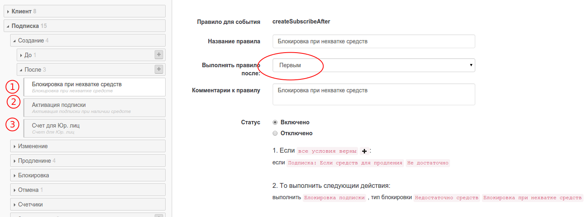
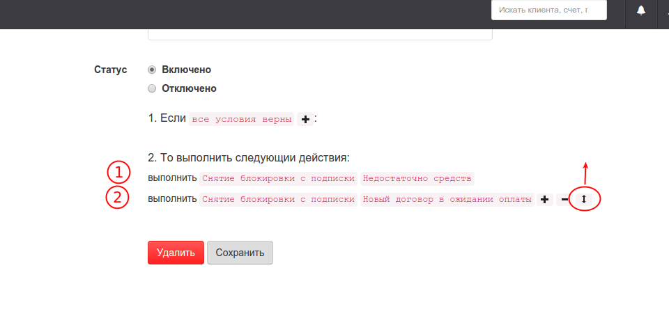

# Порядок выполнения правил

## Порядок выполнения правил.

Все правила в PricePlan выполняются по очередности. Задать очередность выполнения правила можно в поле "Выполнять правило после:"

Действия внутри правила выполняются в порядке их создания. Изменить порядок выполнения правил можно нажав на стрелочку, слева от действия.

## Многоуровневые триггеры

\[TODO\]

## Транзакции.

\[TODO\]

