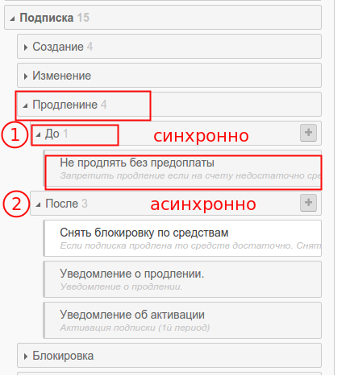

# Когда срабатывают триггеры на события

В PricePlan как в и любой информационной системе постоянно происходят различные события. Модуль бизнес правил дает возможность отслеживать "интересные" с точки зрения биллинга события и добавлять к ним бизнес-логику в форме правил.

Для большиства событий существует два триггера: `ПЕРЕД` и `ПОСЛЕ`

Триггер `ПЕРЕД` срабатывает синхронно, перед наступлением события. Его удобно использовать для валидации данных и отмены события. Хорошим примером будет отмена продления подписки, если на балансе лицевого счета клиента недостаточно средств.

Триггер `ПОСЛЕ` работает асинхронно. Это значит, что все действия в правилах такого триггера будут поставлены в очередь на выполнение.

В любом триггере можно создавать любое количество правил. Порядок их выполнения описан в [предыдущем разделе](poryadok_vipolneniya_pravil.md).

## Особое событие: "Закрытие дня"

В PricePlan ecть два специальных события, которые происходят каждый день в определенное время. Эти события позволяют автоматизировать операции пакетного биллинга то есть выполнять правила без команды оператора или вызова API.

* `Клиент: Закрытие дня`
* `Подписка: Закрытие дня`

Разделение события "Закрытие дня" на два уровня дает возможность биллингу обрабатывать любое количество подписок для каждого клиента клиента по разным правилам.

К сведению администратора: Обработка правил - технически "дорогая" операция. Чем больше правил вы создадите тем меднение будет происходить закрытие дня. Особенно это будет заметно на больом количестве клиентов с фиксированной расчетной датой \(в этом случае вся нагрузка ляжет на биллинг в один день месяца.

