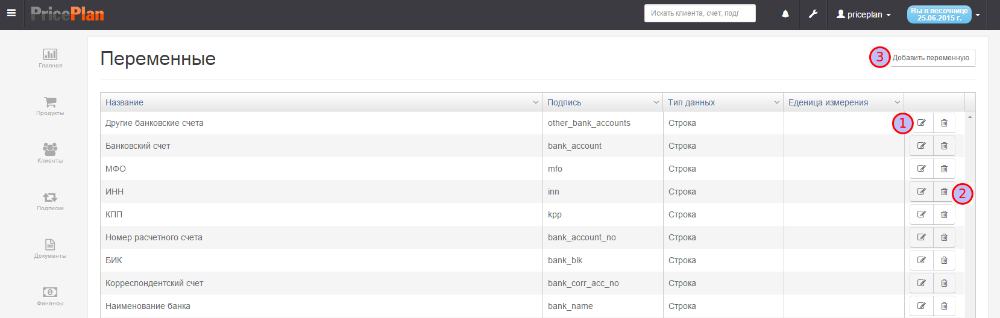
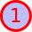
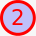
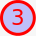
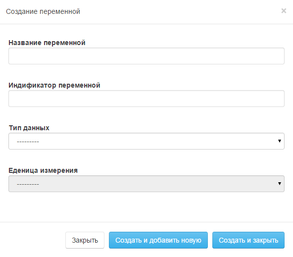

# Переменные

В системе PricePlan есть два основных типа полей: системные поля - т.е. поля удалить, изменить, которые пользователь не может, и кастомные поля, которые может создавать и изменять пользователь. Раздел переменные содержит список кастомных полей, а также предоставляет интерфейс создания новых полей и редактирования уже созданных.

> Редактирование и удаление созданных полей, возможно только в том случае, если они не используются в каких-либо объектах системы \(Клиентах и Продуктах\).

Для входя в раздел "Переменные", необходимо в меню настройки выбрать пункт "Переменные". В открывшемся интерфейсе, представлен список всех созданных полей и их описание Рис.1.

 Пиктограмма редактирования переменной Рис.2  
 Пиктограмма удаления переменной  
 Создание новой переменной

Для создания/редактирования переменной предусмотрен специальный диалог Рис.2. 

**Наименование** - название переменной, которое будет отображаться в системе  
**Идентификатор переменной** - системное обозначение переменной. _ВАЖНО! системное название уникально для каждой переменной и не может повторяться_  
**Тип данных** - выбирается формат поля.  
**Единица измерения** - выбирается единица измерения. Поле обязательно для заполнения для некоторых типов данных. Единицы измерения могут быть дополнены пользователем.

