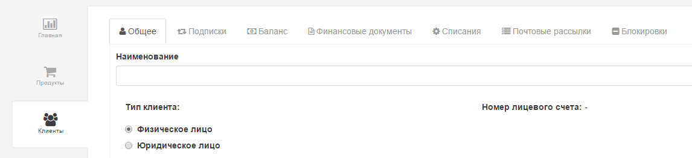
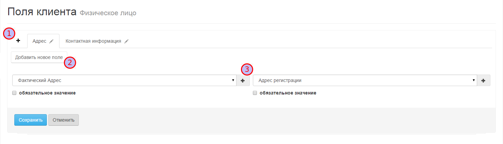
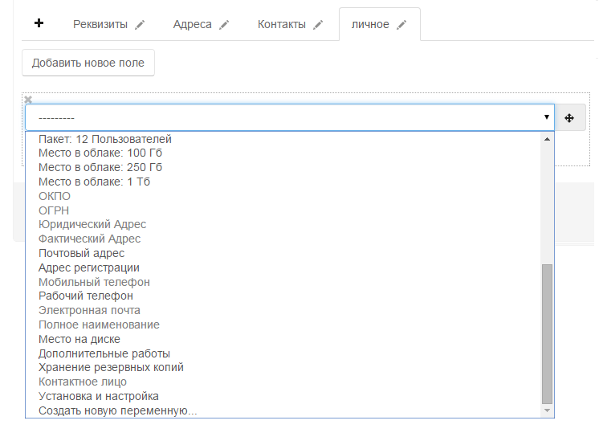

# Поля физическое лицо

Система PricePlan предоставляет возможность, настроить карточку клиента. Отдельно настраиваются карточки для юридических и физических лиц. Для каждого из типов клиентов предусмотрен набор обязательных полей изменение, которых невозможно, это - "Наименование", "Номер лицевого счета", "Тип клиента" \(Рис.1\).

Все остальные поля карточки клиента могут быть настроены пользователем. Для этого необходимо в меню "Настройки", выбрать пункт "Поля физическое лицо". После этого откроется диалог настройки полей Рис.2.

 добавление новой вкладки  
 добавление нового поля  
 перемещение поля по вкладке

Поля в карточке могут быть обязательными к заполнению и не обязательными. Для того, чтобы сделать поле обязательным, необходимо поставить отметку в соответствующем чекбоксе. Для добавления вкладки, необходимо нажать на "+", после чего в открывшемся диалоге ввести название вкладки. Для добавления поля, необходимо нажать на кнопку "Добавить новое поле", после чего новое поле появится на вкладке. Далее необходимо выбрать переменную для добавленного поля Рис.3.

После того, как карточка клиента создана/отредактирована, ее необходимо сохранить.

