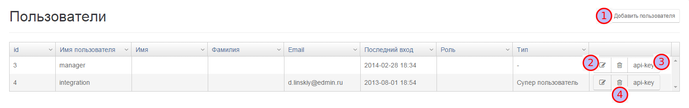

# Пользователи и API-KEYs

Меню настройки "Пользователей" и "API-KEYs" позволяет добавить пользователя к системе, определить права пользователя и создать API-KEY для доступа из стороннего программного обеспечения.  
Для входа в меню, необходимо выбрать соответствующую вкладку Рис.1.  

В открывшемся меню, можно создавать, удалять и редактировать пользователей Рис. 2.

 Добавление нового пользователя

 Редактирование пользователя

 Генерация API-KEY

 Удаление пользователя

## Добавить пользователя

Диалог добавления нового пользователя позволяет создать пользователя/оператора системы Рис. 3.

После заполнения полей, необходимо сохранить нового пользователя. Обратите внимание, поля отмеченные "\*" являются обязательными.

## Редактирование пользователя

Редактирование пользователя происходит в диалоге представленном на Рис.3.

## API-KEY

API-KEY используется для авторизации при доступе через API из сторонних приложений. После нажатия кнопки "API-KEY" открывается диалоговое окно генерации API-KEY Рис.4.

Пример.

> Авторизации с помощью API-KEY используется при интеграции с 1С. Обмен данными осуществляется через пользователя "integration", после генерации API-KEY он указывается в интерфейсе модуля интеграции Рис.5  
> 

## Удаление пользователя

Команда "удаление пользователя" удаляет пользователя из системы.

