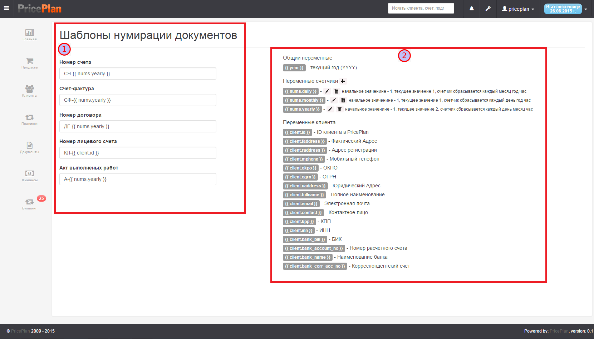
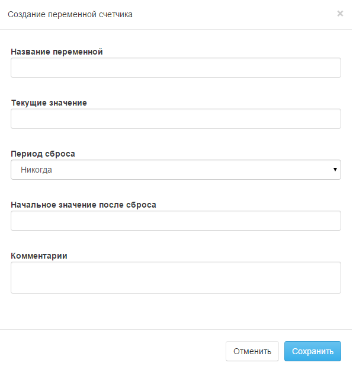
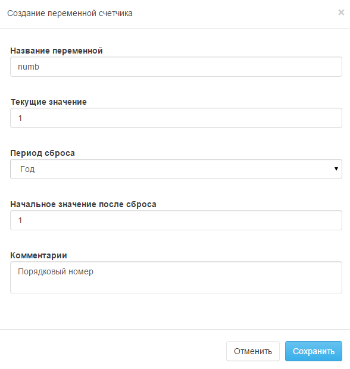
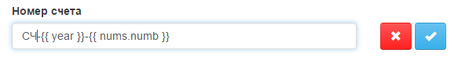

# Настройки нумерации документов

Система PraicPlan позволяет создавать правила нумерации документов. Для создания правил необходимо в меню Настройки выбрать пункт Нумерация документов. Диалог настройки нумерации представлен на Рис.1  

  

В левой части  отображаются типы документов для которых можно создать шаблон номера и сам шаблон. В правой  - отображается список переменных которые могут быть использованы для шаблона номера.  
Пользователи могут добавить свою переменную в раздел "Переменные счетчики", для этого необходимо нажать "+". После чего откроется диалог создания новой переменной Рис.2  

  

Пример
> Мы хотим создать шаблон для нумерации счетов следующего вида: Буквенный префикс СЧ - год - порядковый номер начиная с 1. При этом необходимо чтобы при наступлении следующего года порядковый номер снова начинался с 1.  
> Для этого создадим переменную  "порядковый номер" Рис.3
> 
>   
> После этого необходимо в разделе "Номер счета" создать шаблон Рис.4  
> 
>   

