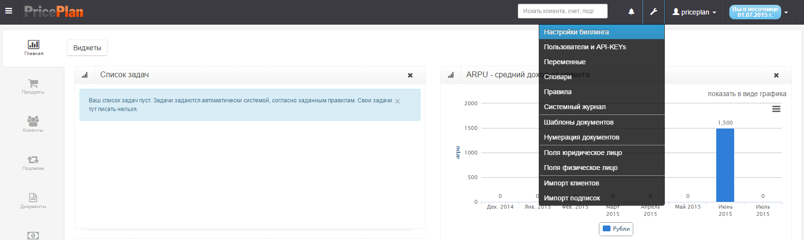
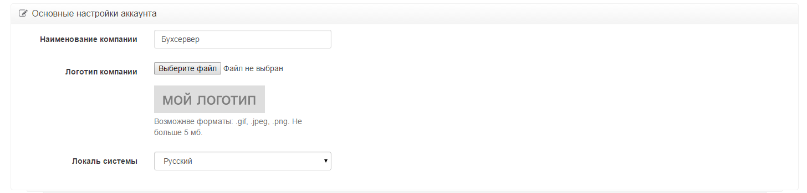
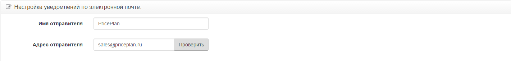
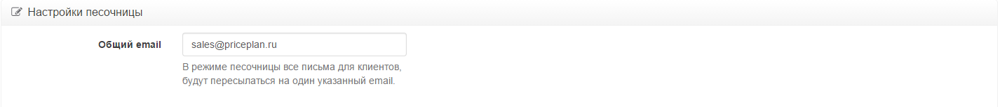
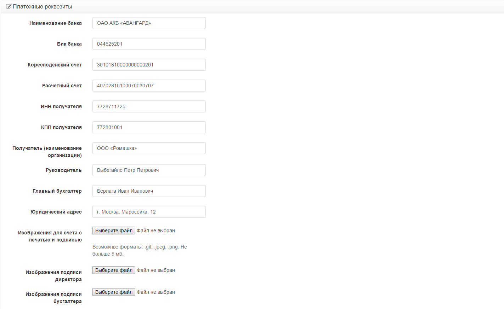
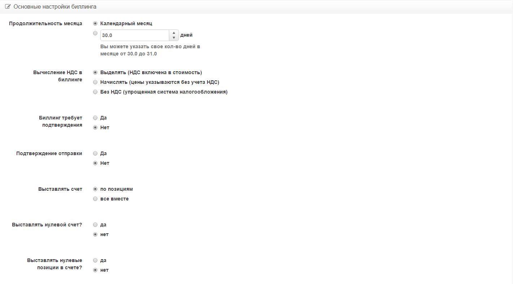
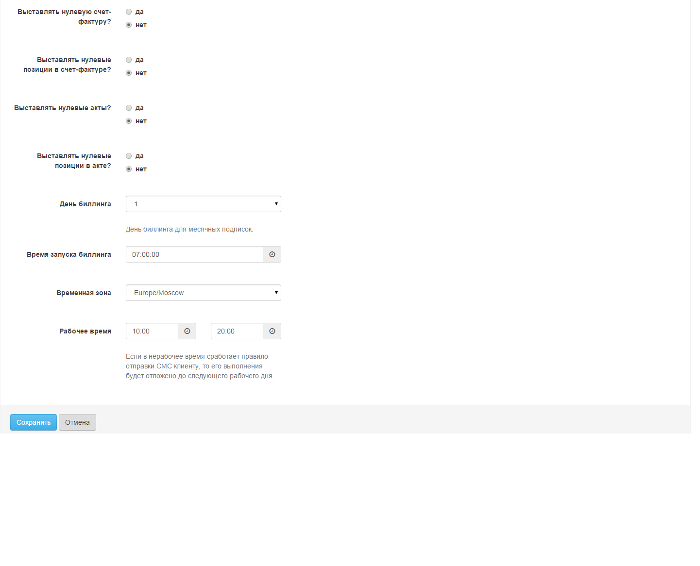
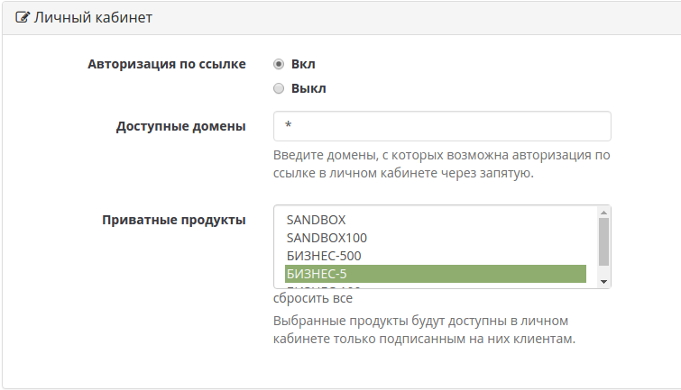
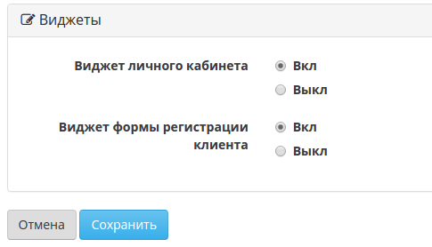

# Общие настройки биллинга

Для перехода в меню настройки биллинга, необходимо в меню настроек выбрать пункт "Настройка биллинга" Рис.1.  


Меню настройки биллинга состоит из пяти разделов:

1. Основные настройки аккаунта  
2. Настройка уведомлений по электронной почте  
3. Настройки песочницы  
4. Платежные реквизиты  
5. Основные настройки биллинга  

## Основные настройки аккаунта

Данный раздел содержит общую информацию о компании  


**Наименование компании** - информация о наименовании компании, от имени которой предоставляются услуги  
**Логотип компании** - загружается логотип, который в дальнейшем может использоваться при оформлении документов. Размер файла не может превышать 5Mb  
**Локаль системы** - выбор языка интерфейса

## Настройки уведомлений по электронной почте

В данном разделе указывается информация об аккаунте электронной почты, с которого будет производиться отправка сообщений от имени системы .



В качестве сервера электронной почты используется почтовый сервер amazon.com  
После ввода адреса электронной почты, необходимо подтвердить адрес электронной почты нажав кнопку "Подтвердить".

## Настройка песочницы

В данном разделе указывается адрес электронной почты, на который будут приходить все сообщения, отправляемые системой при работе в режиме "Песочница".



## Платежные реквизиты

В данный раздел вносятся платежные реквизиты компании. Данные реквизиты используются для формирования платежных документов, которые формирует система



**Изображение для счета с печатью и подписью** - предназначено, для загрузки файла, который будет размещен на PDF копии счета  
**Изображение подписи директора** - предназначено, для загрузки файла с подписью директора, который используется для размещения копии с-ф и Акта  
**Изображение подписи бухгалтера** - предназначено, для загрузки файла с подписью бухгалтера, который используется для размещения копии с-ф и Акта

## Основные настройки биллинга

В данном разделе указываются настройки работы биллинговой системы PricePlan

  


**Продолжительность месяца** -  данный параметр определяет продолжительность месяца, исходя из которой, система будет проводить расчеты  
**Вычисление НДС в биллинге** - данный параметр определяет, как система будет учитывать НДС  
**Биллинг требует подтверждения** - данный параметр определяет, в каком режиме будет работать система "Полный автомат" или "С подтверждением"  
**Подтверждение отправки** -  данный параметр определяет, будут ли система требовать от оператора подтверждение отправки sms и/или e-mail  
**Выставлять счет** - данная позиция определяет, как оказываемые услуги будут отражены в счете  
**Выставлять нулевой счет?** - данная позиция определяет, будут ли выставляться нулевые счета  
**Выставлять нулевые позиции в счете?** -  данная позиция определяет, будут ли в счетах указаны услуги с нулевой стоимостью  
**Выставлять нулевую счет-фактуру?** - данная позиция определяет, будут ли выставляться нулевые с-ф  
**Выставлять нулевые позиции в счет-фактуре?** - данная позиция определяет, будут ли в с-ф указаны услуги с нулевой стоимостью  
**Выставлять нулевые акты?** - данная позиция определяет, будут ли выставляться нулевые Акты  
**Выставлять нулевые позиции в акте?** -данная позиция определяет, будут ли в Актах указаны услуги с нулевой стоимостью  
**День биллинга** - в данной позиции указывается день биллинга, т.е. день, который определяет окончание периода подписки и проведения расчетов. Данный параметр применяется только в случае, когда срок действия подписки \(услуги\) составляет один месяц, по заверщению месяца подписка продлевается.  
Существует три варианта выбора дня биллинга:  
1. Не установлен. В этом случае, система начинает отсчет периода с момента создания подписки и через месяц продлевает ее. Если клиент перешел на оплату подписки сразу за несколько месяцев, а потом вернулся на ежемесячную подписку, система будет вести отсчет периода подписки с даты возврата на ежемесячный вариант подписки  
2. Ежемесячно со дня активации подписки. В этом случае, при ежемесячных подписках система ведет себя аналогично варианту 1. При переходе с подписки сразу за несколько месяцев к ежемесячным подпискам, система будет считать днем биллинга, день создания подписки  
3.  Выбран день биллинга \(1 - 28 день месяца\). В этом случае система автоматически расчитывает первый период до указанного дня  
Пример:

> Подписка создана 10 числа, день биллинга установлен 1 числа. Система автоматически проведет перерасчет первого периода с 10 по 1 числе. В дальнейшем \(второй и последующий периоды\) будут расчитываться с 30/31 по 1 число

**Время запуска биллинга** -время когда система выполняет правила, указанные в событии "закрытие дня"  
**Временная зона** - выбор часового пояса  
**Рабочее время** - выбор рабочего времени


**Шаблон счета по умолчанию** - шаблон счета, используемый в правилах без указания шаблона  
**Учитывать положительное сальдо лицевого счёта клиента при выставлении счёта на оплату?** - учитывает аванс на лицевом счете клиента при расчете поля счёта "Всего к оплате". По умолчанию "Да". См. пример счета ниже \( \) 

**Учитывать отрицательное сальдо лицевого счёта клиента при выставлении счёта на оплату? - **учитывает задолженность на лицевом счете клиента при расчете поля счёта "Всего к оплате". По умолчанию "Нет". См пример счета выше\( \)  
**Шаблон акта по умолчанию** - шаблон акта, используемый в правилах без указания шаблона

**Шаблон счета-фактуры по умолчанию** - шаблон счета-фактуры, используемый в правилах без указания шаблона

## Личный кабинет

В данном разделе указываются настройки работы личного кабинета пользователя  
  
**Авторизация по ссылке.** - По умолчанию выключена. Предполагает возможжность авторизации пользователя по ссылке.  
**Доступные домены.** Список доменов, с котрых возможна автоизация по ссылке в личном кабинете.  
Используйте `"*"` для авторизации с любого домена.  
**Приватные продукты.** Список продуктов, которые не должны быть видны в личном кабинете.Используется для VIP тарифных планов, подписку на которые может создать только менеджер в интерфейсе биллинга

## Виджеты



В разделе указывается возможность встраивать личный кабинет и форму регистрации клиента в ваш сайт. Пример вызова виджета:

```//https://{YOU\_NAME}.priceplan.pro/media/js/public\_widgets/pp\_widgets.js
//https://{YOU_NAME}.priceplan.pro/media/js/iframeResizer.js
//пример вызова виджета
PPWidgets.init({
    https: true,
    customer: '{YOU_NAME}',
    domain: 'priceplan.pro',
    url_auth: '{YOU_URL}', //адрес на вашем сайте, который по сессии клиента выполняет авторизиацию по ссылке в PricePlan
    isReady: function(){
                //событие вызывается когда личный кабинете полностью загрузкился
    },
    afterLogout: function(){
                //событие вызывается, когда человек выйдти из личного кабинета Priceplan
    }
});
//вызываем виджет личного кабинета и 
//прорисовываем его в элементе с id id_element
PPWidgets.Cabinet('id_element',{ width: '1150px' });
//запускаем resize iframe, который будет срабатывать при
//изменение его внутренней высоты
iFrameResize({});
```

После установки всех параметров настройки системы, их необходимо сохранить нажав кнопку "Сохранить"

