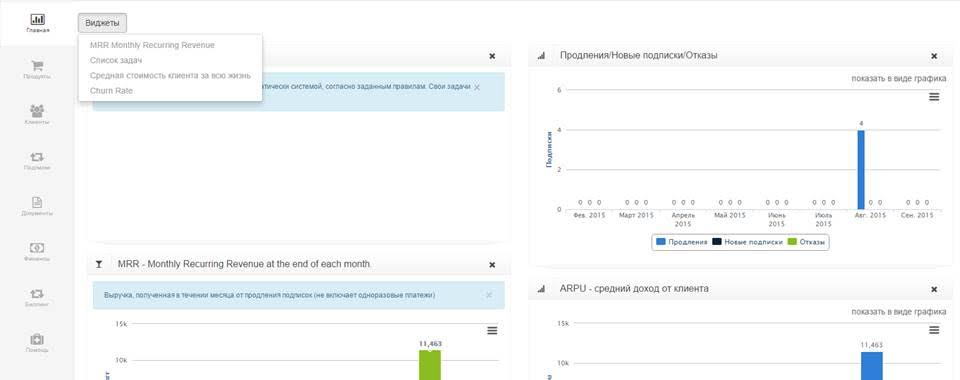
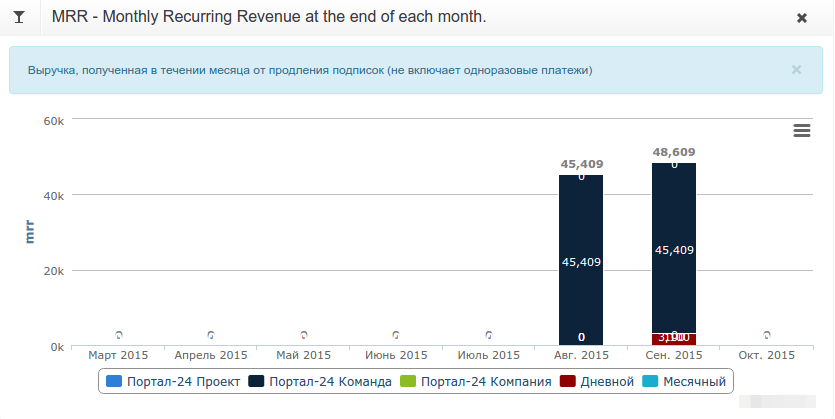
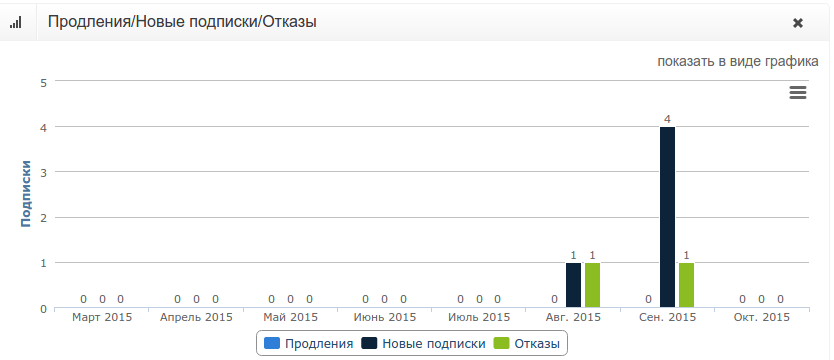
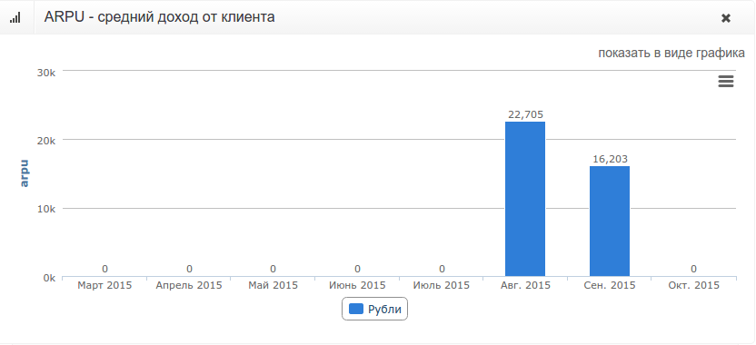

# Отчеты и метрики

На главной странице PricePlan предустановлены несколько видов виджетов таких как: MRR, ARPU, количество продлений/отказов/новых подписок. Для просмотра отчетов на вкладке «Главная», нажмите кнопку «Виджеты» и выберите нужный отчет из списка. 

## MRR - ежемесячная выручка.

* Рассчитывается при закрытии каждого месяца, как сумма всех списаний по каждому тарифу за вычетом одноразовых услуг и списаний по счетчикам.Стоимость всех подписок приводится к месячному зеаменателю.

## Продления/Новые подписки/Отказы

* **Продления** рассчитываются как количество активных клиентов на конец расчетного месяца, подписавшиеся на услугу в другом месяце.
* **Новые подписки** рассчитываются как количество активных клиентов на конец расчетного месяца, подписавшиеся на услугу в этом месяце.
* **Отказы** - количество клиентов, отказавшихся от услуг в расчетном месяце.

## ARPU - средний доход от клиента \(Average Revenue Per User\)

 Вычисляется, как Total Revenue / Number of Subscribers.

## Список задач

Уведомления и задачи пользователя формируются по правилам системы при выполнении действия. 

