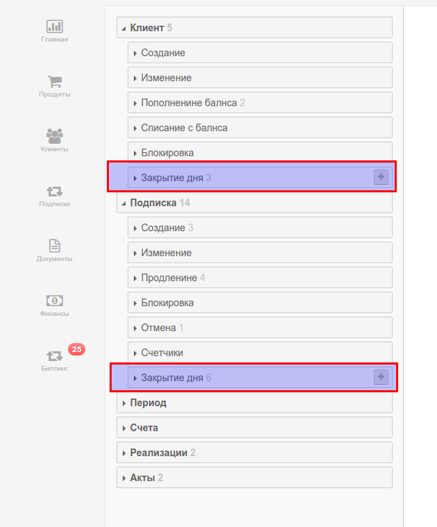
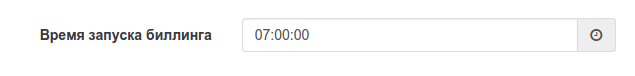

# Пакетный биллинг. Три режима работы.

Сервис ПрайсПлан позволяет выполнять пакетный биллинг в одном из трех режимов работы: "Песочница", "С подтверждением" или "Полный автомат".

Когда мы говорим о пакетном биллинге мы имеем ввиду два события, определенных в разделе "Правила":

* закрытие дня клиента
* закрытие дня подписки (по всем подпискам клиента).

В этих двух событиях могут быть задекларированы правила, выполняющие любые действия с лицевыми счетами клиентов. Например продление подписки, рассчет показаний счетчиков, создание пакета закрывающих документов.

Поскольку событие "закрытие дня" наступает автоматически (в определенное время), то системе необходимо задать один из трех режимов работы. В начале работы вы создаете правилда и тестируете их в режиме "песочнцы". После этого необходимо выбрать "боевой" режим работы: "С подтверждением" или "Полный автомат".  

> Время выполнения события закрытие дня задается в настройках биллинга.
