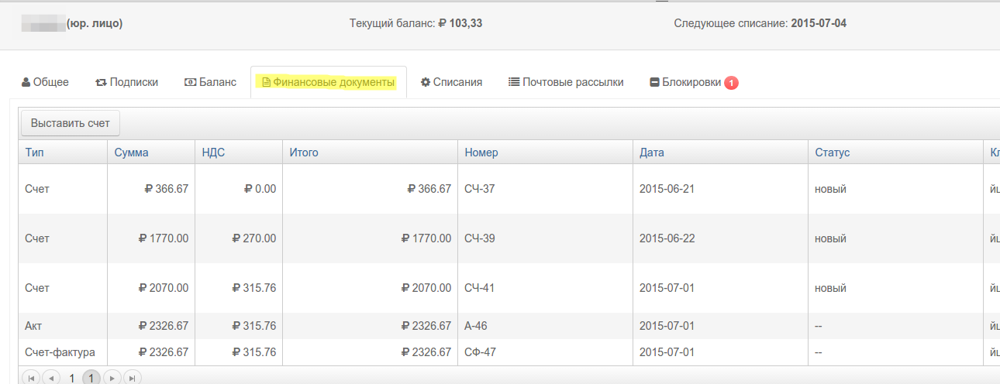
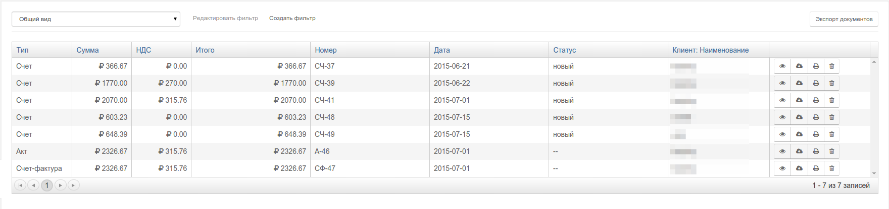

#Первичные документы

##Как создаются счета
Счета в PricePlan создаются на основании списаний или вручную (к примеру пользователь может создать счет на произвольную сумму на пополнение балланса). 

При выполнении в правиле действия `выставить счет` произойдет следущее:

1. PricePlan сформирует счет и влключает в него все списания клиента а также сумму текущей задолженности.  
2. Все созданные счета отображаются во вкладке `Финансовые документы`
3. Номер счета также записывется в поле "Счет" таба "Списания". Таким образом списание првязывается к счету.
4. В счет не будут включены:  
 - списания, включенные в предыдущих счетах  
 - списания за отмененные периоды ```


Таким образом в примере (1) при выполнении действия "выставить счет" PricePlan сформирует счет на оплату на сумму 490 руб. 

После создания счет будет доступен в личном кабинете клиента, его можно выслать клиенту по электронной или обычной почте.  

##Как создаются реализации

Реализации в PricePlan создаются на основании списаний. Их нельзя создать вручную. Реализованным считается списания с прошедшей "датой реализации".

В примере (1) списание будет считается не реализованым при закрытии дня 24.06 и реализованым при зарытии дня 25.06. 
На реализованные списания можно формировать закрывающие документы (акты и счета-фактуры)

Акты формируются системой при выполнении действия "Выставить акт". Счета-фактуры формируются системой при выполнении действия ""Выставить счет-фактуру"

> - в закрывающие документы не будут включены списания, включенные в предыдущих документах
> - в закрывающие документы не будут включены списания за отмененные периоды 

Все закрывающие документы отображаются во вкладке "Финансовые документы".

Номер акта и счета-фактуры также записывются в поле "Акт" таба "Списания". Таким образом списание првязывается к Акту.


###Вкладка `Финансовые документы` с сформированным превичными документами


###Раздел Документы со списком превичных документов


