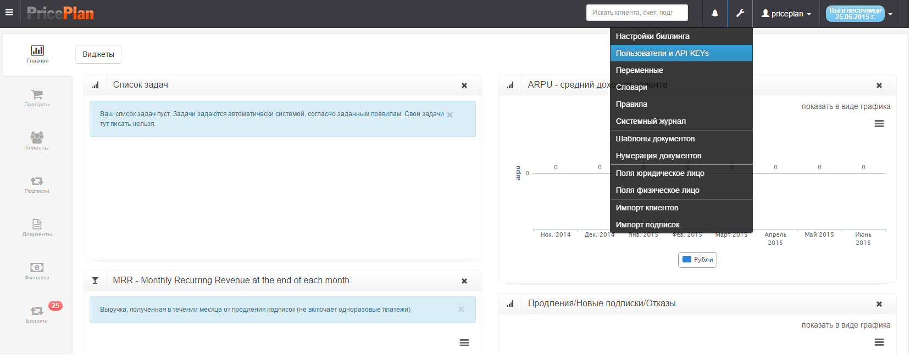
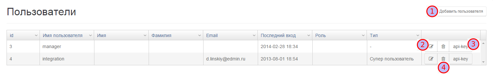
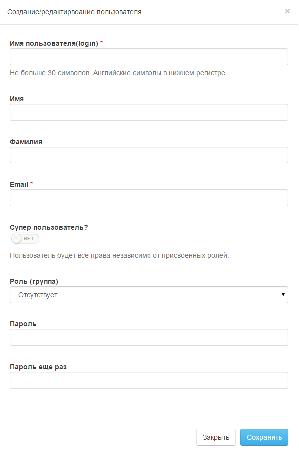

# Пользователи и API-KEYs  

Меню настройки Пользователей и API-KEYs позволяет добавитбь пользователя к системе определить права пользователя и создать API-KEY для доступа из стороннего программного обеспечения.  
Для входа в меню необходимо выбрать соответствующую вкладку Рис.1  
  

В открывшемся меню можно создавать, удалять и редактировать пользовтелей Рис. 2

 Добавление нового пользователя  

 Редактирование пользователя

 Генерация API-KEY

 Удаление пользователя

##Добавить пользователя

Диалог добавления нового пользователя позволяет создать пользователя/оператора системы Рис. 3

