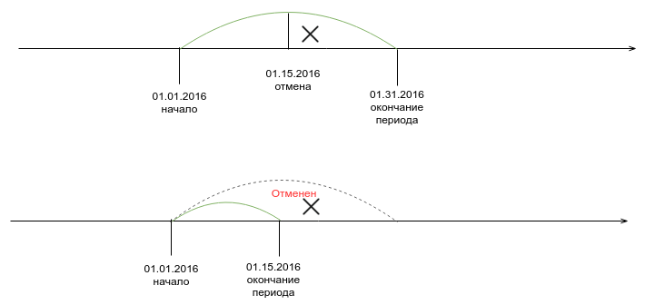

# Перерасчет списаний и проратирование.
Проратированем в биллинге считаетя расчет стоимоси услуги за часть заданного периода. 
В рассчетах учавствубют следующеи величины (определяются в настройках).  

В настройках биллинг предлагается выбрать, как саитема будет конвертировать месяц в дни:
* По календарному месяцу (то есть в марте 31 день, а в апере 30)
* Фиксировнно (в любом месяце определенное коичество дней). 

От этих настроек зависит как биллинг вычислит стоимость дня при заданной стоимости месяца и поизведет прорптирование списания за чать периода.

Приведем несколько примеров. 

## Пример 1. Отмена подписки и возврат средств на баланс

Допустим, что 15.01.2016 вы договорились с клиентом немедленно отменить подписку и вернуть все неизрасходованные средства на баланс
Биллинг будет считать, что клиент проработал 15 полных дней. 

| Настройки  ||
| -- | -- |
| Продолжительность месяца| календарный |
| Биллинг день | нет |

| Подписка  ||
| -- | -- |
| Период продления | 1 месяц |
| Начало | 01.01.2016 |
| Цена | 1 000 руб. |
| Тип списания | предоплата 100% |

Стоимость дня работы будет рассчитана как  1000/31 = 32.26 руб.  
Cответсственно на баланс клиенту вернется  16*32.26 = 516.16 руб.  
Остальная сумма будет считаться реализованной.

При изменении настроек изменятся и прората расчеты:

| Настройки  ||
| -- | -- |
| Продолжительность месяца| 30 |
| Биллинг день | нет |

Стоимость дня работы будет рассчитана как  1000/30 = 33.33 руб.  
Cответсственно на баланс клиенту вернется  16*33.33 =  533.28 руб.  
Остальная сумма будет считаться реализованной.

## Пример 2. Кроссгрейд
Этот пример похож на превый, но вместо отмены подписки 15.01.2016 клиент просит вас перевести его с плана "А" на более догогой план "Б" немедленно.

| Настройки  ||
| -- | -- |
| Продолжительность месяца| календарный |
| Биллинг день | нет |

| Подписка "Базовая" ||
| -- | -- |
| Период продления | 1 месяц |
| Начало | 01.01.2016 |
| Цена | 1 000 руб. |
| Тип списания | предоплата 100% |

| Подписка "Премиум" ||
| -- | -- |
| Период продления | 1 месяц |
| Начало | 01.01.2016 |
| Цена | 2 000 руб. |
| Тип списания | предоплата 100% |

Транзакция кроссгрейда в биллинге состоит из двух частей 
1. отмена существующей подписки
2. создание новой

Соответственно на баланс клиента будет зачислено 516.16 руб (16*32.26). и сразу списано 2 000 руб. за полный период подписки "Премиум".

**При изменении настроек изменятся и прората расчеты:**

| Настройки  ||
| -- | -- |
| Продолжительность месяца| 30 |
| Биллинг день | нет |

На баланс клиента будет зачислено 533.28 руб (16*33.33). и сразу списано 2 000 руб. за полный период подписки "Премиум".  

**Теперь изменим настройки дня биллинга:**

| Настройки  ||
| -- | -- |
| Продолжительность месяца| 30 |
| Биллинг день | ежемесячно со дня активации подписки |

На баланс клиента будет зачислено 533.28 руб (16*33.33). и сразу списано 2 000 руб. за полный период подписки "Премиум".
