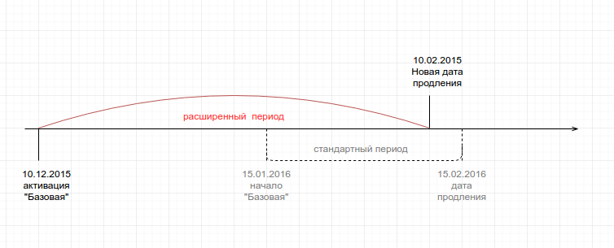

# Расчет списаний и проратирование.
Проратированем в биллинге считаетя расчет стоимоси услуги за часть заданного периода. 
В рассчетах учавствубют следующеи величины (определяются в настройках).  

В настройках биллинг предлагается выбрать, как саитема будет конвертировать месяц в дни:
* По календарному месяцу (то есть в марте 31 день, а в апере 30)
* Фиксировнно (в любом месяце определенное коичество дней). 

От этих настроек зависит как биллинг вычислит стоимость дня при заданной стоимости месяца и поизведет прорптирование списания за чать периода.

Приведем несколько примеров. 

## Пример 1. Отмена подписки и возврат средств на баланс

Допустим, что 15.01.2016 вы договорились с клиентом немедленно отменить подписку и вернуть все неизрасходованные средства на его баланс

| Вводные  ||
| -- | -- |
| Период продления подписки| 1 месяц |
| Активация подписки| 01.01.2016 |
| Цена | 1 000 руб. |
| Тип списания | предоплата 100% |
| Настройки: Продолжительность месяца| календарный |
| Настройки: Биллинг день | нет |

В этом случае биллинг рассчтает стоимость дня подписки как  1 000/31 = 32.26 руб.  
Биллинг будет считать, что клиент проработал 15 полных дней. Cответсственно на баланс клиенту вернется  16*32.26 = 516.16 руб. Остальная сумма будет считаться реализованной.

При изменении настроек изменятся и прората расчеты:

| Настройки  ||
| -- | -- |
| Продолжительность месяца| 30 |
| Биллинг день | нет |

Стоимость дня работы будет рассчитана как  1000/30 = 33.33 руб.  
Cответсственно на баланс клиенту вернется  16*33.33 =  533.28 руб.  
Остальная сумма будет считаться реализованной.

## Пример 2. Кроссгрейд
Этот пример похож на превый, но вместо отмены подписки 15.01.2016 клиент просит вас перевести его с плана "А" на более догогой план "Б" немедленно.

|Вводные||
| -- | -- |
| Настройки: Продолжительность месяца| календарный |
| Настройки: Биллинг день | нет |

| Подписка "Базовая" ||
| -- | -- |
| Период продления | 1 месяц |
| Начало | 01.01.2016 |
| Цена | 1 000 руб. |
| Тип списания | предоплата 100% |

| Подписка "Премиум" ||
| -- | -- |
| Период продления | 1 месяц |
| Начало | 01.01.2016 |
| Цена | 2 000 руб. |
| Тип списания | предоплата 100% |

Транзакция кроссгрейда в биллинге состоит из двух частей 
1. отмена существующей подписки
2. создание новой

Соответственно на баланс клиента будет зачислено 516.16 руб (16*32.26). и сразу списано 2 000 руб. за полный период подписки "Премиум".

**При изменении настроек изменятся и прората расчеты:**

| Настройки  ||
| -- | -- |
| Продолжительность месяца| 30 |
| Биллинг день | нет |

На баланс клиента будет зачислено 533.28 руб (16*33.33). и сразу списано 2 000 руб. за полный период подписки "Премиум".  

**Теперь изменим настройки дня биллинга:**

| Настройки  ||
| -- | -- |
| Продолжительность месяца| 30 |
| Биллинг день | ежемесячно со дня активации подписки |

В этом  случае проратируется сразу 2 подписки.  
На баланс клиента будет зачислено 533.28 руб (16*33.33) и сразу списано 1066.56 руб. за за оставшиеся 16 дней января подписки "Премиум".

**Снова изменим настройки дня биллинга:**

| Настройки  ||
| -- | -- |
| Продолжительность месяца| календарный |
| Биллинг день | 10 |

При проратировании стоимость дня рассчитывается какстоимость подписки за период разделлоное на  количество дней в текущем периоде (что может не совпадать с количеством дней в текущем месяце)

Соответственно с 10.01.16 по 09.02.16 - 31 день. Стоимость дня для подписки "Базовая" рассчитается как 32.26 руб.  

На баланс клиента будет зачислено 25*32.26 = 806.50 руб. и сразу списано 1 613.00 руб. за план "Премиум" за оставшиеся 25 дней до 09.02.16.

## Пример 3. Создание подписки с активацией в прошлом.
Этот пример похож на превый, но вместо отмены подписки 15.01.2016 клиент просит вас перевести его с плана "А" на более догогой план "Б" немедленно.

| Настройки  ||
| -- | -- |
| Продолжительность месяца| календарный |
| Биллинг день | нет |

| Подписка ||
| -- | -- |
| Период продления | 1 месяц |
| Создана | 01.15.2016 |
| Начало | 10.12.2016 |
| Цена | 1 000 руб. |
| Тип списания | предоплата 100% |

Дата продления подписки - 15.02.2016. В периоде 31 день, соответственно стоимость одного дня рассчитывается в 32.26 руб.
К первому периоду подписки добавится 36 отработанных дней. Соответственно первое списание создается на сумму 2161.36 руб.

**Рассмотим этот же пример с фиксированным днем биллинга:**

| Настройки  ||
| -- | -- |
| Продолжительность месяца| календарный |
| Биллинг день | 10 |

Стоимость одного дня рассчитывается в 32.26 руб.  
Дата продления подписки - 10.02.2016.  
Первый период - 26 дней по 32.26 в день. К первому периоду подписки добавляется 36 дней. Соответственно первое списание создается на сумму 2000.12 руб.