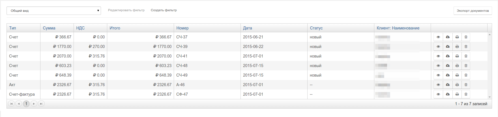

# Первичные документы

## Как создаются счета

Счета в PricePlan создаются на основании списаний или вручную \(к примеру, пользователь может создать счет на произвольную сумму на пополнение балланса\).

При выполнении в правиле действия `выставить счет`, произойдет следущее:

1. PricePlan сформирует счет и включает в него все списания клиента, а также сумму текущей задолженности.  
2. Все созданные счета отображаются во вкладке `Финансовые документы`
3. Номер счета, также записывется в поле "Счет" табл. "Списания". Таким образом, списание првязывается к счету.
4. В счет не будут включены:  
   * списания, включенные в предыдущих счетах  
   * списания за отмененные периоды \`\`\`

Таким образом, в примере \(1\) при выполнении действия "выставить счет", PricePlan сформирует счет на оплату суммы 490 руб.

После создания, счет будет доступен в личном кабинете клиента, его можно выслать клиенту по электронной или обычной почте.

## Списания и реализации

Реализации в PricePlan создаются на основании списаний. Реализованым, считается списания за оказанные услуги с прошедшей "датой реализации".

 В примере \(1\)

* списание "Установка и настройка" будет считаться реализованым при закрытии дня 25.06.
* списание "ФИЛАНКО" будет считаться реализованым при зарытии дня 30.06.

## Закрывающие документы

На реализованые списания PricePlan может формировать закрывающие документы \(акты и счета-фактуры\). Акты формируются системой при выполнении действия `Выставить акт`. Счета-фактуры формируются системой при выполнении действия `Выставить счет-фактуру`. Обычно, правило, создающее закрывающие документы, задается на закрытие месяца.

* в закрывающие документы не будут включены списания, включенные в предыдущих документах
* в закрывающие документы не будут включены списания, за отмененные периоды 

Все созданные документы отображаются во вкладке `Финансовые документы`.

Номер акта и счета-фактуры также записывются в поле "Акт" вкладки `Списания`. Таким образом, списание привязывается к Акту.

### Вкладка `Финансовые документы` со сформированными превичными документами

### Раздел Документы со списком превичных документов

