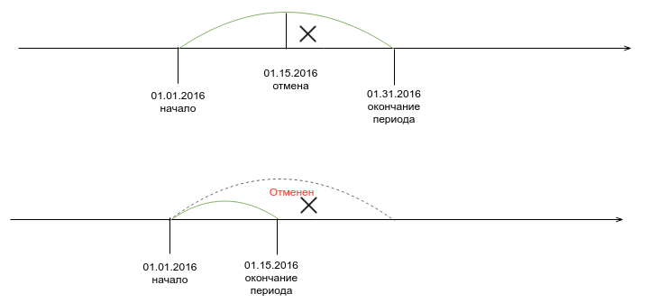
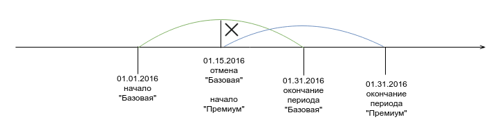
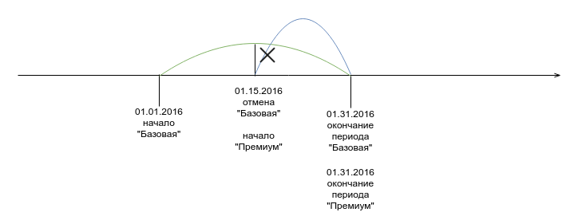
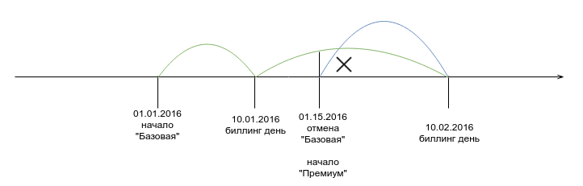
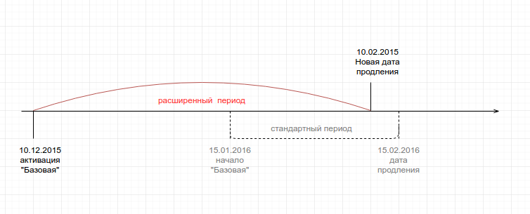
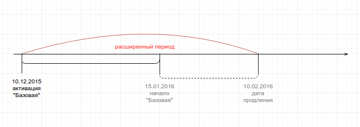

# Расчёт списаний и проратирование.  
  
Проратированем в PricePlan считается расчёт стоимости услуги за часть периода. На результаты проратирования влияют следующие критерии:

1. цена услуги за базовый период
2. период перерасчета
3. метод расчета

Метод расчета определяется в настройках PricePlan, где задается, как система будет конвертировать месяц в дни. От этих настроек зависит, как биллинг вычислит стоимость дня (часа, минуты) при заданной стоимости месяца услуги:  
  
* По календарному месяцу (то есть в марте 31 день, а в апреле 30)  
* Фиксировано (в любом месяце определённое количество дней).  

  
Приведём несколько примеров.

## Пример 1. Отмена подписки и возврат средств на баланс

Допустим, что 15.01.2016 вы договорились с клиентом немедленно отменить подписку и вернуть все неизрасходованные средства на его баланс

| Вводные                             |                 |
|-------------------------------------|-----------------|
| Период продления подписки           | 1 месяц         |
| Активация подписки                  | 01.01.2016      |
| Цена                                | 1 000 руб.      |
| Тип списания                        | предоплата 100% |
| Настройки: Продолжительность месяца | календарный     |
| Настройки: День биллинга            | не установлен   |

 
В этом случае PricePlan рассчитает стоимость дня подписки как 1 000/31 = 32.26 руб.  Ситема будет считать, что клиент проработал 15 полных дней. Соответственно на баланс клиенту вернется 16*32.26 = 516.16 р. Остальная сумма будет считаться реализованной.

При изменении настроек изменятся и прората расчеты:

| Настройки |  |
| :--- | :--- |
| Продолжительность месяца | 30 |
| День биллинга | не установлен |

Стоимость дня работы будет рассчитана как 1000/30 = 33.33 руб.  
Cоответственно на баланс клиенту вернется 16*33.33 = 533.28 руб.  
Остальная сумма будет считаться реализованной.

## Пример 2. Кроссгрейд

Этот пример очень похож на первый, но вместо отмены подписки 15.01.2016 клиент просит перевести его с плана "А" на более дорогой план "Б" немедленно.

| Вводные |  |
| :--- | :--- |
| Настройки: Продолжительность месяца | календарный |
| Настройки: День биллинга | не установлен |

| Подписка "Базовая" |  |
| :--- | :--- |
| Период продления | 1 месяц |
| Начало | 01.01.2016 |
| Цена | 1 000 руб. |
| Тип списания | предоплата 100% |

| Подписка "Премиум" |  |
| :--- | :--- |
| Период продления | 1 месяц |
| Начало | 01.01.2016 |
| Цена | 2 000 руб. |
| Тип списания | предоплата 100% |

Транзакция кроссгрейда в PricePlan состоит из двух частей 1. отмена существующей подписки 2. создание новой

Соответственно на баланс клиента будет зачислено 516.16 руб (16*32.26). и сразу списано 2 000 руб. за полный период подписки "Премиум".

**При изменении настроек изменятся и прората расчеты:**

| Настройки |  |
| :--- | :--- |
| Продолжительность месяца | 30 |
| Биллинг день | нет |

На баланс клиента будет зачислено 533.28 руб (16*33.33). и сразу списано 2 000 руб. за полный период подписки "Премиум".

**Теперь изменим настройки дня биллинга:**

| Настройки |  |
| :--- | :--- |
| Продолжительность месяца | 30 |
| Биллинг день | ежемесячно со дня активации подписки |

 В этом случае проратируется сразу 2 подписки.  
На баланс клиента будет зачислено 533.28 руб (16*33.33) и сразу списано 1066.56 руб. за за оставшиеся 16 дней января подписки "Премиум".

**Снова изменим настройки дня биллинга:**

| Настройки |  |
| :--- | :--- |
| Продолжительность месяца | календарный |
| Биллинг день | 10 |

 При проратировании стоимость дня рассчитывается как стоимость подписки за период разделенная на количество дней в текущем периоде (что может не совпадать с количеством дней в текущем месяце)

Соответственно с 10.01.16 по 09.02.16 - 31 день. Стоимость дня для подписки "Базовая" рассчитается как 32.26 руб.

На баланс клиента будет зачислено 25*32.26 = 806.50 руб. и сразу списано 1 613.00 руб. за план "Премиум" за оставшиеся 25 дней до 09.02.16.

## Пример 3. Создание подписки с активацией в прошлом.

| Вводные |  |
| :--- | :--- |
| Период продления подписки | 1 месяц |
| Подписка создана | 01.15.2016 |
| Подписка активирована | 10.12.2016 |
| Цена | 1 000 руб. |
| Тип списания | предоплата 100% |
| Настройки: продолжительность месяца | календарный |
| Настройки: День биллинга | не установлен |

 
Дата продления подписки - 15.02.2016. В периоде 31 день, соответственно стоимость одного дня рассчитывается в 32.26 руб. К первому периоду подписки добавится 36 отработанных дней. Соответственно первое списание создается на сумму 2161.36 руб.

**Рассмотим этот же пример с фиксированным днем биллинга:**

| Настройки |  |
| :--- | :--- |
| Продолжительность месяца | календарный |
| День биллинга | 10 |

 
Стоимость одного дня рассчитывается в 32.26 руб.  
Дата продления подписки - 10.02.2016.  
Первый период - 26 дней по 32.26 в день. К первому периоду подписки добавляется 36 дней. Соответственно первое списание создается на сумму 2000.12 руб.

