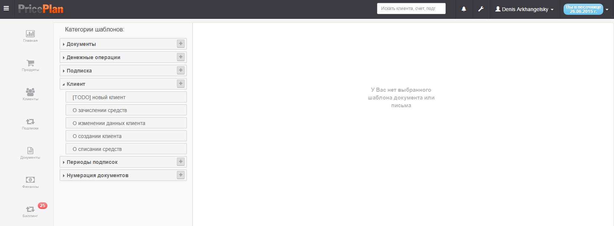
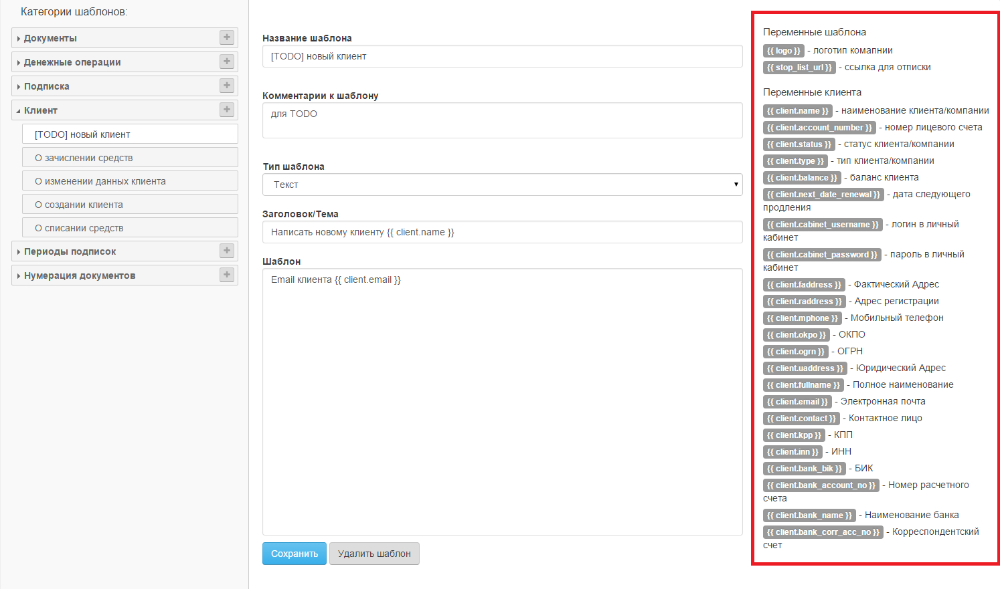
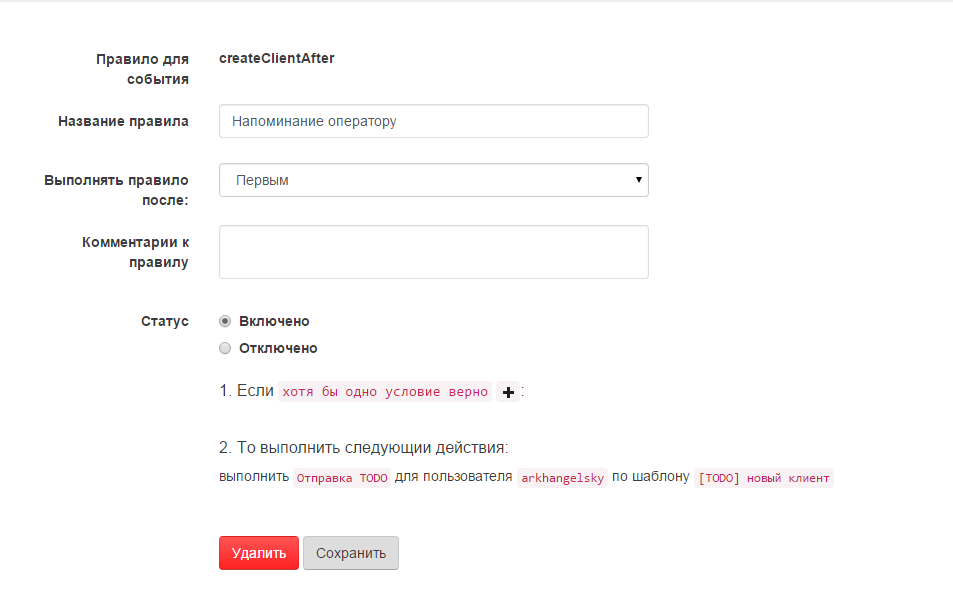
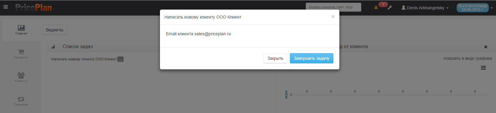

# Шаблоны документов

Меню Шаблоны документов предназначено для создания шаблонов сообщений отправляемых системой. Для входя в интерфейс Шаблоны документов необходимо в меню настройки выбрать подменю Шаблоны документов, после этого откроется интерфейс Рис.1

В системе PricePlan предусмотрены три варианта отправки сообщений операторам и клиентам системы:  
* сообщение отправляемое по e-mail  
* сообщение отправляемое в sms  
* сообщение отправляемое внутри системы  

Для отправки сообщения в системе PricePlan должно быть создано соответствующее правило относящееся к определенному событию.  
Все шаблоны сгруппированы по категориям -> событиям.  
Для создания шаблона сообщения необходимо выбрать соответствующую категорию и нажать "+". После этого откроется диалог создания шаблона Рис.2  
  

В открывшемся диалоге необходимо заполнить поля шаблона. В правой части экрана расположен список переменных которые могут быть использованы в шаблоне сообщения.

Пример
> Создан шаблон сообщения [TODO] (сообщение оператору системы). Далее создадим правило для отправке данного сообщения оператору после регистрации нового клиента Рис.3  
>   
> 
> После регистрации нового клиента в система оператор получит сообщение на основе созданного шаблона Рис.4  
>   
>   

