# Создание продукта

Создание списка продуктов и услуг производится в интерфейсе меню «Продукты».

## Интерфейс меню "Продукты"

Для входя в интерфейс меню "Продукты" выберите соответствующий пункт в интерфейсе главного экрана. Рис.1  
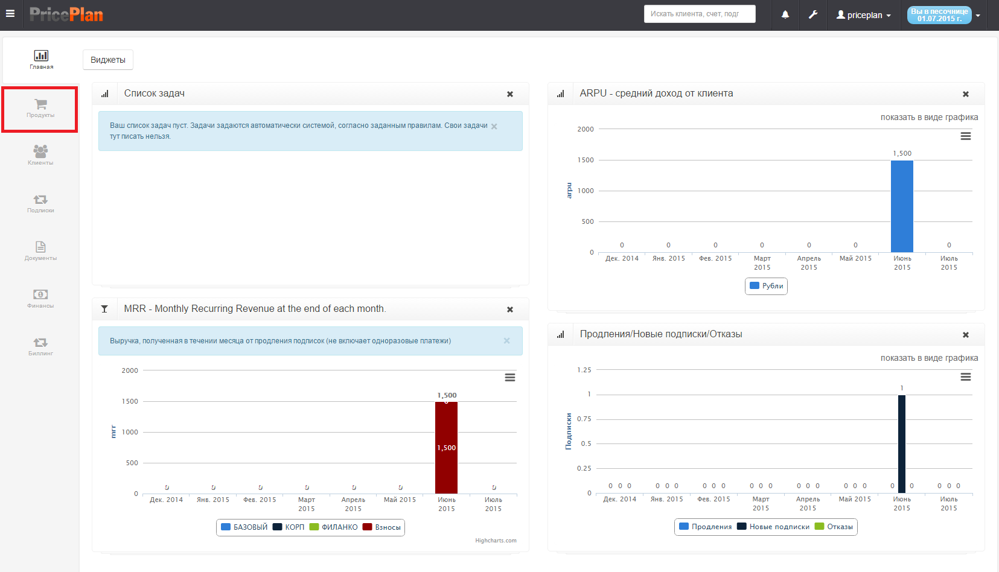

## Описание интерфейса

В меню представлен список, созданных продуктов в табличном виде. Для каждого продукта предусмотрена возможность просмотра и редактирования продукта, пиктограммы «Обзор» и «Редактирование». \(Рис. 2\).  
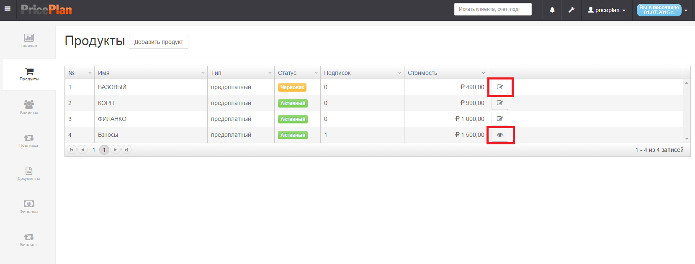

В таблице параметров продукта указывается:  
1.    **№** - Порядковый номер продукта;  
2.    **Имя** - Наименование продукта;  
3.    **Тип** – тип продукта предоплатный или постоплатный;  
4.    **Статус** – статус продукта \(архивный, черновик, активный\);  
5.    **Подписок** – количество активных подписок на данный продукт;  
6.    **Стоимость** – базовая стоимость продукта;  
7.    **Редактирование или обзор продукта** – редактирование продукта возможно в случае если у продукта нет ни одной активной подписки, если есть подписки на продукт, возможен только просмотр продукта.

## Создание продукта

Для создания нового продукта, необходимо выбрать «добавить продукт», после чего откроется интерфейс создания нового продукта. Интерфейс создания продукта разделен на два раздела: в верхней половине  - основное окно создания продукта; в нижней – окно добавления дополнительных опций продукта. Рис. 3.

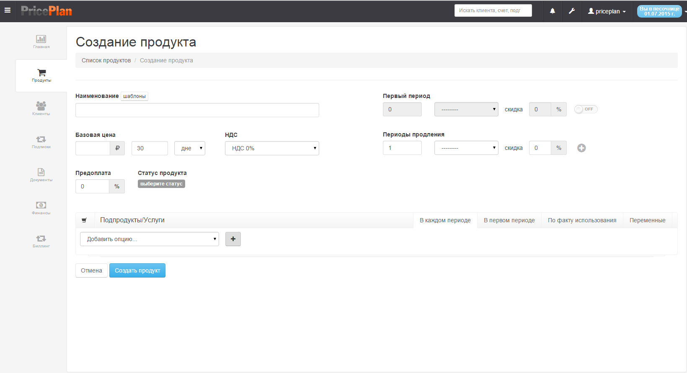

#### Описание полей

**Наименование** – в поле указывается наименование продукта

| 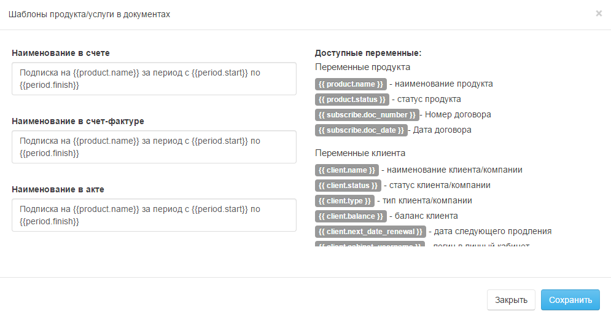 | Кнопка шаблон позволяет конструировать описание продукта в финансовых документах |
| --- | --- |

**Базовая цена** – поля для создания стоимости продукта/услуги.

| 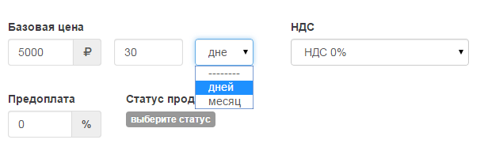 | В первом поле указывается стоимость продукта за период. Во втором указывается период, и выбирается тип периода день/месяц. В последнем поле указывается НДС |
| --- | --- |

**Предоплата** – поле определяет тип оплаты за продукт/услугу.

**Статус продукта** – выбирается статус продукта Черновик/Активный/Архивный,Удален.

| 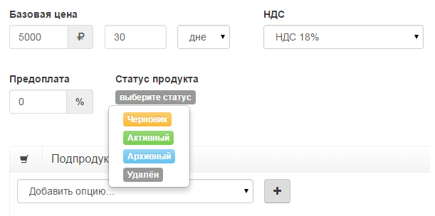 | Значение указывается как процент от базовой цены в диапазоне от 0% \(постоплатный продукт\) и  до 100% \(предоплатный продукт\). Только продукты со статусом «Активный» могут назначаться клиентам. |
| --- | --- |

**Первый период** – дает возможность предоставить специальную скидку, действующую в первом периоде.

| 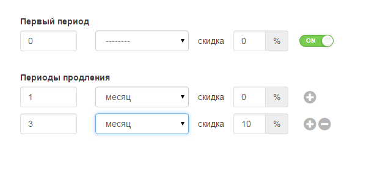 | Для активации опции, необходимо передвинуть переключатель on/off в положение on. После активации устанавливаются период действия специальной скидки и размер скидки. |
| --- | --- |

**Периоды продления** – предоставляют возможность установить специальные скидки на периоды продления подписки.

|  | Для активации опции необходимо передвинуть переключатель on/off в положение on. После активации устанавливаются период действия специальной скидки и размер скидки. |
| --- | --- |

**Предоплата** – поле определяет тип оплаты за продукт/услугу.

### Продукты/услуги

Раздел «Продукты/услуги» предназначен для создания дополнительных продуктов/услуг сопутствующих основному продукту.  
Раздел представлен четырьмя вкладками: в каждом периоде, в первом периоде, по факту использования, переменные.

Для создания нового продукта необходимо выбрать «добавить продукт», после чего откроется интерфейс создания нового продукта. Интерфейс создания продукта разделен на два раздела: в верхней половине  - основное окно создания продукта; в нижней – окно добавления дополнительных опций продукта. Рис. 3.

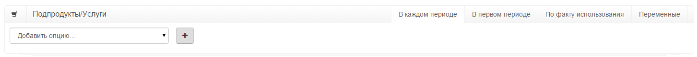

**В каждом периоде** – добавляет услуги, которые могут быть добавлены к продукту на постоянной основе.  
**В первом периоде** – добавляет услуги, которые могут быть добавлены к продукту только в первом периоде.  
**Счетчики** – добавляет услуги, расчитываемые по факту их потребления \(например электрическтво, горячая вода или интернет траффик\). Количество потребленных услуг вводится как показания счетчика вручную или через API  
**Переменные** – позволяют создавать пользовательские переменные для каждой подписки.

### Описание вкладок

#### В каждом периоде

Для создания одной или нескольких дополнительных услуг, которые могут предлагаться вместе с основным продуктом, необходимо добавить опцию и выбрать необходимую позицию, и нажать кнопку «+».

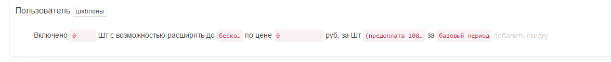

| Описание полей |  |  |
| --- | --- | --- |
| 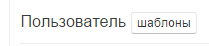 | Пользователь | Выбранная дополнительная услуга для добавления. Название и характеристики дополнительных услуг, предварительно должны быть созданы в настройках в разделе переменные |
| -- | -- | -- |
|  | шаблон | Кнопка шаблон позволяет конструировать описание дополнительной услуги в финансовых документах |
| -- | -- | -- |
| 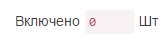 | Включено | Указывается значение в случае, если в состав основного продукта уже входит какое-либо количество |
| 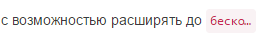 | С возможностью расширения | Указывается максимально значение дополнительной услуги |
| -- | -- | -- |
| 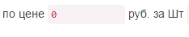 | по цене | Указывается стоимость дополнительной услуги за ед. |
| -- | -- | -- |
| 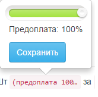 | предоплата | Указывается тип оплаты, предоплата или оплата по факту в процентном соотношении |
| -- | -- | -- |
| 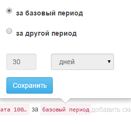 | за базовый период | Указывается период действия дополнительной услуги |
| -- | -- | -- |
| 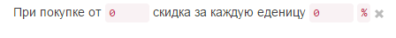 | добавить скидку | Добавляет количественную скидку |
| -- | -- | -- |

#### В первом периоде

Для создания дополнительных услуг которые могут быть предложены только в первом периоде, необходимо в поле добавить опцию и  выбрать необходимую позицию, и нажать кнопку «+».

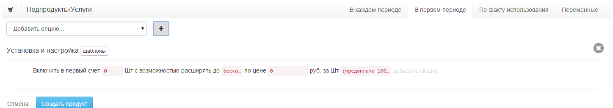

| Описание полей |  |  |
| --- | --- | --- |
| 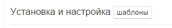 | Дополнительные работы | Выбранная дополнительная услуга для добавления. Название и характеристики дополнительных услуг предварительно должны быть созданы в настройках в разделе переменные |
| -- | -- | -- |
|  | шаблон | Кнопка шаблон позволяет конструировать описание дополнительной услуги в финансовых документах |
| -- | -- | -- |
| 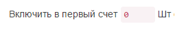 | Включено в первый счет | Указывается значение количества дополнительных услуг в первом периоде |
| -- | -- | -- |
|  | С возможностью расширения | Указывается максимально значение дополнительной услуги |
| -- | -- | -- |
|  | по цене | Указывается стоимость дополнительной услуги за ед. |
| -- | -- | -- |
|  | предоплата | Указывается тип оплаты, предоплата или оплата по факту в процентном соотношении |
| -- | -- | -- |
|  | добавить скидку | Добавляет количественную скидку |
| -- | -- | -- |

#### По факту использования

Для создания дополнительной услуги, для тарификации которой необходимо ввести какое-либо значение, нужно в поле добавить опцию, выбрать необходимую позицию и нажать кнопку «+».

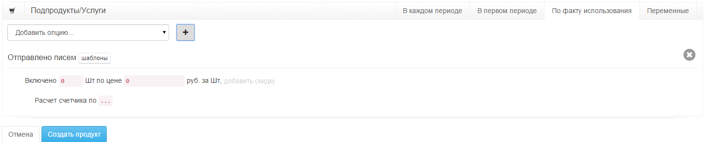

| Описание полей |  |  |
| --- | --- | --- |
| 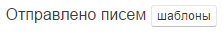 | Отправлено писем | Выбранная дополнительная услуга для добавления. Название и характеристики дополнительных услуг предварительно должны быть созданы в настройках в разделе переменные |
| -- | -- | -- |
|  | шаблон | Кнопка шаблон позволяет конструировать описание дополнительной услуги в финансовых документах |
| -- | -- | -- |
|  | Включено | Указывается значение в случае, если в состав основного продукта уже входит какое-либо количество |
|  | по цене | Указывается стоимость дополнительной услуги за ед. |
| -- | -- | -- |
|  | добавить скидку | Добавляет количественную скидку |
| -- | -- | -- |
| 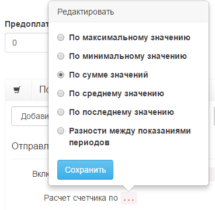 | Расчет счетчика по | Указывается вариант расчета счетчика |
| -- | -- | -- |

#### Переменные

Для создания пользовательского поля для продукта или подписки, необходимо выбрать команду "добавить" у соответствующего поля. Поле "Значение продукта" автоматически присваивается всем подпискам, созданным на основе данного продукта. Поле "Значение подписки" заполняется при создании подписки. Значение этого поля является уникальным для каждой подписки

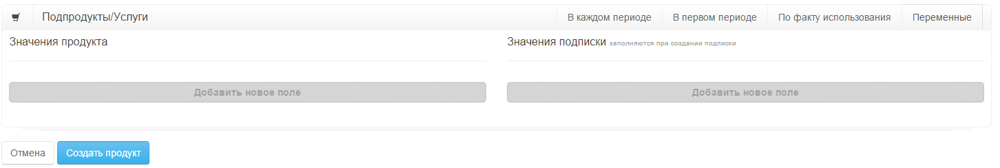

