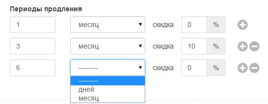

# Создание продукта

Создание списка продуктов и услуг создается в интерфейсе меню «Продукты»  
## Интерфейс меню Продукты

Для входя в интерфейс меню продукты выберете соответствующий пункт в интерфейсе главного экрана Рис.1  

## Описание интерфейса

В меню представлен список созданных продуктов в табличном виде. Для каждого продукта предусмотрена возможность просмотра и редактирования продукта пиктограммы «Обзор» и «Редактирование». (Рис. 2).   
  

В таблице параметров продукта указывается:  
1.	**№** - Порядковый номер продукта;
2.	**Имя** - Наименование продукта;
3.	**Тип** – тип продукта предоплатный или постоплатный;
4.	**Статус** – статус продукта (архивный, черновик, активный);
5.	**Подписок** – количество активных подписок на данный продукт;
6.	**Стоимость** – базовая стоимость продукта;
7.	**Редактирование или обзор продукта** – редактирование продукта возможно в случае если у продукта нет ни одной активной подписки, если есть подписки на продукт, возможен только просмотр продукта.

## Создание продукта

Для создания нового продукта необходимо выбрать «добавить продукт», после чего откроется интерфейс создания нового продукта. Интерфейс создания продукта разделен на два раздела: В верхней половине  - основное окно создания продукта; в нижней – окно добавления дополнительных опций продукта. Рис. 3.  

  

#### Описание полей

**Наименование** – в поле указывается наименование продукта

|  | Кнопка шаблон позволяет конструировать описание продукта в финансовых документах |
| -- | -- |  

**Базовая цена** – поля для создания стоимости продукта/услуги  

|  | В первом поле указывается стоимость продукта за период. Во втором указывается период и выбирается тип периода день/месяц. В последнем поле указывается НДС |
| -- | -- |

**Предоплата** – поле определяет тип оплаты за продукт/услугу  

**Статус продукта** – выбирается статус продукта Черновик/Активный/Архивный,Удален

| | Значение указывается в как процент от базовой цены в диапазоне от 0% (постоплатный продукт) до 100% (предоплатный продукт). Только продукты со статусом «Активный» могут назначаться клиентам|
| -- | -- |

**Первый период** – предоставляет возможность предоставить специальную скидку, действующую в первом периоде

| | Для активации опции необходимо передвинуть переключатель on/off в положение on. После активации устанавливаются период действия специальной скидки и размер скидки|
| -- | -- |

**Периоды продления** – предоставляют возможность установить специальные скидки на периоды продления подписки

| | Для создания специальных скидок на период продления подписки, указывается значение периода и размер скидки. Для добавления нового периода используется кнопка «+». Для удаления кнопка «-»|
| -- | -- |

###Продукты/услуги

Раздел «Продукты/услуги» предназначен для создания дополнительных продуктов/услуг сопутствующих основному продукту.  
Раздел представлен четырьмя вкладками: В каждом периоде; В первом периоде; По факту использования; Переменные.  

Для создания нового продукта необходимо выбрать «добавить продукт», после чего откроется интерфейс создания нового продукта. Интерфейс создания продукта разделен на два раздела: В верхней половине  - основное окно создания продукта; в нижней – окно добавления дополнительных опций продукта. Рис. 3.  

  

**В каждом периоде** – добавляет услуги которые могут быть добавлены к продукту на постоянной основе  
**В первом периоде** – добавляет услуги которые могут быть добавлены к продукту только в первом периоде  
**По факту использования** – добавляет услуги для тарификации которых необходимо ввести значение  
**Переменные** – позволяют создавать пользовательские переменные для каждой подписки  

###Описание вкладок

####В каждом периоде

Для создания одной или нескольких дополнительных услуг, которые могут предлагаться вместе с основным продуктом, необходимо в поле добавить опцию выбрать необходимую позицию и нажать кнопку «+»  

|  | Пользователь | Выбранная дополнительная услуга для добавления. Название и характеристики дополнительных услуг предварительно должны быть созданы в настройках в разделе переменные. |
| -- | -- | -- |  
|  | шаблон | Кнопка шаблон позволяет конструировать описание дополнительной услуги в финансовых документах |
| -- | -- | -- |