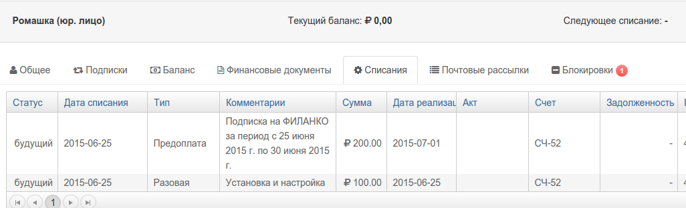

##Списания с расчетного счета

Списания с расчетного счета создаются системой при выполнеи одного из трех возможных действий:

1. рассчет будущего периода подписки 
2. продление подписки
3. рассчет реализациий по показаниям счетчика

Помимо рассчета цены, в каждом списании создаются три ключевые даты:

1. Дата списания или дата начала оказания услуг
2. Дата реализации. Дата окончания оказания услуг. Для прописки услуги по факту использования (постоплата), даты  списания и реализации будут одинаковыми. 
3. Дата оплаты. Дата поступления оплаты.

Рассмотрим пример (1). 

При создании подписки на план "ФИЛАНКО", система автоматически создала 2 списания:

1. Установка и настройка (предоплата 100% ) 100руб.
  - дата списания 25.06
  - дата реализации 25.06
  - дата оплаты пока отсутствует  

- Подписка на первый период, на сумму (предоплата 100% ) 200 руб.
  - дата списания 25.06
  - дата реализации 01.06
  - дата оплаты пока отсутствует.
  -

##Генерация счетов на оплату

На созданные списания можно создавать счета на оплату. При выполнении действия правила "выставить счет", произойдет следущее:

1. PricePlan сформирует счет и включит в него все списания клиента, а также сумму текущей задолженности. 
> в счет не будут включены списания, включенные в предыдущих счетах  
> в счет не будут включены списания за отмененные периоды 
2. Все созданные счета отображаются во вкладке "Финансовые документы"
3. Номер счета также записывется в поле "Счет" табл. "Списания". Таким образом, списание привязывается к счету.

Таким образом, в примере (1) при выполнении действия "выставить счет", PricePlan сформирует счет на оплату суммы 300 руб. 

##Реализованые списания
Реализоваными, считаются списания за оказанные услуги с прошедшей "датой реализации".
 

В примере (1) 
- списание "Установка и настройка" будет считаться реализованым при закрытии дня 25.06.
- списание "ФИЛАНКО" будет считается реализованым при закрытии дня 30.06.

На реализованые списания PricePlan может формировать закрывающие документы (акты и счета-фактуры). Закрывающие документы формируются в любое время, после наступления даты реализации. Обычно, формирование закрывающих документов, происходит при закрытии месяца.

В нашем случе, если в биллинге 1го июля сработает правило с действиями "Выставить акт" и  "Выставить счет-фактуру", то в эти документы войдут оба списания.

