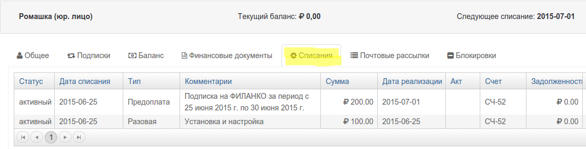

##Как создаются списания

Списания создаются системой при выполнеи одного из трех возможных действий

1. рассчет будущего периода подписки 
2. продление подписки
3. рассчет реализациий по показаниям счетчика

Помимо рассчета цены в каждом списании создаются три ключевые даты:

1. Дата списания. Или дата начала оказания услуг
2. Дата реализации. Дата окончания оказания услуг. Для прописки на услуги по факту использования (постоплата) даты  списания и реализации будут одинаковыми. 
3. Дата оплаты. Дата поступления оплаты.

Рассмотрим пример (1). 

При создании подписки на план "ФИЛАНКО" система автоматически создала 2 списания:

1. Установка и настройка (предоплата 100% ) 100руб.
  - дата списания 25.06
  - дата реализации 25.06
  - дата оплаты пока отсутствует  

- Подписка на первый период на сумму (предоплата 100% ) 200 руб.
  - дата списания 25.06
  - дата реализации 30.06
  - дата оплаты пока отсутствует
-

1. дата списания 24.06
2. дата реализации 24.06
3. дата оплаты пока отсутствует
