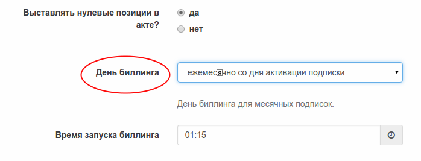

# Расчетный день для ежемесячных подписок

Для ежемесячных подписок в настройках биллинга можно указать фиксированный или плавающий расчетный день (billing day). 

В настойках предлагается выбрать одно из значений

1. Плавающий день "ежемесячно со дня активации подписки" (по умолчанию)
2. Плавающий день "не установлен"
3. Фиксированный день от 1 до 28

Разберем на примерах как рассчитываются списания подписки в каждом случае:

**Пример 1**  
Условия
- Рассчетный день "ежемесячно со дня активации подписки"
- Подписка создана 5го февраля. Оплата и активация произошла 7го февраля

Датой продления подписки будет 7е марта (один месяц со дня активации). Первый и все последующие периоды будут равны одному календарному месяцу.

**Пример 2**  
Условия
- Рассчетный день выбран "не установлен"
- Подписка создана 5го февраля. Оплата и активация произошла 7го февраля

Датой продления подписки будет 7е марта (один месяц со дня активации). Первый и все последующие периоды будут равны одному календарному месяцу. То есть подписка будет вести себя так же как и в первом примере (разница между ними выяснится в примере 5).

**Пример 3**  
Условия
- Выбран фиксированный расчетный день "1"
- Подписка создана 5го февраля. Оплата и активация произошла 7го февраля
- Стоимость подписки - 100 руб в месяц.

Датой продления подписки будет 1е марта (по настройкам). Первый период будет равен 0.785 календарного месяца (в феврале не високосного года это 22 дня). Стоимость будет рассчитана как 22/28*100 = 78.57 руб. 
Второй и все последующие периоды будут равны одному календарному месяцу со стоимостью 100 руб. 

При Апгрейде или Кросс-рейде на другой продукт с сохранением периода (1 месяц) расчетный день будет сохранен.

**Пример 4**  
Условия
- Расчетный день выбран "ежемесячно со дня активации подписки"
- Подписка создана 5го февраля. Оплата и активация произошла 7го февраля
- Апгрейд 10го марта до 200 руб в месяц.

10го марта мы будем находиться во втором периоде подписки с расчетным днем "ежемесячно со дня активации подписки". Соответственно:
1. Подписка будет отменена. И рассчитана как 2 отработанных дня и 30 неотработанных.
2. На баланс клиента будет зачислено 93.75 руб.
3. Новая подписка будет создана с датой продления 7 го Апреля.
4. С баланса будет списано 187.50 руб. по новой цене.

**Пример 5**  
Условия
- Расчетный день выбран "не установлен"
- Подписка создана 5го февраля. Оплата и активация произошла 7го февраля
- Апгрейд 10го марта до 200 руб в месяц.

10го марта мы будем находиться во втором периоде подписки с расчетным днем "не установлен". Соответственно:
1. Подписка будет отменена. И рассчитана как 2 отработанных дня и 30 неотработанных.
2. На баланс клиента будет зачислено 93.75 руб.
3. Новая подписка будет создана с датой продления 10 го Апреля.
4. С баланса будет списано 200 руб. по новой цене.

**Пример 6**  
Условия
- Выбран фиксированный расчетный день "1"
- Подписка создана 5го февраля. Оплата и активация произошла 7го февраля
- Стоимость подписки - 100 руб в месяц.
- Апгрейд 10го марта до 200 руб в месяц.

10го марта мы будем находиться во втором периоде подписки с фиксированным расчетным днем "1". Соответственно 
1. Подписка будет отменена. И рассчитана как 9 отработанных дней и 22 неотработанных.
2. На баланс клиента будет зачислено 70.96 руб.
3. Новая подписка будет создана с датой продления 01 го Апреля.
4. С баланса будет списано 141.94 руб. по новой цене.

