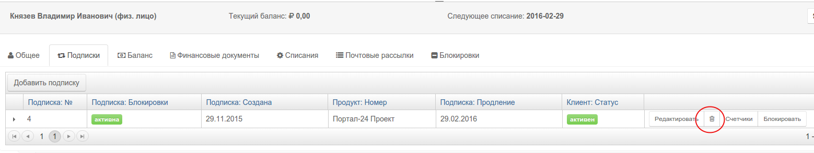

# Отмена подписки (Cancellation)

Отменить действие активной подписки можно в ручном режиме (рис. 1) или в правилах биллинга.


Действия биллинга при отмене подписки: 
- Статус подписки изменится на `"Отменена"`
- Отменяются все `"будущие"` и `"оплаченные"` периоды
- Рассчитывается списание за отработанную часть активного периода
- На баланс лицевого счета зачисляется сумма за неотработанную часть `"активного"` периода и суммы, списанные за `"оплаченные"` будущие периоды.


**Например**

```1го мая клиент оплатил подписку на ежемесячный тарифный план "Базовый", стоимостью 100 руб в месяц.
10го мая клиент решил отменить подписку, после операции отмены.``

1. Статус подписки изменится на "Отменена"
2. Биллинг создаст оплаченную реализацию на сумму 32.26 руб. За 10 отработанных дней.
3. На баланс клиента будет зачислено 67.74 руб. за 21 неотработанный день.
```

Вам предлагается самостоятельно решить (в соответствии с договорными обязательствами перед вашими клиентами), что делать с остатком на балансе лицевого счета после того, как подписка была отменена. Вы можете оформить возврат средств клиенту (вне рамок биллинга) , списать остаток с лицевого счета или оставить его на балансе клиента. 

Процесс расчета и разделения периода на несколько частей и перерасчета списания, называется "проратирование".


