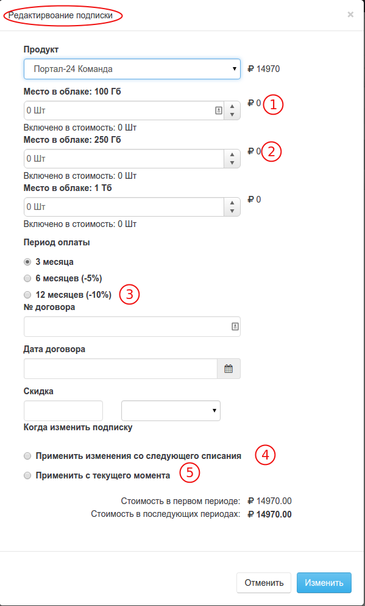
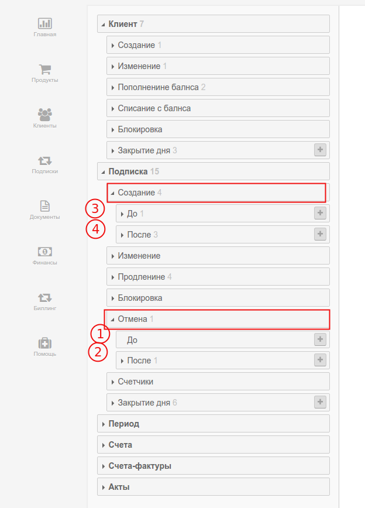

# Апгрейд (Upgrade)

`Апгрейдом` в биллинге PricePlan называется изменение параметров подписки, при котором увеличивается её стоимость но не меняется продукт. 

**Пример 1** Клиент подписан на ежемесячную подписку, стоимостью 100 руб в месяц. В ее стоимость входит "1 пользователь" с возможностью дозаказа дополнительных пользователей по цене 50 руб. в месяц. Заказ дополнительного пользователя будет считаться `Апгрейдом`.Показатель MRR клиента в этом случае увеличится.

**Пример 2** Клиент подписан на ежемесячную подписку (предоплата), стоимостью 100 руб в месяц с возможностью перейти на ежегодную подписку, стоимостью 1000 руб за 12 месяцев. Переход клиента на ежегодную подписку будет также считаться `Апгрейдом`. Показатель MRR клиента в этом случае уменьшится. Показатель но вырастет показатель LTV.

При выполнении операции `Апгрейда` биллинг последовательно выполняет 2 операции: 
1. [Отмена подписки](subscription_cancellation.md) 
2. Создание новой подписки

При этом в разделе подписок этот процесс будет отражен как отмена периода и созание нового ( подпска останется активной). 

При `Апгрейде` поисходит триггер нескольких событий для которых вы можете создать бизнес правила, в соответсвии с вашими договорными обязательствами. Например вы можете запретить `Апгрейд` если на баллансе лицевого счета клиета недостаточно средств для этой операции.

