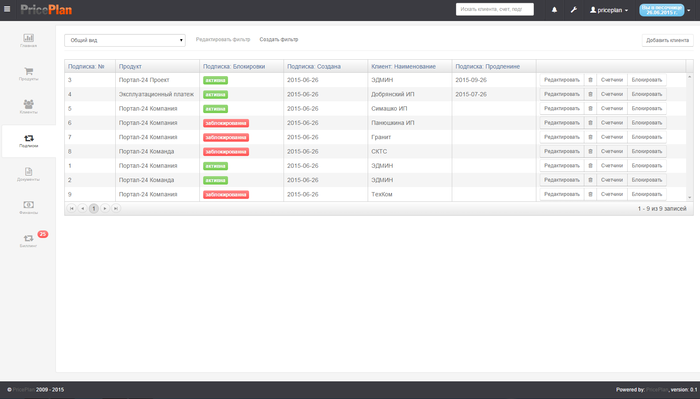
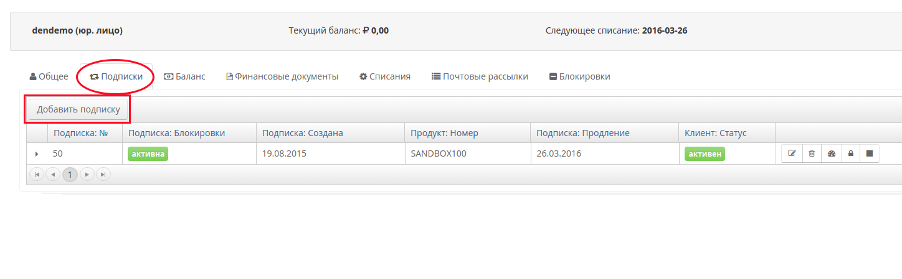
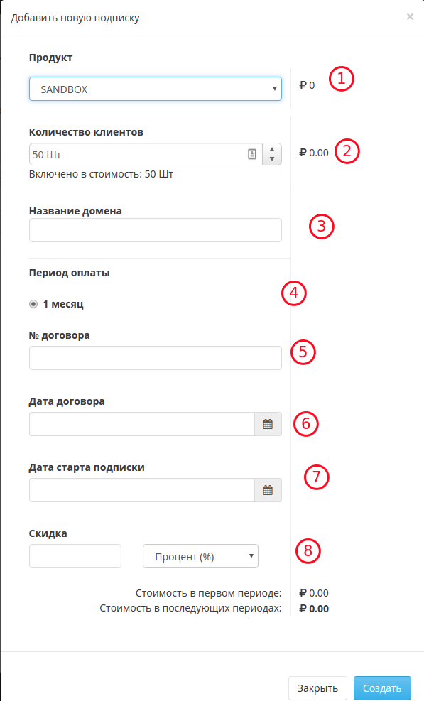
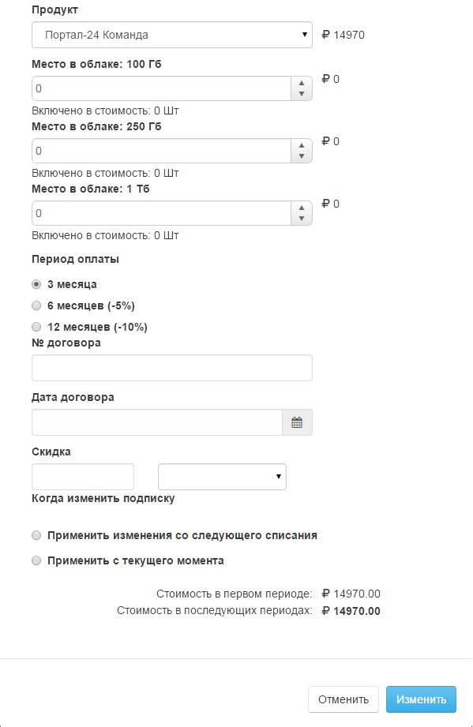
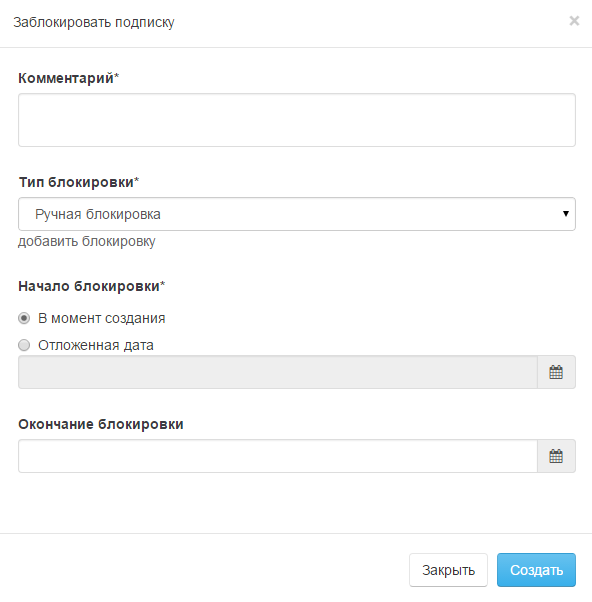
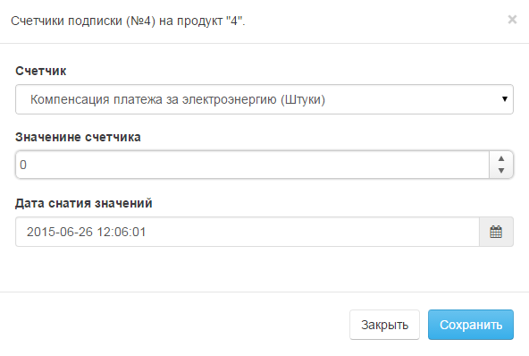
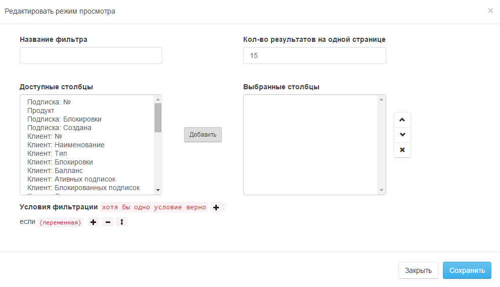

# Подписки

Вкладка "Подписки" содержит информацию о всех существующих подписках. Рис.1 

В таблице показан список всех подписок, их статус, клиент к которому относится подписка, сроки начала и продления.  
Помимо этого, оператор может заблокировать, удалить, отредактировать подписку или внести показания счетчиков \(аналогичные действия оператор может произвести, выбрав клиента во вкладке клиенты и открыв закладку Подписки\).

## Создание подписки

Для создания новой подписки кликните на кнопку "Добавить подписку" во вкладке "Подписки".

 

В открывшемся окне выберите:

* продукт \(1\)
* значения дополнительных переменных продукта \(2\) и \(3\)
* Период продления \(4\)
* Номер и дату договора для подстановки в закрывающие документы. \(6\) и \(7\).
* Дата старта подписки \(7\). По умолчанию подписка будет активирована сразу после создания. Используйте дату в будущем, если вы ходите указать отложенный старт первого периода. 
* Скидка \(8\). Скидка указывается в процентах к общей сумме подписки или фиксированною в валюте аккаунта.

## Создание подписки с отложенной активацией

Иногда требуется создать подписку с отложенной датой активации. Например по просьбе вашего клиент. Для этого, при создании подписки дата начала \(7\) необходимо указать дату начала в будущем.

* Сразу после создания подписки установится блокировка \(в правиле "Блокировка отложенной подписки"\)
* При наступлении даты начала подписки блокировка автоматически отменится \(в правиле "Снять блокировку для отложенных подписок"\)

## Создание подписки с активацией в прошлом

Иногда в биллинге требуется создать подписку с датой активации в прошлом. Например, если вы предоставили клиенту пробный доступ к услуге, но при переходе на платный доступ ему нужно также оплатить и пробный период. Для этого, при создании подписки дату начала \(7\) необходимо указать в прошлом.

При создании такой подписки дата активации будет установлена в прошлом, а продолжительность первого период будет увеличена. Стоимость первого периода будет пересчитана в соответствии с правилами проратирования \("Настройки биллинга: Основные настройки биллинга: Продолжительность месяца"\).

**Пример:**

```text
Дата создания подписки: 01 февраля
Дата активации подписки 10 января
Стоимость продукта 1000 руб в месяц
День биллинга не установлен.
Продолжительность месяца - Календарный месяц

На выходе мы получим подписку с первым периом с 10 января по 28 февраля
Соответственно, на момент создания подписки у клиента уже будет задолженность 785.71 руб. за использованные услуги (1000/28Х22). Счет за первое списание будет рассчитан на сумму 1785.71 руб (1000/28Х22 + 1000)
```

## Редактирование подписки

Для редактирования подписки, необходимо нажать кнопку "Редактировать", после чего, в открывшемся диалоге, внести необходимые изменения в параметры подписки Рис.2.



## Удаление подписки

Для удаления подписки, необходимо нажать кнопку "Удалить" - 

## Блокировка подписки

Для блокировки подписки, необходимо нажать кнопку "Блокировать", после чего, в открывшемся интерфейсе, заполнить необходимые поля. Рис.3



## Счетчики

Для внесения значения счетчика, необходимо нажать кнопку "Счетчики", после чего, в открывшемся интерфейсе, внести необходимое значение. Рис.4



## Фильтры

Фильтры позволяют выводить список клиентов в соответствии с условиями, задаваемыми фильтром. Для создания или редактирования фильтра, необходимо нажать кнопку "Создать фильтр/Редактировать фильтр", после чего, в открывшемся диалоге, создать или отредактировать фильтр. Рис.5



