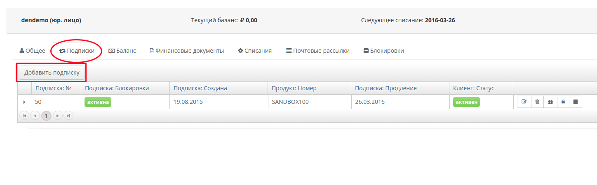
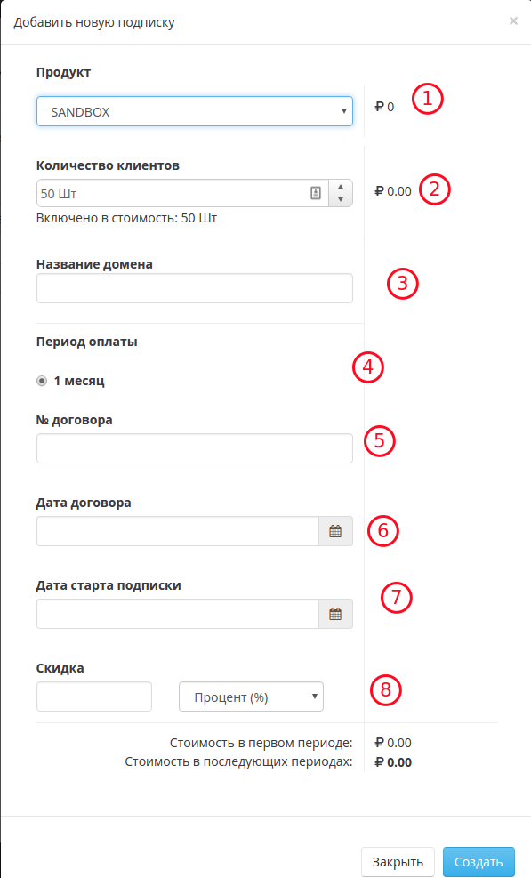

# Подписки

Вкладка "Подписки" содержит информацию о всех существующих подписках. Рис.1
  

В таблице показан список всех подписок, их статус, клиент к которому относится подписка, сроки начала и продления.  
Помимо этого, оператор может заблокировать, удалить, отредактировать подписку или внести показания счетчиков (аналогичные действия оператор может произвести, выбрав клиента во вкладке клиенты и открыв закладку Подписки).  

## Создание подписки
Для создания новой подписки кликните на кнопку "Добавить подписку" во вкладке "Подписки".

В открывшемся окне выберите:
* продукт (1)
* значения дополнительных переменных продукта (2) и (3)
* Период продления (4)
* Номер и дату договора для подстановки в закрывающие документы. (6) и (7).
* Дата старта подписки (7). По умолчанию подписка будет активирована сразу после создания. Используйте дату в будущем, если вы ходите указать отложенный старт первого периода. 
* Скидка (8). Скидка указывается в процентах к общей сумме подписки или фиксированною в валюте аккаунта.

## Создание подписки с отложенным стартом
Иногда требуется создать подписку с отложенной датой активации. Например по просьбе вашего клиент. Для этого, при создании подписки дата начала (7) необходимо указать дату начала в будущем. 
* Сразу после создания подписки установится блокировка (в правиле "Блокировка отложенной подписки")
* При наступлении даты начала подписки блокировка автоматически отменится (в правиле "Снять блокировку для отложенных подписок")

## Редактирование подписки
Для редактирования подписки, необходимо нажать кнопку "Редактировать", после чего, в открывшемся диалоге, внести необходимые изменения в параметры подписки Рис.2.

  

## Удаление подписки
Для удаления подписки, необходимо нажать кнопку "Удалить" -    

##Блокировка подписки
Для блокировки подписки, необходимо нажать кнопку "Блокировать", после чего, в открывшемся интерфейсе, заполнить необходимые поля. Рис.3  

  

## Счетчики
Для внесения значения счетчика, необходимо нажать кнопку "Счетчики", после чего, в открывшемся интерфейсе, внести необходимое значение. Рис.4

## Фильтры  
Фильтры позволяют выводить список клиентов в соответствии с условиями, задаваемыми фильтром. Для создания или редактирования фильтра, необходимо нажать кнопку "Создать фильтр/Редактировать фильтр", после чего, в открывшемся диалоге, создать или отредактировать фильтр. Рис.5  

