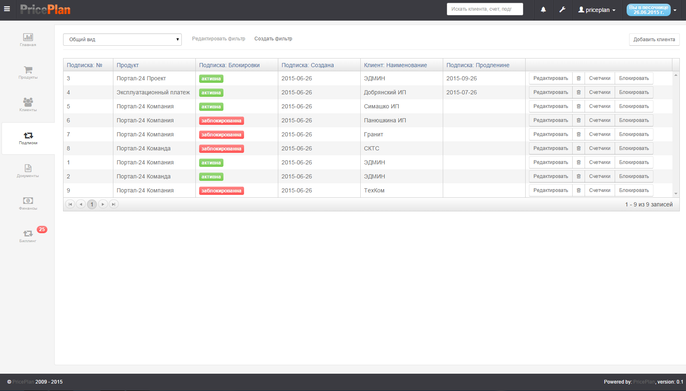
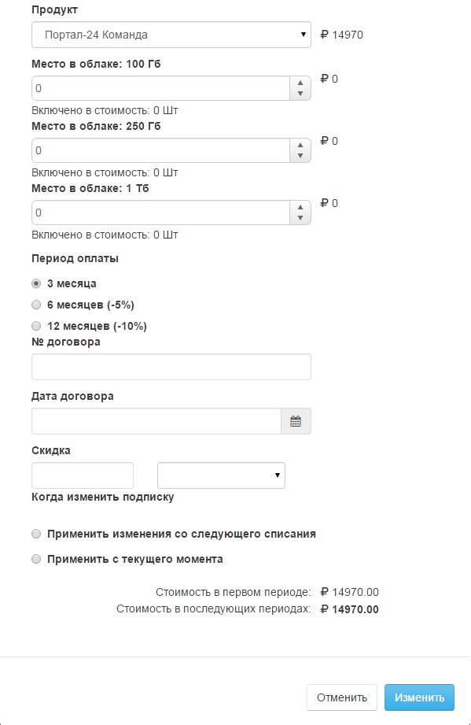
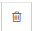
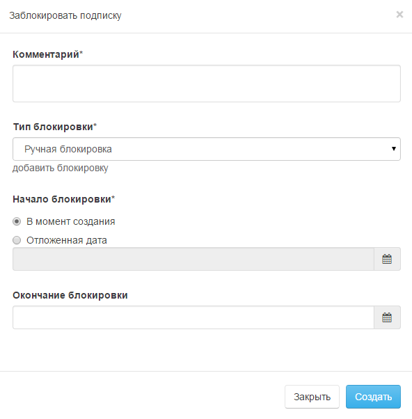
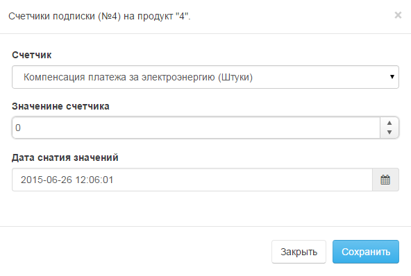
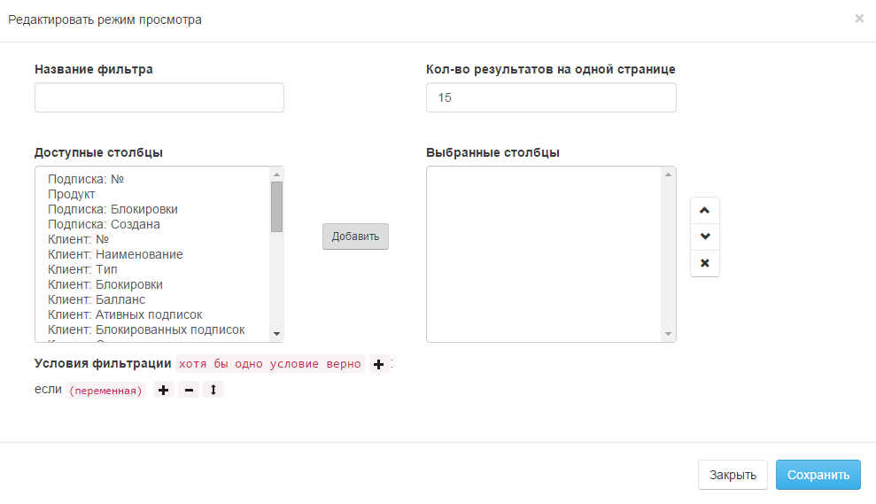

# Подписки

Вкладка "Подписки" содержит информацию о всех существующих подписках. Рис.1
  

В таблице показан список всех подписок, их статус, клиент к которому относится подписка, сроки начала и продления.  
Помимо этого, оператор может заблокировать, удалить, отредактировать подписку или внести показания счетчиков (аналогичные действия оператор может произвести, выбрав клиента во вкладке клиенты и открыв закладку Подписки).  

## Редактирование подписки
Для редактирования подписки, необходимо нажать кнопку "Редактировать", после чего, в открывшемся диалоге, внести необходимые изменения в параметры подписки Рис.2.

  

## Удаление подписки
Для удаления подписки, необходимо нажать кнопку "Удалить" -    

##Блокировка подписки
Для блокировки подписки, необходимо нажать кнопку "Блокировать", после чего, в открывшемся интерфейсе, заполнить необходимые поля. Рис.3  

  

## Счетчики
Для внесения значения счетчика, необходимо нажать кнопку "Счетчики", после чего, в открывшемся интерфейсе, внести необходимое значение. Рис.4

## Фильтры  
Фильтры позволяют выводить список клиентов в соответствии с условиями, задаваемыми фильтром. Для создания или редактирования фильтра, необходимо нажать кнопку "Создать фильтр/Редактировать фильтр", после чего, в открывшемся диалоге, создать или отредактировать фильтр. Рис.5  

