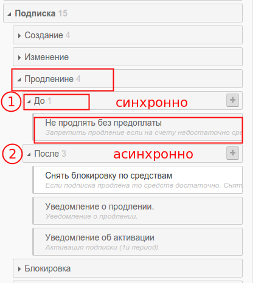

# События и триггеры

В PricePlan как в и любой информационной системе постоянно происходят различные события. Модуль бизнес правил дает возможность отслеживать "интересные" с точки зрения биллинга события и добавлять к ним бизнес-логику в форме правил.

Для большиства событий существует два триггера: `ПЕРЕД` и `ПОСЛЕ`

Триггер `ПЕРЕД` срабатывает синхронно, перед наступлением события. Его удобно использовать для валидации данных и отмены события. Хорошим примером будет отмена продления подписки, если на баллансе лицевого счета клиента недостаточно средств.

Триггер `ПОСЛЕ` работает асинхронно. Это значит, что все действия в правилах такого триггера будут поставлены в очередь на выполнение.

На любое событие можно создавать любое количество правил. Порядок их выполнения описан в статье 

