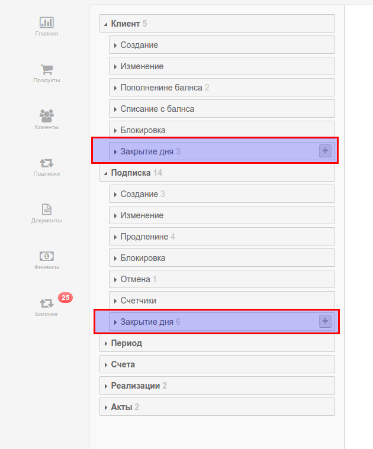

# Автоматический режим работы биллинга. 

Натройки режима пакетного биллинга "полный автомат" имеют отношение к выполнению правил закрытия дня. 

#### Особенности режима "Полный автомат"

В режиме "Полный автомат" все действия, указанные в правилах на закрытие дня выполняются автоматически. Все доументы клиентов будут созданы и проведены. Подписки продлены, уведомленя разосланы клиентам. 

Режим "Полный автомат" работы безусловно является наиболее эффективным но и наиболее рискованным.  
В этом режиме у менеджера **НЕТ ВОЗМОЖНОСТИ** отменить действия биллинга. Вы можете только проверить отчет в разделе биллинг.

Мы рекоммендуем испрользовать режим  "с подтверждением" первые 2-3 месяца после начала эксплуатации биллинга и переключиться на режим "полный автомат" только после полной уверенности в безошибочной работе всех правил. 

включить режим "Полный автомат" можно в настойках биллинга.

Результаты операций закрытия дня в режиме "Полный автомат" отображаются в разделе "Биллинг"
