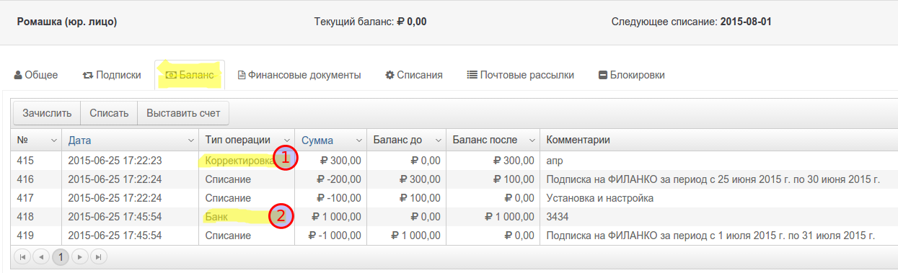
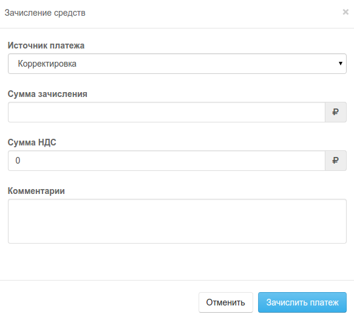
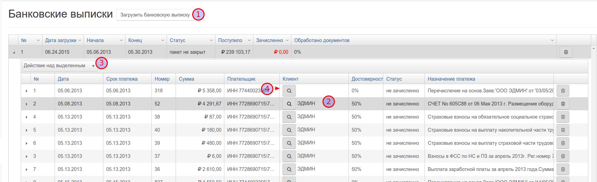

#Зачисления на рассчетный счет

Зачислене средств на расчетный счет может быть произведено вручную или при выполнеии пакетой опрации.

## Ручное зачисление на расчетный счет

В примере (1) показана история операций с баллансом лицевого счета. 

-  Ручная корретировка балланса 

-  Ручное зачисление банковкого перевода

-  Ручное зачисление электронных платежных ситем  

Для ручного зачисления средств на рассчетный счет, нажмите кнопку `Зачислить`. Выберите источник платежа, введите сумму, комментарии и нажмите кнопку `Зачислить платеж`. 

Будте внимательны! На событие `пополнение балланса` могут быть установлены правила, продлевающие подписки, уведомления клиена и.т.п.

 

## Пакетное зачисление платежей

Пакетное зачисление платежей производится в разделе  

В систему PriсеPlan можно загружать банковские выписки или платежи из программы 1С. Priceplan автоматически распознает контрагента, если это возможно. 

После этого платеж можно зачислить на балланс клиента.

Прайсплан учитывает номер счета, указанный в комментариях к платежу, для определения ID клиента, однако не распределяет платеж по счетам. 

Платеж будет зачислен на балланс лицевого счета и распределен по списаниям очереди даты создания "раньше создан - раньше оплачен".

 

-   Загрузите банковскую выписку или получите платежи из 1С при помощи модуля интеграции
-  Проверьте контрагенов платежей с установленным клиентом (в данном случае, вероятность совпадения определена как 50%)
-  Определите лицевые счета для платежей, у которых клиент не удалось установить автоматически
- Удалите платежи, не относящиеся к биллингу
-  Зачислите платежи на лицевые счета клиентов.

Подробнее о процессе зачисления платежей из 1С, описано в учебном видео-ролике [Интеграция с 1С](http://youtu.be/7wSDOFz_V2c)
